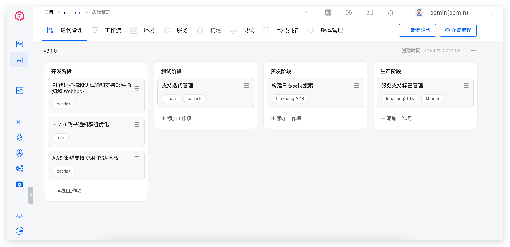

在复杂的项目迭代过程中，虽然各角色的任务能够通过工作流实现自动化，但角色之间的协作信息却无法在平台上有效整合与传递。传统方式是在项目管理平台手动粘贴变更信息（如代码分支、镜像信息、配置变更内容、数据变更内容、测试结果、发布工单等），但随着需求的发展，这种方式已无法满足，尤其在稳态研发模式下，信息流无法顺畅传递。本迭代管理功能旨在解决这些问题，实现流程和信息可视化，为各角色在研发流程中的协作提供便利。

本文主要介绍 Zadig 迭代管理的基本概念和使用方法。

## 基本概念

- 流程：项目迭代的有序步骤架构，流程中可配置各阶段及关联工作流，以保障信息流传递和项目顺利推进。
- 迭代：迭代是基于流程开展的交付周期，通过看板展示相关信息，可进行新建、删除、归档等操作，便于追溯项目情况。
- 工作项：工作项是迭代中的具体任务，有自身属性、执行和活动记录，可对其进行新建、编辑、查看、删除和移动等操作来推进任务。

## 配置流程

访问迭代管理页面，点击`配置流程`，配置流程中的阶段，以及各个阶段中需要使用的工作流。

## 迭代管理

访问迭代管理页面，对迭代进行管理，包括新建、修改、删除、归档、切换等操作。

操作说明：
- 新建：一个项目能够对应一个或者多个迭代，每个迭代都需要有唯一的名称，以此来区分不同的迭代过程。
- 修改：支持对迭代名称进行修改，便于在项目发展过程中，根据实际情况对迭代进行重新命名。
- 删除：迭代一旦被删除不可恢复，请谨慎操作。
- 归档：当迭代完成相应任务后，可以进行归档操作。已经归档的迭代可以在后续需要的时候重新启用，方便对历史迭代追溯。
- 切换：可以在不同的迭代之间进行自由切换，以方便查看和操作不同迭代阶段的相关内容。

## 工作项管理

访问迭代管理页面，对工作项进行管理，包括新建、修改、删除、执行、移动等操作。

工作项信息说明：
- 负责人：指定工作项负责人，明确工作的归属和责任。
- 描述：对工作项具体内容、目标、要求等详细阐述。
- 执行记录：按照阶段和工作流记录工作项的执行详情，包括代码信息、服务信息、镜像信息等。
- 活动记录：以时间、人员、具体活动内容的形式记录与工作项相关的各种操作，完整地展现了工作项在整个生命周期内的动态变化。