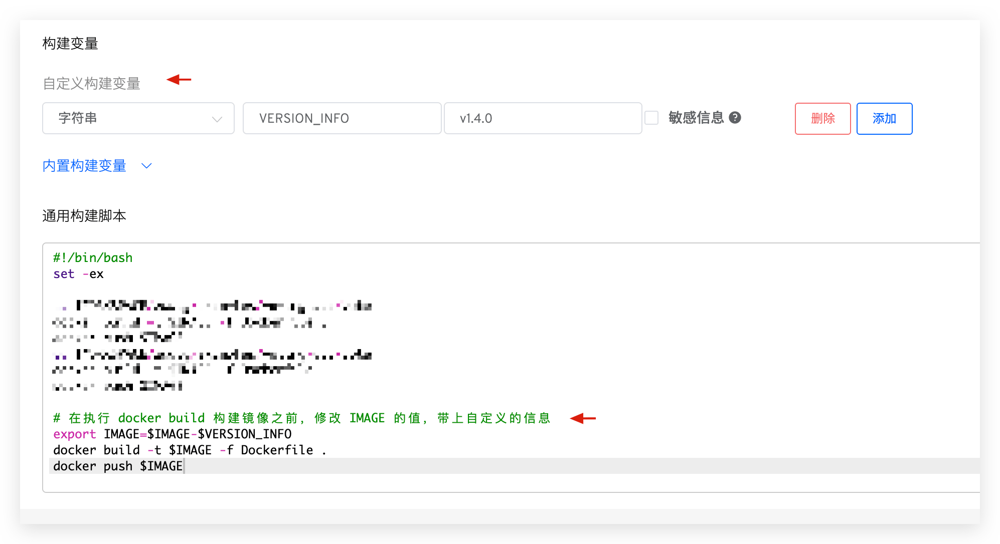
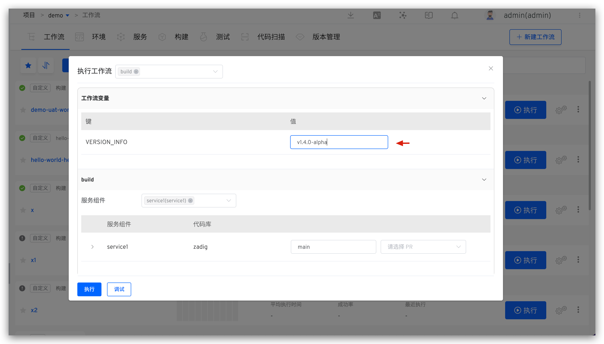
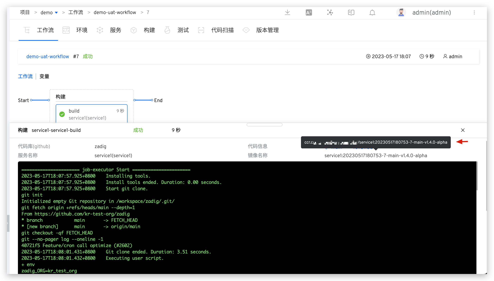

工作流中支持丰富的变量（项目维度、工作流维度、任务维度），并且可以在多个任务、工作流、项目之间自由传递。本文将用一个具体的场景来举例说明如何使用。

## 背景

使用工作流来构建部署服务，希望构建出的镜像中能体现更多信息，比如：团队当前在冲刺的版本号。

## 如何使用

1. 编辑工作流，增加变量 `VERSION_INFO`，值设置为`运行时输入`，参考文档：[工作流变量](/cn/Zadig%20v3.4/project/common-workflow/#工作流)。

2. 在构建配置中增加自定义变量 `VERSION_INFO` 并修改构建脚本，在构建镜像之前修改 `IMAGE` 变量的值，让它和 `VERSION_INFO` 联系起来，比如：`export IMAGE=$IMAGE-$VERSION_INFO`，参考文档：[自定义变量](/cn/Zadig%20v3.4/project/build/#构建变量)。

3. 修改工作流中构建任务的变量配置，使用第一步中的工作流全局变量 `{{.workflow.params.VERSION_INFO}}` 来为其赋值，参考文档：[构建任务变量](/cn/Zadig%20v3.4/project/common-workflow/#构建任务)。

## 使用效果

执行工作流时，指定 `VERSION_INFO` 的值即可。

变量传递的更多使用姿势可参考 [变量传递](/cn/Zadig%20v3.4/project/common-workflow/#变量传递)、[触发 Zadig 工作流](/cn/Zadig%20v3.4/project/workflow-jobs/#触发-zadig-工作流)。
