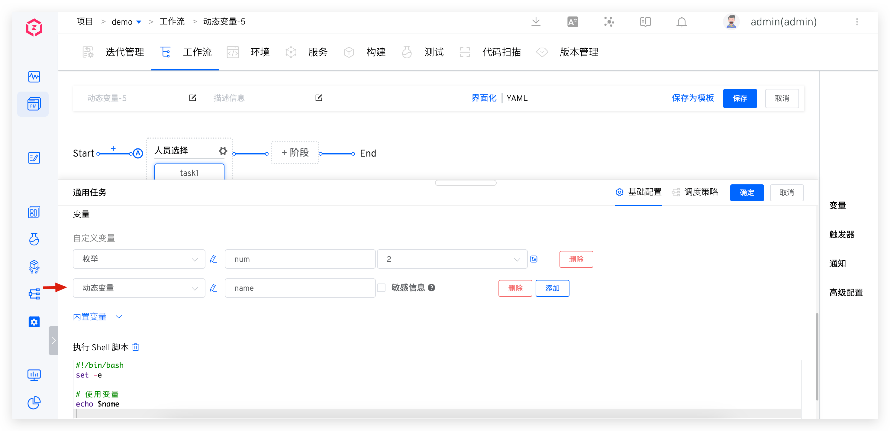

本文主要介绍工作流中动态变量的配置和使用。

适用场景：工作流中的变量值需要从外部系统获取或者通过编码的方式生成。

## 如何配置

配置工作流任务，添加变量，选择变量类型为`动态变量`，填写对应配置。

**配置说明：**
- 变量名称：可在脚本中使用
- 代码块：支持 Golang 代码块，要求返回 []string
- 调用函数：声明需要调用代码块中函数，输入参数支持来自工作流的其他任务，格式为`{{.key}}`
- 描述：对于变量的描述信息

**上图变量配置说明：**

上图实现的是变量之间的级联，通过 `num` 变量控制 `name` 变量值的数量。
- `num`：控制 name 返回的用户名称数量
- `name`：用户名称列表
   1. 代码块：从外部系统获取用户名称
   2. 调用函数：调用外部系统 API，返回名称字符串数组，输入参数为`{{.job.task1.num}}`

## 使用效果

在执行工作流时，`name` 变量中包含的值的数量会根据所选择的 `num` 变量值进行相应的调整。

