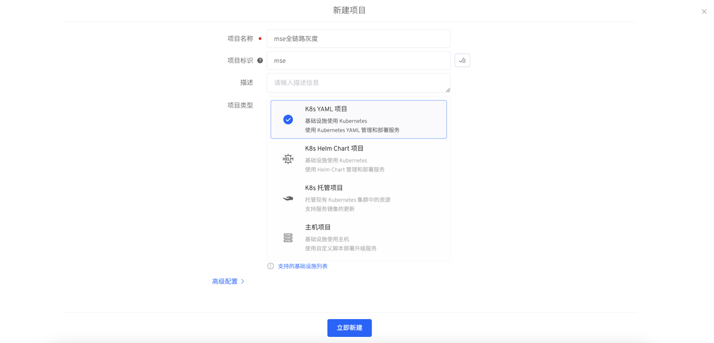
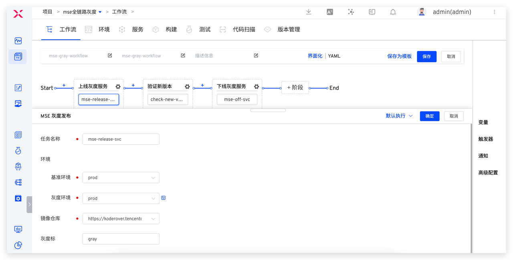
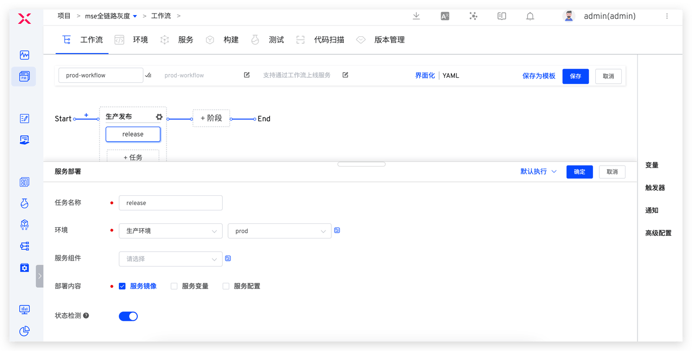

本文详细探讨 Zadig 如何利用阿里云 MSE 实现的全链路灰度发布方案，包括方案原理介绍、管理员配置讲解以及工程师日常操作等方面的细节。

## 工作原理介绍


**工作流程描述:**

MSE 灰度发布任务
1. 复制一份基准环境中服务的 YAML
2. 自动为 YAML 中的资源名称 `metadata.name` 添加后缀 `-mse-<grayTag>`
3. 自动为 YAML 中的资源添加 MSE 全链路灰度发布所需的相关 label 
4. 用户可以设置灰度镜像、副本数，此外可以直接在渲染后的 YAML 中修改其他需要改动的字段（不可删除灰度过程中使用的 label）
5. 根据最终的 YAML 生成灰度版本资源

下线 MSE 灰度服务
1. 删除所有带灰度标的 Kubernetes 资源


## 前置操作

> MSE 全链路灰度能力可以支持任意 K8S 集群，全链路灰度场景需基于网关能力建设，下面以 MSE 自带的云原生网关为例介绍场景，用户可以根据自身情况选择合适的网关。

### 安装 MSE 组件

在阿里云 ACK 集群中安装 MSE 组件，安装方式参考 [安装 ack-onepilot 组件](https://help.aliyun.com/document_detail/2360531.html?spm=a2c4g.2359474.0.0.33a34ca1nN0X0c)。

### 安装 MSE Ingress 云原生网关

安装方式参考
1. [创建 MSE 云原生网关](https://help.aliyun.com/document_detail/347638.html?spm=a2c4g.250951.0.0.c99b3e06EsealV)
2. [通过 MSE Ingress 访问容器服务](https://help.aliyun.com/document_detail/438003.html?spm=a2c4g.440050.0.0.1e5e30d5JwFRF1#task-2229308)

下面以 spring-a、spring-b、spring-c、nacos 这几个服务为例，结合 MSE 云原生网关演示项目初始化和 MSE 灰度发布过程。

## 管理员做项目初始化

### 步骤一：新建项目

在 Zadig 上新建项目，输入项目名称，项目类型选择「K8s YAML」项目。



### 步骤二：新建服务

在 Zadig 服务-生产服务模块新建 `nacos`、`spring-a`、`spring-b`、`spring-c` 服务并配置对应的 YAML。具体配置参考 [示例项目 YAML 配置](https://github.com/koderover/zadig/tree/main/examples/mse-demo)。


::: warning 注意
在服务 deployment 中需添加以下  selector 和 template.metadata.labels：

`zadigx-release-version: original`
:::

### 步骤三：新建环境并启用 MSE

1. 在 Zadig 上新建生产环境


2. 执行以下命令启用 MSE，对灰度过程涉及到的命名空间（上图中为：mse-prod） 打上 `mse-enable` 标签。

``` bash
kubectl label namespace <NAMESPACE> mse-enable=enabled
```

3. 在生产环境中添加服务 `spring-a`、`spring-b`、`spring-c`、`nacos`。

4. 检查服务是否成功接入 MSE。在 Zadig 环境中选择服务，比如`spring-a`，检查 Pod YAML 中是否成功注入`one-pilot-initcontainer`，如下图所示。


### 步骤四：配置 MSE 灰度发布工作流

1. 新建发布工作流 mse-gray-workflow，添加任务，配置如下。
  1. `MSE 灰度发布`：用于部署灰度服务
  2. [可选]`通用任务` ：用于验证灰度后的新版本
  3. `下线 MSE 灰度`：用于下线灰度服务




2. 新建发布工作流 prod-workflow ，添加`部署`任务，用于执行生产发布，配置如下图所示。



## 工程师执行 MSE 灰度发布

### 多个灰度服务部署

执行 mse-gray-workflow，选择服务组件 `spring-cloud-a`和`spring-cloud-c`，设置灰度标，选择对应的灰度镜像、副本数量、修改灰度服务 YAML 配置，点击执行即可完成灰度服务部署。


此处 `spring-cloud-a` 为流量入口，因此需要在灰度服务 YAML 中手动添加/修改 Service 和 MSE Ingress 资源的一些相关字段：
1. 通过 MSE Ingress 的 annotations 设置灰度流量规则，并为灰度流量带上灰度标 Header。
  MSE Ingress 云原生网关支持按请求头、Cookie、权重三个维度进行配置，三者可以只配置一种，若同时配置生效规则按请求头、Cookie、权重顺序匹配
  - 按请求头：基于 Request Header 的流量切分，添加注解`nginx.ingress.kubernetes.io/canary-by-header`、`nginx.ingress.kubernetes.io/canary-by-header-value`或`nginx.ingress.kubernetes.io/canary-by-header-pattern`。
  - 按 Cookie：基于 Cookie 的流量切分，添加注解`nginx.ingress.kubernetes.io/canary-by-cookie`。
  - 按权重：设置请求到指定服务的百分比（值为0~100的整数），添加注解`nginx.ingress.kubernetes.io/canary-weight`。

2. 设置灰度路由规则的 `backend.service.name` 为其下的灰度 Service 名称。具体改动内容如下：

:::details
``` yaml
apiVersion: networking.k8s.io/v1
kind: Ingress
metadata:
  annotations: # 加上灰度路由
    mse.ingress.kubernetes.io/request-header-control-update: x-mse-tag gray
    nginx.ingress.kubernetes.io/canary: "true"
    nginx.ingress.kubernetes.io/canary-by-header: x-user-id
    nginx.ingress.kubernetes.io/canary-by-header-value: "100"
    nginx.ingress.kubernetes.io/canary-weight: "0"
  creationTimestamp: null
  labels:
    zadigx-release-service-name: spring-a
    zadigx-release-type: mse-gray
    zadigx-release-version: gray
  name: spring-cloud-a-mse-gray
spec:
  ingressClassName: mse
  rules:
  - host: example.com
    http:
      paths:
      - backend:
          service:
            name: spring-cloud-a-mse-gray  # 修改 service 配置
            port:
              number: 20001
        path: /
        pathType: Prefix
status:
  loadBalancer: {}
---
apiVersion: v1
kind: Service
metadata:
  creationTimestamp: null
  labels:
    zadigx-release-service-name: spring-a
    zadigx-release-type: mse-gray
    zadigx-release-version: gray
  name: spring-cloud-a-mse-gray
spec:
  ports:
  - name: http
    port: 20001
    protocol: TCP
    targetPort: 20001
  selector:
    app: spring-cloud-a
    zadigx-release-service-name: spring-a
    zadigx-release-type: mse-gray
    zadigx-release-version: gray
status:
  loadBalancer: {}
```
:::

部署完成后，可在生产环境中查看灰度服务的运行状态和基本信息。


### 灰度结果验证

灰度服务部署完成后，自动执行新版本功能验证或通过其他业务方法验证灰度结果。


### 正式发布生产服务

灰度服务验证没有问题后，执行 prod-workflow 工作流，选择更新的服务及对应的镜像，即可更新生产服务。


### 灰度服务清理与下线

生产发布成功后，执行 mse-gray-workflow 工作流，选择需要下线的灰度标，即可下线对应的灰度服务。


