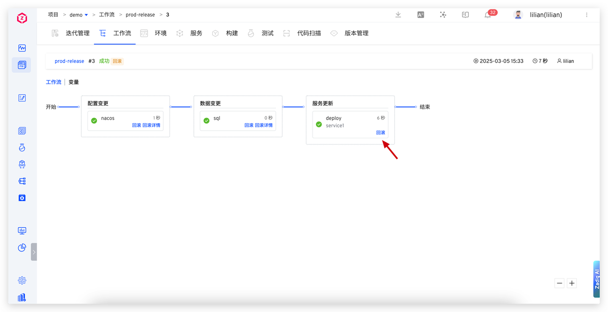

本文介绍 Zadig 工作流支持的发布回滚能力，包括服务部署、Nacos 配置变更和 SQL 数据变更的回滚功能。

## 服务版本回滚

Zadig 完整记录服务镜像版本，新版本服务出现问题时，用户可在工作流中点击“回滚”操作，比对版本差异，快速切换至稳定旧版本，确保系统快速恢复运行。

## 配置变更回滚

借助 Nacos 的配置版本管理能力，Zadig 自动为每次配置变更记录独立版本。出现问题时，用户可在工作流中点击“回滚”按钮，可视化比对前后配置差异，杜绝盲操作，一键回滚至稳定状态，确保配置正确性，避免服务异常。

## SQL 数据变更回滚

Zadig 提供数据变更回滚功能，确保数据操作可追溯、可恢复。出现问题时，用户可快速点击“回滚”按钮，输入回滚 SQL，一键恢复至安全状态。该功能不仅快速还原数据，保障完整性，还便于后续审计。

