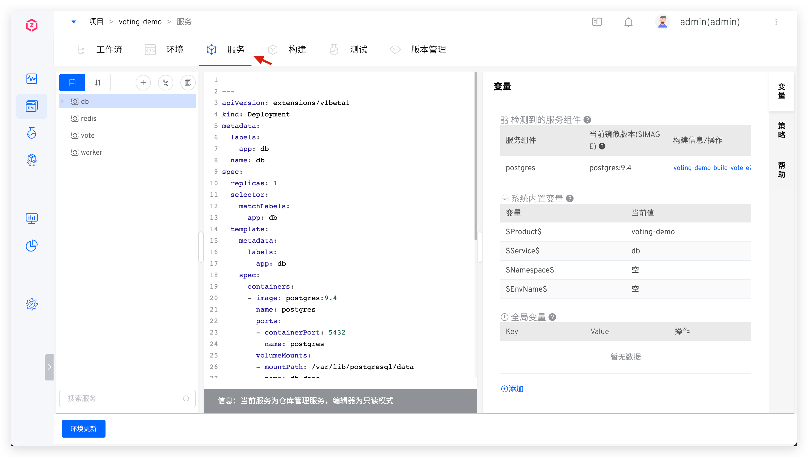
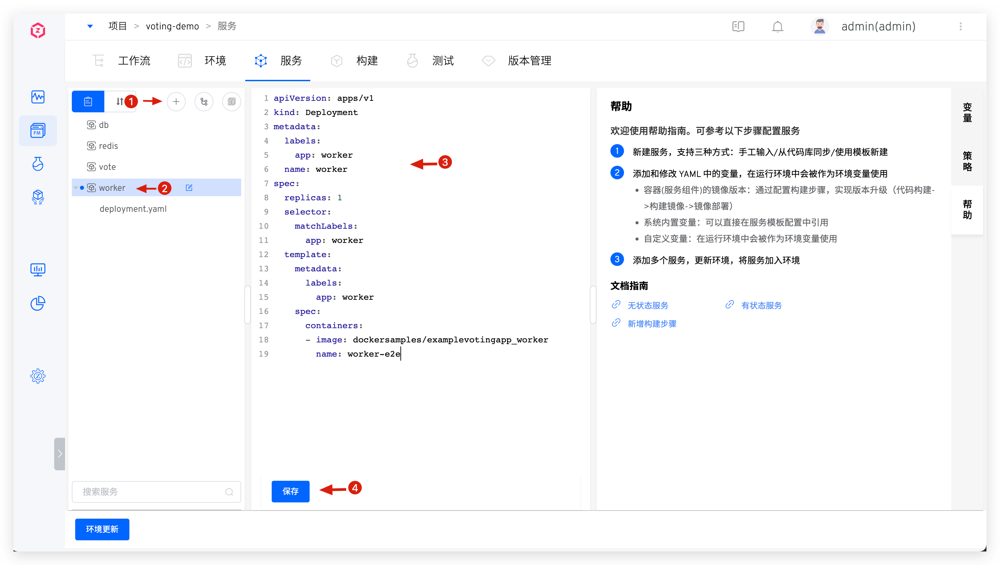
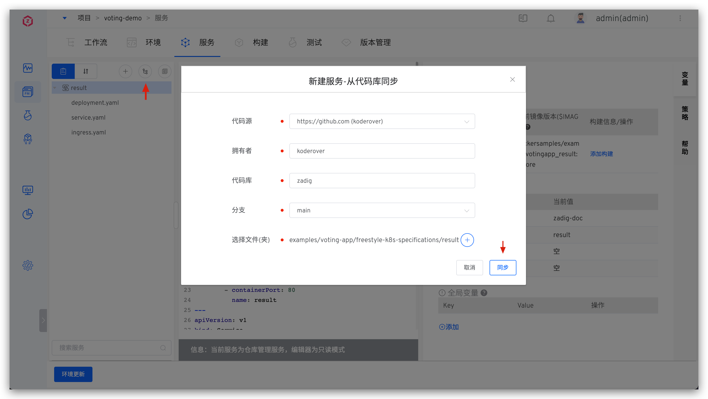
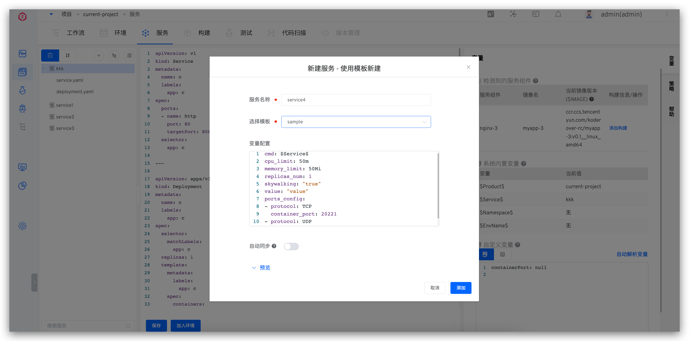
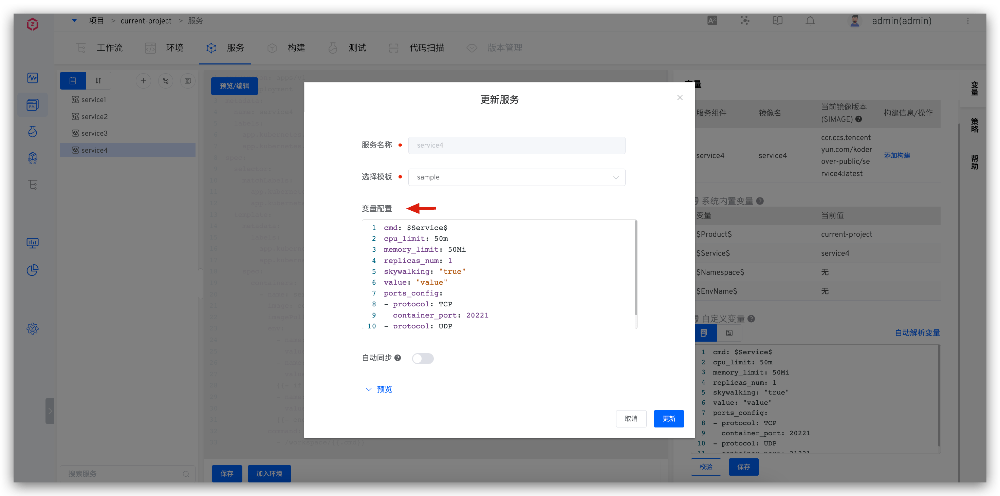
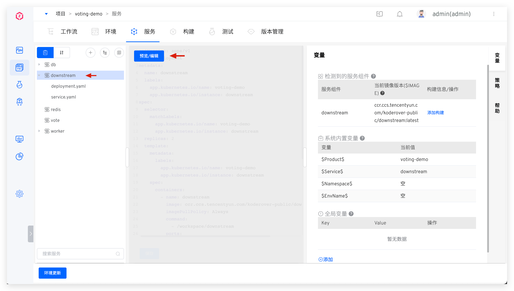
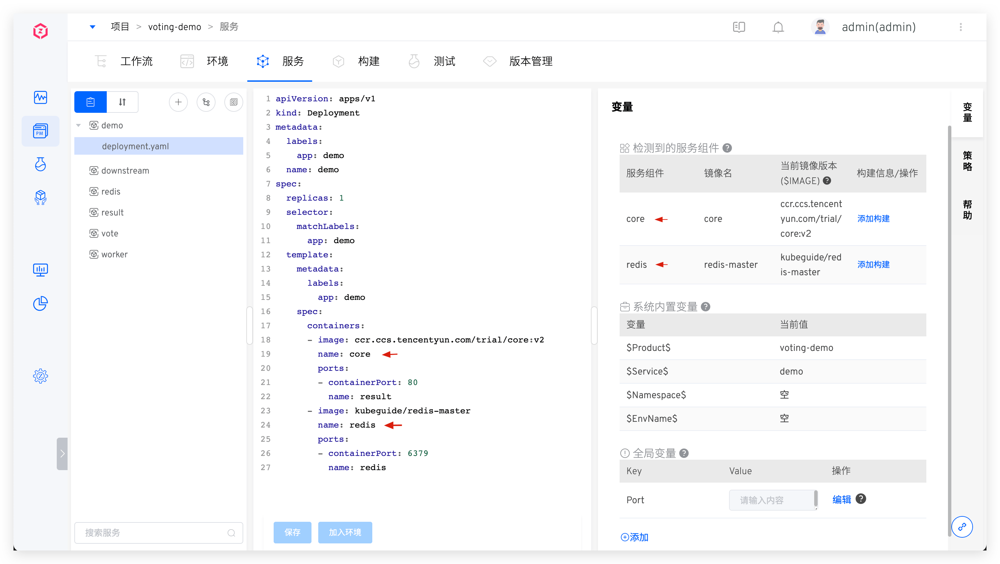
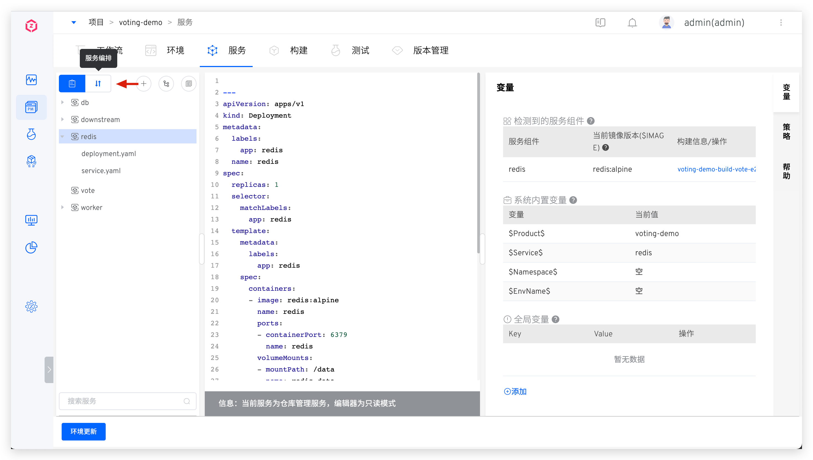
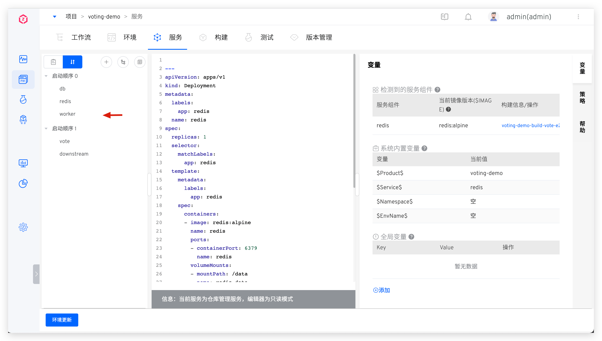

本文介绍 K8s YAML 项目中测试服务和生产服务相关配置。

## 新建服务

进入 K8s YAML 项目，点击 `服务` - `测试服务` 或 `生产服务`，进入服务管理页面。



系统支持以下四种方式创建 K8s YAML 服务：
- `手工输入`：在新建服务时手工输入服务的 K8s YAML 配置文件。
- `从代码库同步`：从代码库中同步服务的 K8s YAML 配置，一次同步可创建一个服务也可创建多个服务。当代码库中的服务配置有变更时，会通过 Webhook 自动更新 Zadig 平台中的服务配置。
- `使用模板新建`：使用模板库中的 K8s YAML 模板来新建服务。
- `从 Kubernetes 导入`：从现有 Kubernetes 命名空间中导入服务配置。

### 手工输入服务

点击手工输入按钮 -> 填写服务名称 -> 将服务 K8s YAML 填入编辑器 -> 点击保存按钮，即可新建服务。



添加服务成功后即可对环境进行更新：点击`环境更新`，选择要更新的环境，将服务加入到环境中。


### 从代码库同步单个服务

::: tip
1. 需要在系统中集成代码源，可参考：[代码源集成](/cn/Zadig%20v3.4/settings/codehost/overview/)
2. 支持的代码源请参考文档：[代码源信息](/cn/Zadig%20v3.4/settings/codehost/overview/#功能兼容列表)
:::

服务的 YAML 配置组织在单独的文件夹中，点击从代码库同步按钮 -> 选择具体的代码库和服务配置文件所在的目录 -> 点击同步，即可从代码库同步新建服务。

以 [result](https://github.com/koderover/zadig/tree/main/examples/voting-app/freestyle-k8s-specifications/result) 服务为例：



同步后，效果如下：


### 从代码库同步多个服务

::: tip
1. 需要在系统中集成代码源，可参考：[代码源集成](/cn/Zadig%20v3.4/settings/codehost/overview/)
2. 支持的代码源请参考文档：[代码源信息](/cn/Zadig%20v3.4/settings/codehost/overview/#功能兼容列表)
:::

多个服务的 YAML 配置分别组织在同一级目录的单独文件夹中，点击从代码库同步按钮 -> 选择具体的代码库和多个服务配置文件所在的目录 -> 点击同步，即可从代码库同步新建多个服务。

以 [voting](https://github.com/koderover/zadig/tree/main/examples/voting-app/freestyle-k8s-specifications/result)  项目中的 5 个服务为例说明，多个服务的配置文件组织：

```shell
├── 根目录(zadig/examples/voting-app/freestyle-k8s-specifications)
│   ├── db
│   │   ├── db-deployment.yaml
│   │   └── db-service.yaml
│   ├── redis
│   │   ├── redis-deployment.yaml
│   │   └── redis-service.yaml
│   ├── result
│   │   ├── result-deployment.yaml
│   │   └── result-service.yaml
│   ├── vote
│   │   ├── vote-deployment.yaml
│   │   └── vote-service.yaml
│   └── worker
│       └── worker-deployment.yaml
```

从代码库同步多个服务：


同步后，效果如下：


### 使用模板新建服务

::: tip 前提
需要先在系统模板库里创建 K8s YAML 模板，请参考 [K8s YAML 模板管理](/cn/Zadig%20v3.4/template/k8s_yaml/)。
:::

点击新建按钮 -> 选择`使用模板新建` -> 填写服务名称，选择模板后填写相关配置 -> 点击新建，即可使用此模板和赋值的变量新建服务。

- 变量配置可使用模板中的默认值，也可以在新建时重新赋值
- 开启`自动同步`后，当在模板库中对使用的模板操作`应用到服务`时，该服务配置将自动基于模板内容同步



### 从 Kubernetes 导入

点击新建按钮 -> 选择`从 Kubernetes 导入` -> 填写以下信息后导入即可。

- `选择集群`：要导入的服务所在的 K8s 集群，其中`本地集群`指 Zadig 所在的集群
- `选择命名空间`：要导入的服务所在的 K8s 命名空间
- 点击`添加服务`后填写服务名称，选择资源类型及对应的配置，目前支持选择 deployment/statefulset/cronjob/service/ingress/secret/configmap/pvc 资源进行导入


新建服务成功后，可点击查看服务配置的具体内容，按需对其进行修改保存。点击`加入环境`可将该服务加入到环境中。

::: tip
`加入环境`操作会在环境对应的命名空间中部署该服务，若环境的命名空间即为导入服务的命名空间，则会对原始服务进行重启或更新。
:::


## 更新服务
下面分别介绍如何更新使用不同方式新建的服务。

### 更新手工输入的服务

修改服务的 K8s YAML  内容并保存即可。


服务修改成功后即可对环境进行更新：点击环境更新，选择要更新的环境对环境中的服务进行更新。


### 更新从代码库同步的服务

* 提交服务配置变更到代码仓库。


* 变更合并后，会通过 Webhook 的能力自动同步最新配置到 Zadig 系统。也可以在界面上手动同步服务配置，如下图所示。


* 在环境中，查看服务配置变更，点击更新服务钮执行更新操作。


### 更新使用模板新建的服务

**方式一：基于模板内容同步**

点击服务名右侧的同步按钮 -> 选择模板 -> 按需填写变量配置即可。

::: tip

更新服务时：
1. 如果不切换模板，则系统会将服务中已保存过的变量和模板中的自定义变量做合并，对于在两者中都存在的 key，默认使用服务中已保存过的值。
2. 如果切换模板，则系统会使用新模板中的自定义变量来作为服务的变量配置。
:::




**方式二：直接编辑**

点击使用模板新建的服务 -> 点击预览/编辑，即可预览/编辑该服务的 K8s YAML 配置。
> 直接编辑后，将不可再基于模板内容同步来更新服务。



### 更新从 Kubernetes 导入的服务

点击从 Kubernetes 导入的服务即可预览该服务配置的详细内容，修改内容后保存即可。


## 删除服务

点击服务右侧的删除按钮即可将服务删除。


## 服务版本回滚

参考文档： [服务版本回滚](/cn/Zadig%20v3.4/project/service/versions/)。

## 服务组件



参考文档：[服务组件](/cn/Zadig%20v3.4/env/overview/#什么是服务组件)。

## 服务编排
> Zadig 系统支持对多个服务的部署顺序进行编排管理，同一启动顺序组的服务在部署时会并行执行，不同启动顺序组的服务会按照组顺序执行，适用于多个服务的启动顺序有先后依赖关系的场景。

点击`服务编排`图标，按需对服务启动顺序进行拖拽组合。




## 标签管理

通过给服务打标签，帮助快速分类和检索服务元信息，具体配置和使用参考[文档](/cn/Zadig%20v3.4/project/service/label/)。

## 变量配置

通过变量配置，实现多个环境共享一份服务配置，具体配置和使用参考[文档](/cn/Zadig%20v3.4/project/service/variable/)。

## 策略配置
在策略中设置部署服务的超时时间、服务配置更新后是否自动同步更新环境以及交付物命名规则。


### 基本说明

- 服务部署超时设置：将服务部署到环境中的超时时间，默认值为 10 分钟。若超出该阈值服务仍未处于 Running 状态，则视为部署超时。
- 服务自动更新设置：开启后，若服务配置变更，Zadig 会自动对包含该服务的环境进行更新，应用最新的服务配置。
- 交付物命名规则设置：自定义该项目中工作流构建产物的命名规则，可通过以下[内置变量](#内置变量)和常量组合的方式设置，注意：
  - 规则一旦设置后，对当前项目的所有服务都生效。
  <!-- - `JENKINS 生成镜像规则`适用于使用 [Jenkins 构建](/cn/Zadig%20v3.4/project/build/#jenkins-构建) 的服务，不可使用下述[内置变量](#内置变量)中的 `REPO_*` 变量。 -->

### 内置变量

|变量名称|描述|
|-------|---|
|`TIMESTAMP`|工作流任务的执行时间戳，形如 `20211029113304`|
|`TASK_ID`|工作流任务的 ID|
|`REPO_BRANCH`|构建过程中指定代码仓库使用的分支信息|
|`REPO_PR`|构建过程中指定代码仓库使用的 Pull Request ID 信息，若指定了多个 Pull Request，则会使用 `-` 将多个 ID 拼接起来|
|`REPO_TAG`|构建过程中指定代码仓库使用的 Tag 信息|
|`REPO_COMMIT_ID`|构建过程中指定代码仓库使用的 Commit ID 信息|
|`PROJECT`|构建所属的项目标识|
|`SERVICE`|构建的服务组件名称|
|`IMAGE_NAME`|镜像名称|
|`字符常量`|大小写字母、数字、中划线、下划线及点组合生成的 127 个字符以内的常量|

## 服务 YAML 样例
### 无状态服务

概念：服务运行的实例不会在本地存储需要持久化的数据，并且多个实例对于同一个请求响应的结果是完全一致的。可以参考[这篇文章](https://kubernetes.io/zh/docs/tasks/run-application/run-stateless-application-deployment/)了解无状态服务的更多细节。
::: details
```yaml
apiVersion: apps/v1
kind: Deployment
metadata:
  name: nginx-deployment
spec:
  selector:
    matchLabels:
      app: nginx
  replicas: 2 # 2 个 Pod 实例
  template:
    metadata:
      labels:
        app: nginx
    spec:
      containers:
      - name: nginx
        image: nginx:1.14.2
        ports:
        - containerPort: 80
```
:::

### 有状态服务

概念：服务的实例可以将一部分数据随时进行备份，并且在创建一个新的有状态服务时，可以通过备份恢复这些数据，以达到数据持久化的目的。可以参考[这篇文章](https://kubernetes.io/zh/docs/tasks/run-application/run-replicated-stateful-application/)了解有状态服务的更多细节。
::: details
```yaml
apiVersion: v1
kind: ConfigMap
metadata:
  name: mysql
  labels:
    app: mysql
data:
  master.cnf: |
    # Apply this config only on the master.
    [mysqld]
    log-bin
  slave.cnf: |
    # Apply this config only on slaves.
    [mysqld]
    super-read-only
---
# Headless service for stable DNS entries of StatefulSet members.
apiVersion: v1
kind: Service
metadata:
  name: mysql
  labels:
    app: mysql
spec:
  ports:
  - name: mysql
    port: 3306
  clusterIP: None
  selector:
    app: mysql
---
# Client service for connecting to any MySQL instance for reads.
# For writes, you must instead connect to the master: mysql-0.mysql.
apiVersion: v1
kind: Service
metadata:
  name: mysql-read
  labels:
    app: mysql
spec:
  ports:
  - name: mysql
    port: 3306
  selector:
    app: mysql
---
apiVersion: apps/v1beta1
kind: StatefulSet
metadata:
  name: mysql
spec:
  selector:
    matchLabels:
      app: mysql
  serviceName: mysql
  # 1 master and 2 slave
  replicas: 3
  template:
    metadata:
      labels:
        app: mysql
    spec:
      initContainers:
      - name: init-mysql
        image: mysql:5.7
        command:
        - bash
        - "-c"
        - |
          set -ex
          # Generate mysql server-id from pod ordinal index.
          [[ `hostname` =~ -([0-9]+)$ ]] || exit 1
          ordinal=${BASH_REMATCH[1]}
          echo [mysqld] > /mnt/conf.d/server-id.cnf
          # Add an offset to avoid reserved server-id=0 value.
          echo server-id=$((100 + $ordinal)) >> /mnt/conf.d/server-id.cnf
          # Copy appropriate conf.d files from config-map to emptyDir.
          if [[ $ordinal -eq 0 ]]; then
            cp /mnt/config-map/master.cnf /mnt/conf.d/
          else
            cp /mnt/config-map/slave.cnf /mnt/conf.d/
          fi
        volumeMounts:
        - name: conf
          mountPath: /mnt/conf.d
        - name: config-map
          mountPath: /mnt/config-map
      - name: clone-mysql
        image: gcr.azk8s.cn/google-samples/xtrabackup:1.0
        command:
        - bash
        - "-c"
        - |
          set -ex
          # Skip the clone if data already exists.
          [[ -d /var/lib/mysql/mysql ]] && exit 0
          # Skip the clone on master (ordinal index 0).
          [[ `hostname` =~ -([0-9]+)$ ]] || exit 1
          ordinal=${BASH_REMATCH[1]}
          [[ $ordinal -eq 0 ]] && exit 0
          # Clone data from previous peer.
          ncat --recv-only mysql-$(($ordinal-1)).mysql 3307 | xbstream -x -C /var/lib/mysql
          # Prepare the backup.
          xtrabackup --prepare --target-dir=/var/lib/mysql
        volumeMounts:
        - name: data
          mountPath: /var/lib/mysql
          subPath: mysql
        - name: conf
          mountPath: /etc/mysql/conf.d
      containers:
      - name: mysql
        image: mysql:5.7
        env:
        - name: MYSQL_ALLOW_EMPTY_PASSWORD
          value: "1"
        ports:
        - name: mysql
          containerPort: 3306
        volumeMounts:
        - name: data
          mountPath: /var/lib/mysql
          subPath: mysql
        - name: conf
          mountPath: /etc/mysql/conf.d
        resources:
          requests:
            cpu: 500m
            memory: 1Gi
          limits:
            cpu: 500m
            memory: 1Gi
        livenessProbe:
          exec:
            command: ["mysqladmin", "ping"]
          initialDelaySeconds: 30
          periodSeconds: 10
          timeoutSeconds: 5
        readinessProbe:
          exec:
            # Check we can execute queries over TCP (skip-networking is off).
            command: ["mysql", "-h", "127.0.0.1", "-e", "SELECT 1"]
          initialDelaySeconds: 5
          periodSeconds: 2
          timeoutSeconds: 1
      - name: xtrabackup
        image: gcr.azk8s.cn/google-samples/xtrabackup:1.0
        ports:
        - name: xtrabackup
          containerPort: 3307
        command:
        - bash
        - "-c"
        - |
          set -ex
          cd /var/lib/mysql

          # Determine binlog position of cloned data, if any.
          if [[ -f xtrabackup_slave_info && "x$(<xtrabackup_slave_info)" != "x" ]]; then
            # XtraBackup already generated a partial "CHANGE MASTER TO" query
            # because we're cloning from an existing slave. (Need to remove the tailing semicolon!)
            cat xtrabackup_slave_info | sed -E 's/;$//g' > change_master_to.sql.in
            # Ignore xtrabackup_binlog_info in this case (it's useless).
            rm -f xtrabackup_slave_info xtrabackup_binlog_info
          elif [[ -f xtrabackup_binlog_info ]]; then
            # We're cloning directly from master. Parse binlog position.
            [[ `cat xtrabackup_binlog_info` =~ ^(.*?)[[:space:]]+(.*?)$ ]] || exit 1
            rm -f xtrabackup_binlog_info xtrabackup_slave_info
            echo "CHANGE MASTER TO MASTER_LOG_FILE='${BASH_REMATCH[1]}',\
                  MASTER_LOG_POS=${BASH_REMATCH[2]}" > change_master_to.sql.in
          fi

          # Check if we need to complete a clone by starting replication.
          if [[ -f change_master_to.sql.in ]]; then
            echo "Waiting for mysqld to be ready (accepting connections)"
            until mysql -h 127.0.0.1 -e "SELECT 1"; do sleep 1; done

            echo "Initializing replication from clone position"
            mysql -h 127.0.0.1 \
                  -e "$(<change_master_to.sql.in), \
                          MASTER_HOST='mysql-0.mysql', \
                          MASTER_USER='root', \
                          MASTER_PASSWORD='', \
                          MASTER_CONNECT_RETRY=10; \
                        START SLAVE;" || exit 1
            # In case of container restart, attempt this at-most-once.
            mv change_master_to.sql.in change_master_to.sql.orig
          fi

          # Start a server to send backups when requested by peers.
          exec ncat --listen --keep-open --send-only --max-conns=1 3307 -c \
            "xtrabackup --backup --slave-info --stream=xbstream --host=127.0.0.1 --user=root"
        volumeMounts:
        - name: data
          mountPath: /var/lib/mysql
          subPath: mysql
        - name: conf
          mountPath: /etc/mysql/conf.d
        resources:
          requests:
            cpu: 100m
            memory: 100Mi
      volumes:
      - name: conf
        emptyDir: {}
      - name: config-map
        configMap:
          name: mysql
  volumeClaimTemplates:
  - metadata:
      name: data
    spec:
      accessModes: ["ReadWriteOnce"]
      resources:
        requests:
          storage: 10Gi
```
:::
