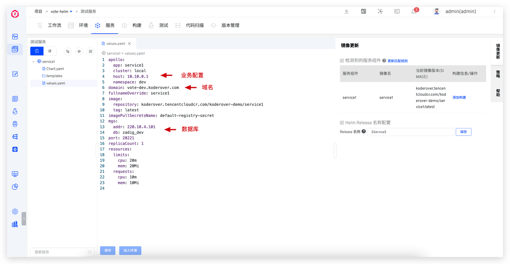
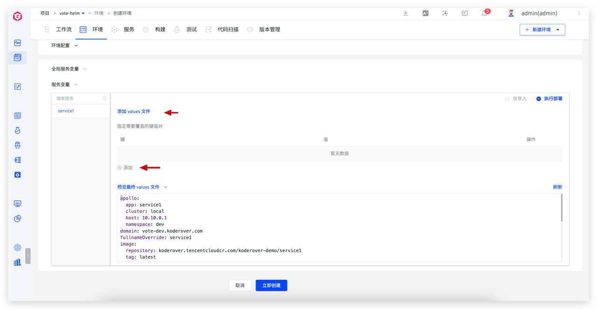
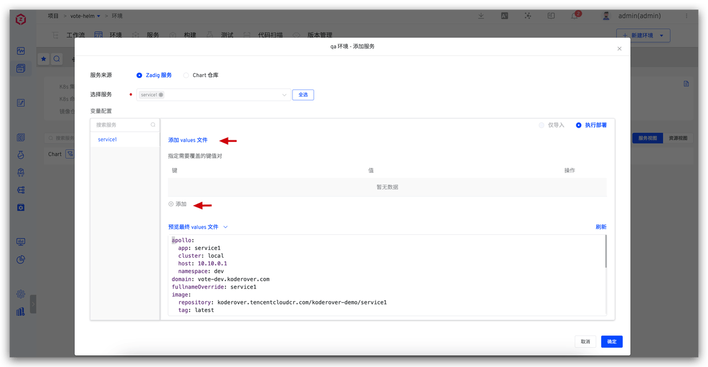
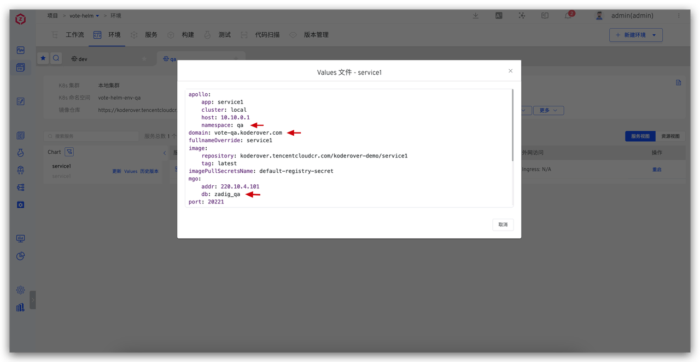
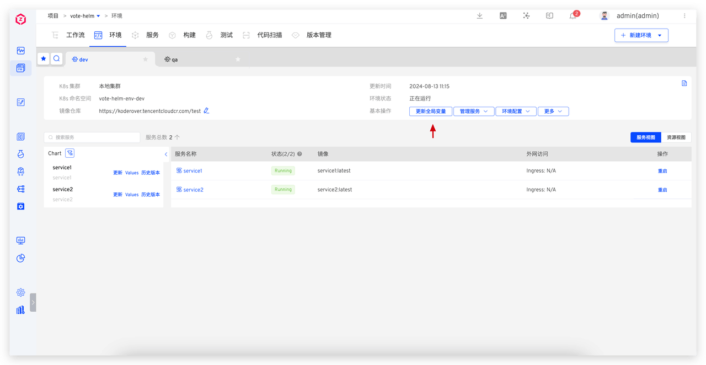
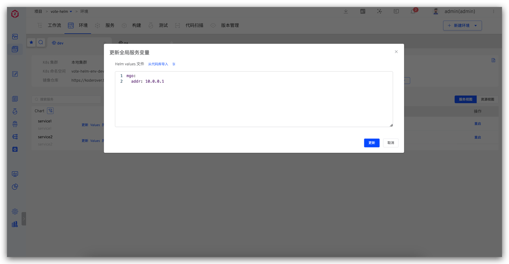

本文主要介绍如何使用 Zadig Helm Chart 项目服务管理的变量配置能力，通过一套配置，实现多环境的隔离以及全局配置管理：

- 定义 values 区分服务：
  - 数据库隔离：每个环境的业务数据独立存放在不同的数据库中，互不影响
  - 差异化域名访问：使用不同的域名地址访问不同的环境
  - 差异化业务配置：业务配置管理在 Nacos、Apollo 等配置中心，不同的环境使用不同的配置
- 全局管理共享配置：对多个服务共享的同一组配置进行全局管理

Zadig 提供了系统内置变量和自定义变量来区分不同环境的不同变量值。下面具体介绍以上配置在 Zadig 系统中的实践。

## 定义 values 区分服务

根据不同环境的需求，可以通过设定不同的 values 变量值来区分和配置服务。

### 定义 values 文件

针对数据库隔离、差异化域名访问、差异化业务配置场景，可以将数据库、域名、业务配置等信息定义成 values 文件中的变量。

### 使用 values 文件

新建环境或者添加服务到环境时，可以定义 values 中对应变量的值。

同一个服务在 dev 环境和 qa 环境的变量区分如下：

## 全局管理共享配置

在实际应用场景中，经常会遇到多个服务共享相同的数据库地址、配置管理系统地址等信息。为了有效管理这些共用的配置信息并简化后续的维护工作，我们可以采用「全局变量」来统一存储和管理这些变量。这样，一旦需要进行配置更新或变更，只需在全局变量中进行一次修改，即可实现对所有相关服务的同步更新，从而提高了管理效率并减少了出错的可能。

在修改全局变量后，系统会自动检测这些变化，并且所有依赖于这些全局变量的服务将自动进行相应的更新。

