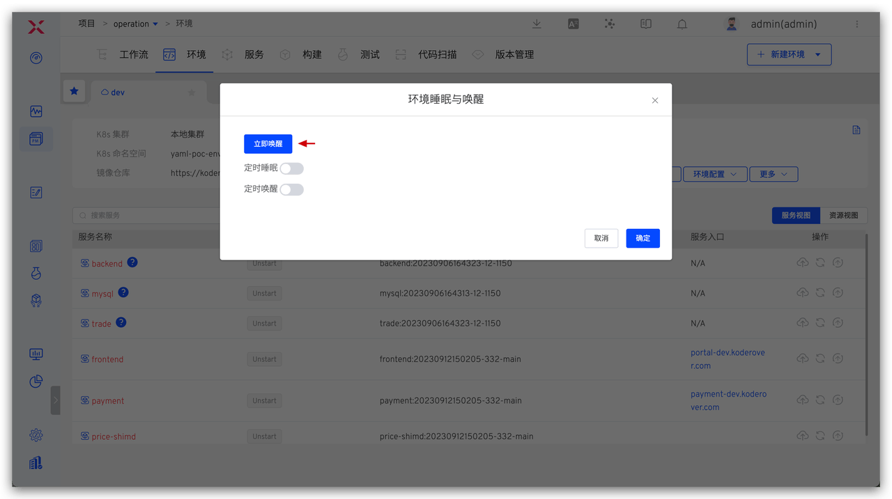
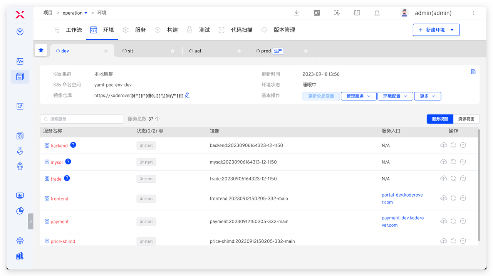

本文主要介绍如何配置和使用环境睡眠功能，以及效果的展示。

::: warning 注意
睡眠中的环境不可添加、更新服务。
:::

## 一键睡眠/唤醒

进入环境，点击睡眠与唤醒 → 立即睡眠即可将环境一键睡眠。

需要使用环境时，进入睡眠的环境，点击睡眠与唤醒 → 立即唤醒即可将环境唤醒恢复可用。

## 配置定时睡眠/唤醒

进入环境，点击睡眠与唤醒 → 配置定时睡眠和唤醒 Cron 表达式即可。

**示例配置**：每天 22:00 定时睡眠环境，每天 8:00 环境将定时唤醒恢复可用。

## 使用效果一览

### 睡眠效果

睡眠后，环境中所有服务实例副本数将会自动调整为 0，CronJob 会被挂起，节省环境所使用云资源成本。

### 唤醒效果

唤醒后，环境中的所有服务会根据服务编排顺序恢复到睡眠之前的状态。

