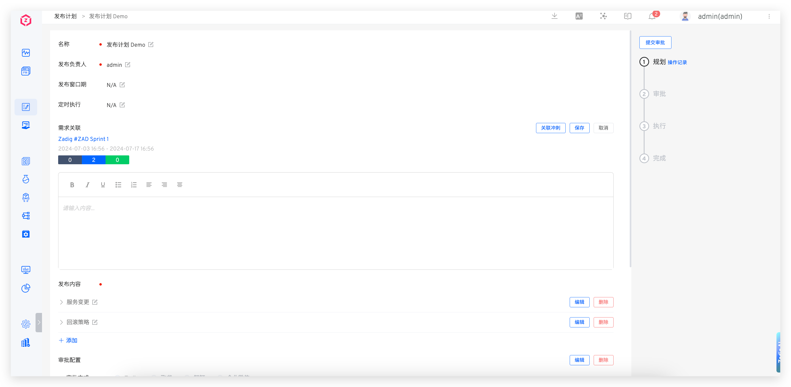
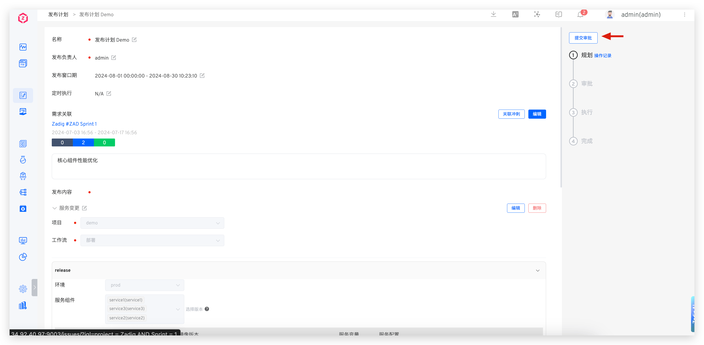
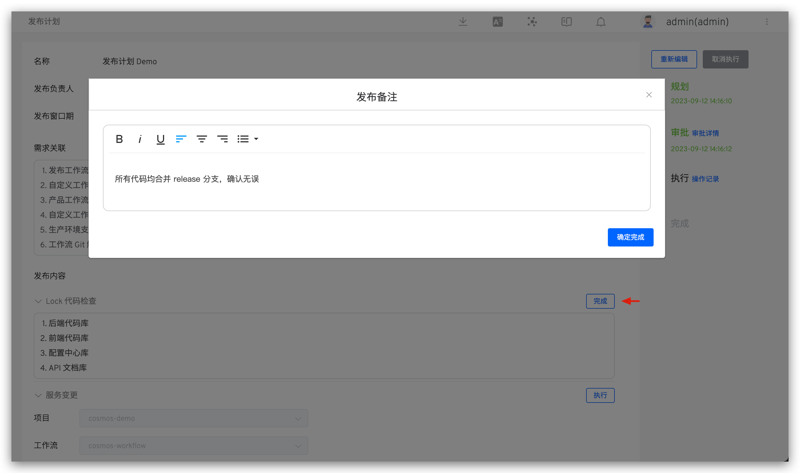
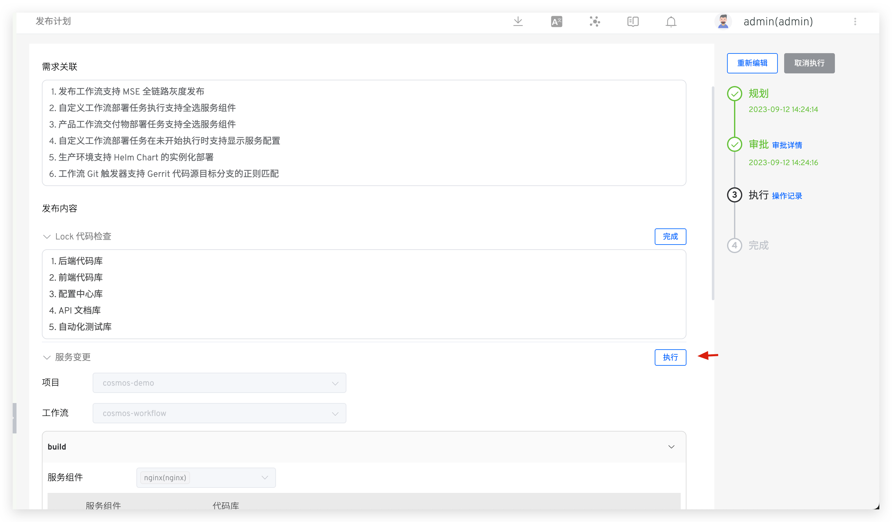
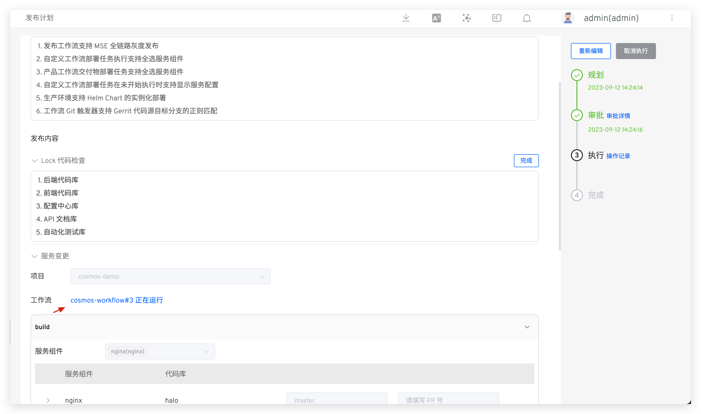
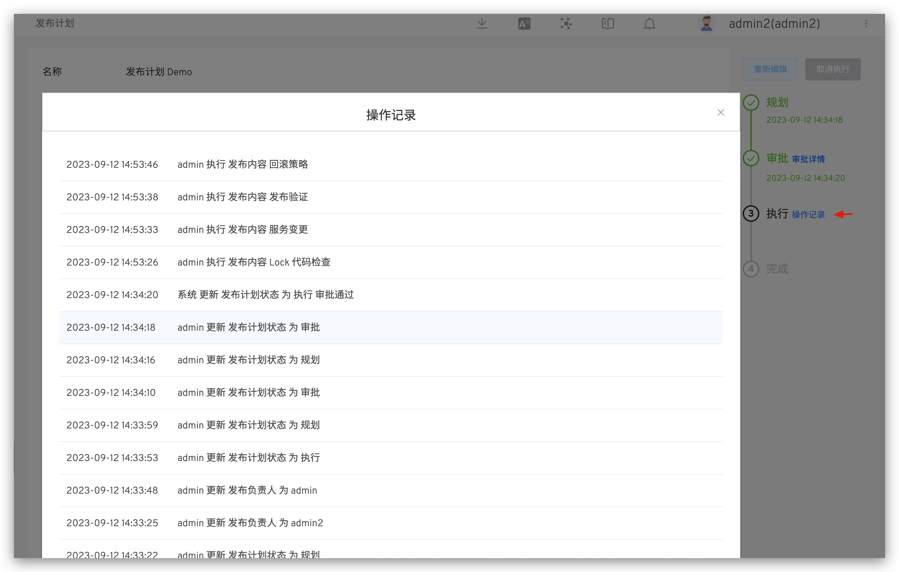

本文主要介绍如何使用 Zadig 的发布计划功能，包括发布计划的规划、审批和执行，以及追踪详细的操作记录。

## 规划
访问管理 -> 发布计划，新建发布计划并填写内容后保存草稿即可，支持多人协同合作规划发布计划。

参数说明：

- `名称`：发布计划名称
- `发布负责人`：负责此次发布的负责人，发布计划制定后，仅负责人可执行发布
- `发布窗口期`：可以进行发布操作的时间窗口
- `定时执行`：在指定时间执行发布项中的工作流
- `需求关联`：发布关联的需求清单，支持关联多个 JIRA 冲刺
- `发布内容`：具体的发布内容，可创建多个，包含富文本和工作流两种类型
    - `富文本类型`：输入内容
    - `工作流类型`：选择 Zadig 中的项目和工作流，按需配置工作流参数
- `审批配置`：按需配置审批，支持 Zadig、飞书、钉钉三种审批方式
    - `Zadig`：审批申请将会发送到 Zadig 账号对应的邮箱中，具体审批配置可参考文档 [Zadig 审批](/cn/Zadig%20v3.4/workflow/approval/#zadigx-审批/)
    - `飞书`：审批申请将会发送到飞书中，具体审批配置可参考文档 [飞书审批](/cn/Zadig%20v3.4/workflow/approval/飞书审批/)
    - `钉钉`：审批申请将会发送到钉钉中，具体审批配置可参考文档 [钉钉审批](/cn/Zadig%20v3.4/workflow/approval/钉钉审批/)

## 审批

> 适用于发布计划中包含审批配置的场景。

发布负责人提交审批后，由审批人负责审批。审批通过后发布负责人才可以操作发布。

::: tip
如果审批拒绝，可再次编辑发布计划的内容，重新规划发布计划。
:::

## 执行

::: tip
1. 在发布时间窗口内可操作执行。
2. 仅发布负责人可操作执行。
:::

对于富文本类型的发布内容，点击右侧的`完成`，输入发布备注即可。

对于工作流类型的发布内容，点击右侧的`执行`即可自动触发工作流执行，点击链接可跳转查看工作流执行详情。
<!-- 终版 ok 后再展开说明工作流执行参数 -->

对于需要跳过执行的发布项，可点`跳过`，所有发布项完成执行或者跳过，发布计划自动为完成。

## 操作记录

系统中详细记录了发布计划的操作日志，点击`操作记录`即可查看。

