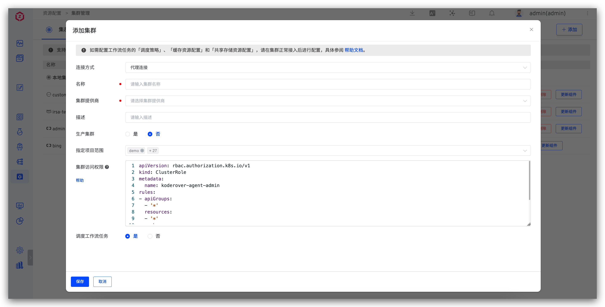
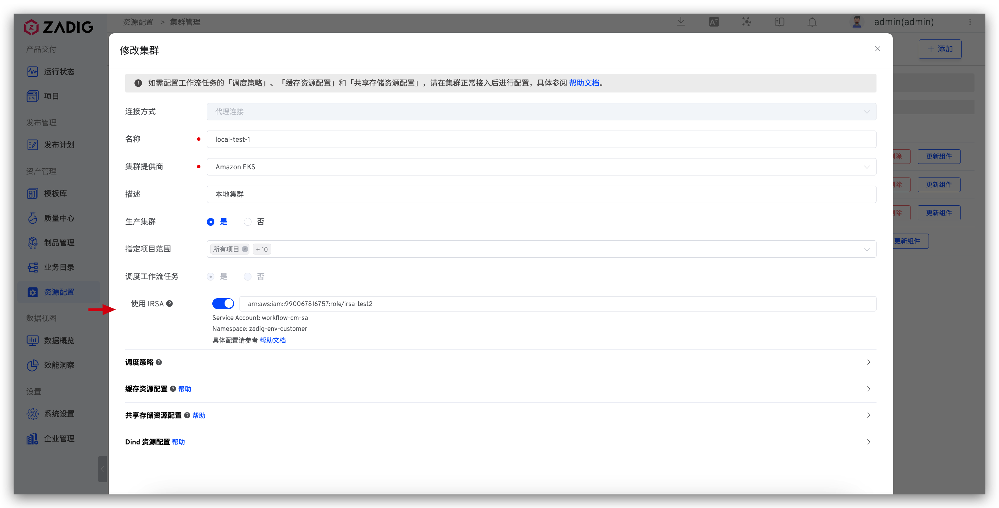
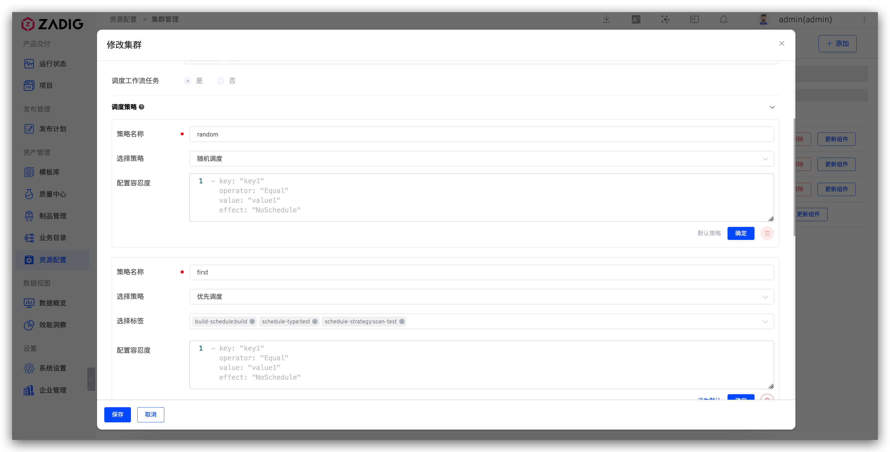
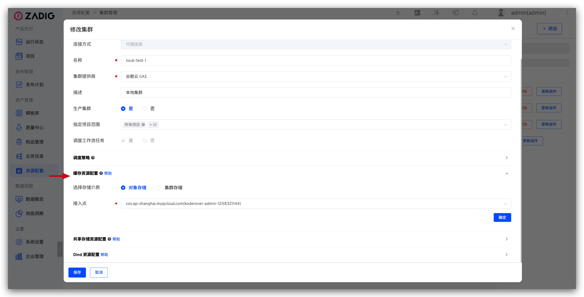
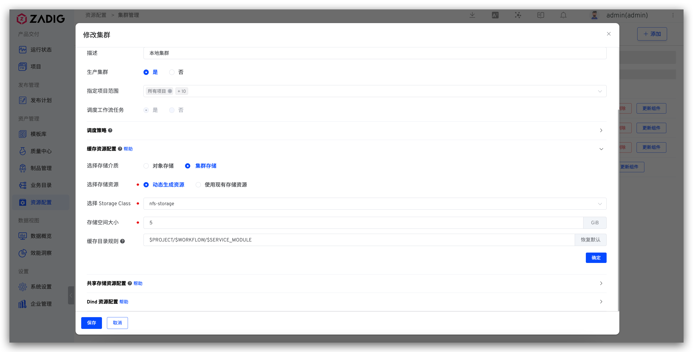
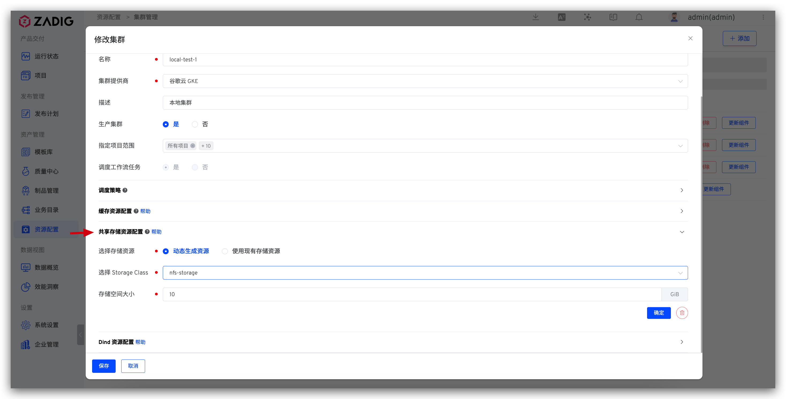
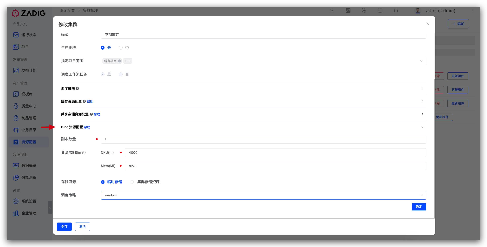

本文介绍如何在 Zadig 系统上进行多集群管理。Zadig 基于本地集群安装，同时支持外部多个 Kubernetes 集群资源的接入和使用。

## 添加集群

### 基础配置

访问 `资源配置` -> `集群管理`，点击 `添加`。



参数说明：

- `连接方式`：支持`代理连接`和`直接连接`两种方式，具体操作请参考 [代理连接方式](#代理连接)、[直接连接方式](#直接连接)。
- `名称`：集群名称只支持小写字母、数字和中划线。
- `集群提供商`：支持`阿里云 ACK`、`腾讯云 TKE`、`腾讯云 TKE Serverless`、`华为云 CCE`、`Amazon EKS`、`谷歌云 GKE`、`微软云 AKS` 和其他自建的 Kubernetes 集群。
- `描述`： 该集群的用途描述信息。
- `生产集群`：开启后，构建/测试/代码扫描/通用任务/自定义任务/灰度发布/istio 发布/蓝绿发布/金丝雀发布/更新 K8s YAML 任务/新建环境选择集群等均显示是否为生产。
- `KubeConfig`：待接入集群的 KubeConfig 配置文件内容，使用`直接连接`方式时需填写。
- `指定项目范围`：指定集群可被哪些项目使用，其中`所有项目`包括集群添加后，后续新建的项目。
- `调度工作流任务`：若选择`是`，则会在集群中安装工作流任务执行时需要的 dind 组件。

#### 代理连接
> 在外接集群中安装 Agent，适用场景：外接集群可以访问 Zadig 所在的集群。

选择`代理连接`方式填写集群基本信息后，在待接入集群中执行 Agent 安装脚本，如图所示：


脚本执行完毕后，刷新集群列表查看集群状态，状态正常即为接入成功。

#### 直接连接
> 需要外接集群的 admin 权限，在 Zadig 系统中配置其 KubeConfig，适用场景：Zadig 所在的集群可以访问外接集群。

选择`直接连接`方式填写集群基本信息及外接集群的 KubeConfig 内容后保存即可。

### 阿里云 ACK

添加集群，集群提供商选择 `阿里云 ACK`，其他配置参考[基础配置](#基础配置)中的描述。


### 腾讯云 TKE

添加集群，集群提供商选择 `腾讯云 TKE`，其他配置参考[基础配置](#基础配置)中的描述。


### 腾讯云 TKE Serverless

添加集群，集群提供商选择 `腾讯云 TKE Serverless`，其他配置参考[基础配置](#基础配置)中的描述。


### 华为云 CCE

添加集群，集群提供商选择 `华为云 CCE`，其他配置参考[基础配置](#基础配置)中的描述。


### Amazon EKS

> 仅支持代理连接方式。

添加集群，集群提供商选择 `Amazon EKS`，其他配置参考[基础配置](#基础配置)中的描述。


#### 使用 IRSA 配置

执行在 Amazon EKS 上的工作流任务支持使用 IRSA 方式与 AWS 交互，具体配置方式如下：

1. [为 Amazon EKS 集群创建 IAM OIDC 供应商](https://docs.aws.amazon.com/zh_cn/eks/latest/userguide/enable-iam-roles-for-service-accounts.html)：每个集群，只需创建一次。
2. [为 Kubernetes 服务账户分配 IAM 角色](https://docs.aws.amazon.com/zh_cn/eks/latest/userguide/associate-service-account-role.html)：获取 `role-arn`。
3. 将获得的 `role-arn` 配置到 Zadig 系统中：「集群配置」-「高级配置」开启「使用 IRSA」，配置 Role ARN 信息。



4. 配置工作流任务调度到对应的 Amazon EKS 集群上。

> 以上步骤 1 和 2 详细操作查阅 [Amazon EKS 官方文档](https://docs.aws.amazon.com/zh_cn/eks/latest/userguide/iam-roles-for-service-accounts.html)

### 微软云 AKS

添加集群，集群提供商选择 `微软云 AKS`，其他配置参考[基础配置](#基础配置)中的描述。


### 谷歌云 GKE

添加集群，集群提供商选择 `谷歌云 GKE`，其他配置参考[基础配置](#基础配置)中的描述。


### Oracle OKE

> 仅支持代理连接方式。

添加集群，集群提供商选择 `Oracle OKE`，其他配置参考[基础配置](#基础配置)中的描述。


### 标准 Kubernetes 集群

添加集群，集群提供商选择 `标准 Kubernetes 集群`，其他配置参考[基础配置](#基础配置)中的描述。


## 基本操作
- `断开`：断开集群操作并不会删除已经在集群中创建的环境资源，如需清理，请手动删除。集群断开后，可通过再次执行 Agent 安装脚本接入。
- `编辑`：可修改集群的基本信息及高级配置。
- `删除`：删除集群操作并不会删除已经在集群中创建的环境资源，如需清理，请手动删除。
- `更新 Agent`：更新 Zadig 系统在该集群中安装的 Agent，即：koderover-agent 命名空间下的 dind、koderover-agent 组件。

## 集群访问权限
对于代理连接接入的集群，支持在高级配置中设置 Zadig 访问集群的权限，修改配置后需要主动断开集群连接，并重新接入集群。

::: details 点击查看配置示例
```
apiVersion: rbac.authorization.k8s.io/v1
kind: ClusterRole
metadata:
  name: koderover-agent-admin
rules:
- apiGroups:
  - '*'
  resources:
  - '*'
  verbs:
  - '*'
- nonResourceURLs:
  - '*'
  verbs:
  - '*'
```
:::

## 设置调度策略

支持配置是否将工作流任务调度到集群上，并设置集群资源的调度策略，以执行工作流任务为例说明如下：

- `随机调度`：不需要指定标签，工作流任务将被随机调度在集群的任意节点上执行。
- `优先调度`：需要指定标签，工作流任务将被优先调度到符合标签的节点上执行，若节点资源无法满足调度需求，则该任务会被分配给其他节点。
- `强制调度`：需要指定标签，工作流任务将被调度到符合标签的节点上执行。
- `配置容忍度` ：容忍度（Toleration）应用于 Pod 上，允许调度器调度带有对应污点的 Pod，在文本框内可以进行容忍度配置，具体参数如下。
``` yaml
  — key: "key1"
    operator: "Equal"
    value: "value1"
    effect: "NoSchedule"
```

容忍度（Toleration） 是应用于 Pod 上的。容忍度允许调度器调度带有对应污点的 Pod。<br>
污点和容忍度互配合，可以更精细的将 Pod 分配到目标节点上。 每个节点上都可以应用一个或多个污点，如果 Pod 不能容忍这些污点，则不会被部署在该节点。需注意容忍度允许调度并不保证调度成功，除容忍度以外，调度器也会评估其他参数，详情可见：[污点和容忍度](https://kubernetes.io/zh-cn/docs/concepts/scheduling-eviction/taint-and-toleration/)。

::: tip
在工作流配置中支持指定集群调度策略，若不指定，则使用`默认`调度策略。
:::



## 缓存资源配置

可按需对不同集群资源配置缓存策略。

### 使用对象存储

将会使用已集成的对象存储来缓存资源，可在[对象存储管理](/cn/Zadig%20v3.4/settings/object-storage/)中集成对象存储。

::: tip
缓存的上传/下载受网络情况影响，使用对象存储作为缓存介质时并不一定能提高构建效率，更多最佳实践可参考：[Zadig 构建缓存配置指南](https://www.koderover.com/blog/build-cache/)。
:::



### 使用集群存储



可使用集群中已有的存储资源或按需动态创建资源。

**选择存储资源**

- `动态生成资源`：选择文件存储类型的 StorageClass 并指定动态生成的存储空间大小，注意：若使用腾讯云 cbs 作为 StorageClass，则有效的存储空间大小范围 (GiB)：[10, 32000]。
- `使用现有存储资源`：选择已有存储资源，注意：创建该存储资源的 PVC 中，accessModes 需要是 ReadWriteMany。

**缓存目录规则**

可设置缓存资源在集群存储中的存储目录相对路径规则，实现共享缓存，或者根据不同的项目/工作流/服务组件独享缓存。支持以下变量：

    $PROJECT：项目名称
    $WORKFLOW：工作流名称
    $SERVICE_MODULE：服务组件名称 (测试工作流中无此参数，对于测试工作流的缓存，该变量将被忽略)

举例说明如下：
| 缓存目录规则 | 说明 |
|---------------------------------------|--------------------------------------------------------------------------|
| `$PROJECT/$WORKFLOW/$SERVICE_MODULE`  | 为同一项目同一工作流中的服务组件单独设置独享缓存，不同服务组件之间互不干扰            |
| `$PROJECT/$WORKFLOW`                  | 同一项目下的同一工作流共享缓存；不同工作流之间独享缓存互不干扰                      |
| `$PROJECT/$SERVICE_MODULE`            | 同一项目下的相同服务组件共享缓存                                               |
| `$PROJECT`                            | 同一项目共享缓存；不同项目的缓存资源将存储在集群 PVC 的不同目录中，彼此独享缓存互不干扰 |
| `cache`                               | 缓存资源将存储在集群 `/<PVC 根目录>/cache` 目录下，所有项目共享使用缓存            |
|  无                                   | 缓存资源将存储在集群 `/<PVC 根目录>` 下 ，所有项目共享使用缓存                     |

:::tip
若修改了集群的缓存资源配置（比如`动态生成资源`修改为`使用现有存储资源`），则修改之前已缓存的资源在修改后将不再生效，会在新的存储资源下重新开始缓存。
:::

## 共享存储资源配置

### 如何配置
点击共享存储资源配置右侧的 `+` 配置存储资源。

- `动态生成资源`：选择文件存储类型的 StorageClass 并指定动态生成的存储空间大小，注意：若使用腾讯云 cbs 作为 StorageClass，则有效的存储空间大小范围 (GiB)：[10, 32000]。
- `使用现有存储资源`：选择已有存储资源，注意：创建该存储资源的 PVC 中，accessModes 需要是 ReadWriteMany。



### 如何使用
在工作流中使用共享存储资源，实现多个任务之间的存储资源共享，参考文档：[在工作流中配置共享存储](/cn/Zadig%20v3.4/project/common-workflow/#共享存储)。

## Dind 资源配置

配置集群的 Dind 组件相关部署信息。
- `副本数量`：默认为 1，可按需调整。设置多副本后，工作流任务会被尽可能打散调度到不同的 Dind 实例，避免因单个 Dind 实例承载过多的任务而增加失败概率。
- `资源限制`：CPU 默认为 4000m，Memory 默认为 8192Mi。
- `存储资源`：可用于存储镜像缓存等。当指定集群存储资源时，选择文件存储类型的 StorageClass 并指定动态生成的存储空间大小。
- `调度策略`：dind 组件调度策略，默认为随机调度。



## 集群使用

1. 在 Zadig 系统中接入外部集群后，便可以在该集群上创建新环境，并使用工作流对新环境进行更新操作，环境操作可参考 [新建环境](/cn/Zadig%20v3.4/project/env/k8s/#新建环境)。
2. 支持在指定集群上运行工作流/测试/代码扫描任务，在其高级配置中指定集群资源即可，参考文档（以构建示例）：[构建配置](/cn/Zadig%20v3.4/project/build/#高级配置)。
