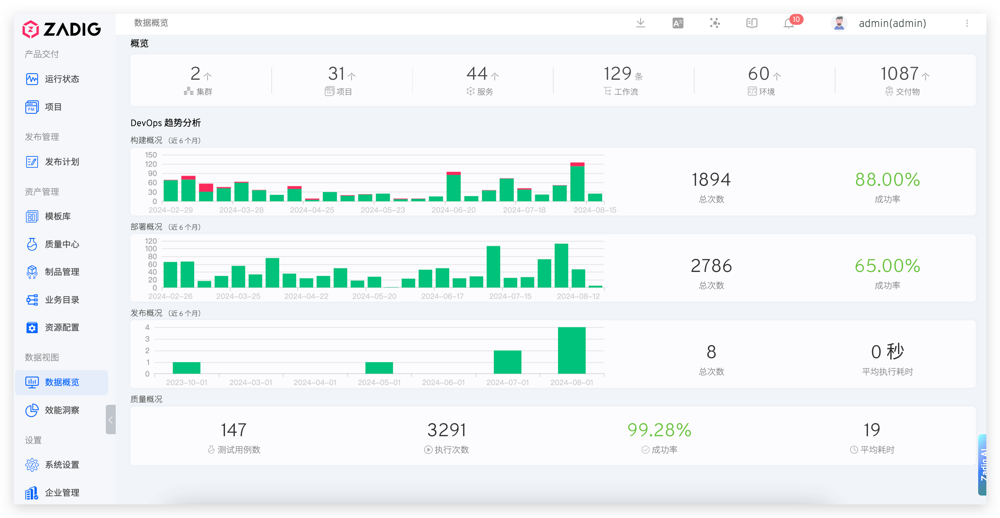

## 功能概述

数据概览提供系统整体的数据看板，帮助管理员和团队负责人快速了解 Zadig 平台的运行状况和项目交付情况。通过直观的图表和统计数据，可以从宏观角度分析企业内部项目的整体运行状况。

## 主要功能

### 系统资源统计
- **集群数量**：当前管理的 Kubernetes 集群总数
- **项目数量**：平台中创建的项目总数
- **微服务总数**：所有项目中的微服务数量
- **工作流总数**：平台中配置的工作流数量
- **环境总数**：所有项目的环境数量
- **交付物总数**：通过工作流产生的交付物数量

### 运行状况分析
- **构建数据**：近 6 个月构建任务运行概况，包括总运行次数和成功率
- **部署数据**：近 6 个月部署任务运行概况，包括总运行次数和成功率
- **发布数据**：近 6 个月发布任务运行概况，包括总运行次数和成功率
- **质量测试数据**：近 6 个月测试任务运行概况，包括总运行次数和成功率

## 使用场景

1. **系统监控**：定期查看系统整体运行状况，及时发现异常
2. **容量规划**：根据资源使用情况，合理规划系统扩容
3. **效能评估**：通过成功率等指标评估团队和系统的效能
4. **趋势分析**：观察各项指标的变化趋势，为改进提供数据支撑

## 界面展示

从这些客观数据中可以分析出企业内部项目整体的运行状况。