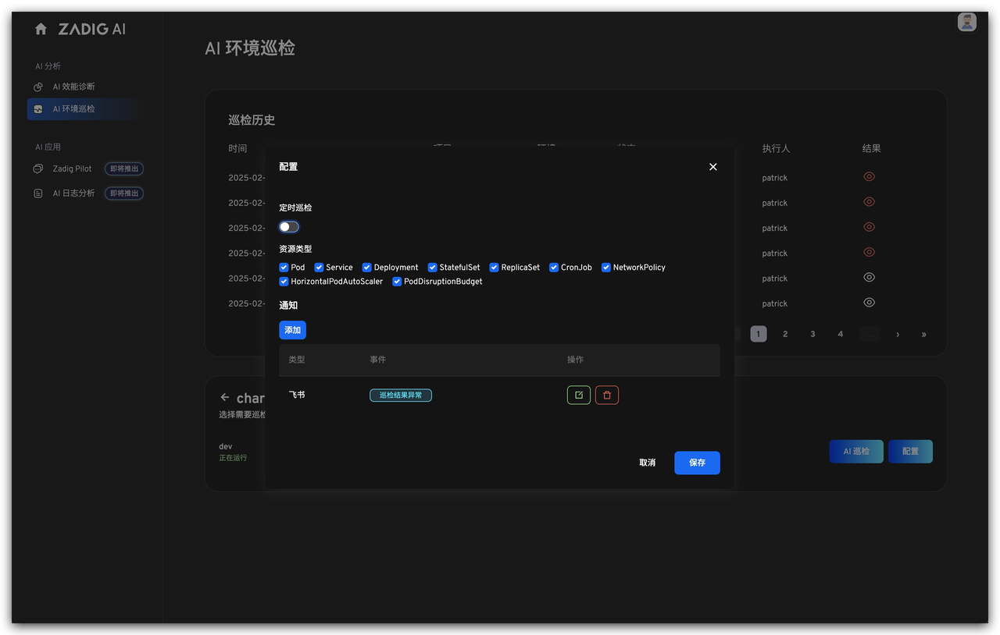
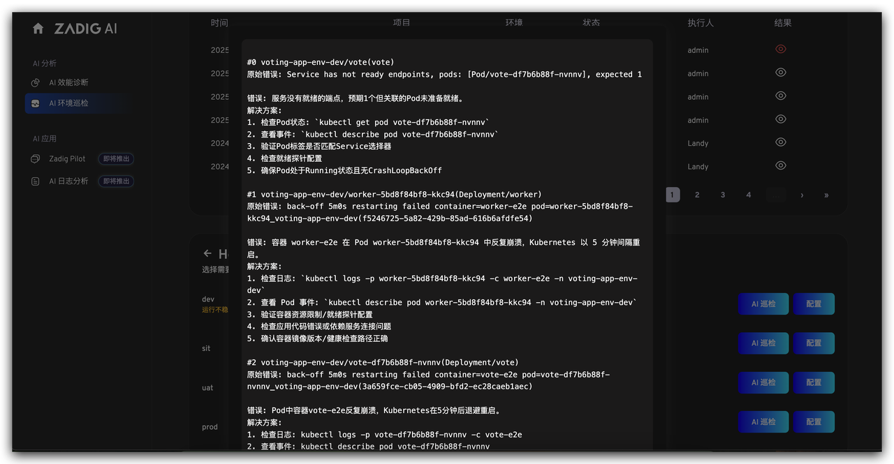
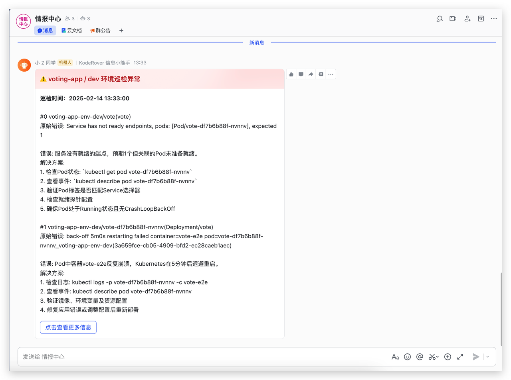

面对复杂的 Kubernetes 生产环境，传统人工巡检耗时费力，且难以覆盖潜在风险。Zadig 的 AI 环境巡检功能，通过定时巡检与智能告警，确保环境稳定性。

场景价值：
- 无需手动巡检，AI 自动完成环境健康检查，大幅降低人力成本。
- 通过即时告警，团队可快速响应环境问题，避免小问题演变为大故障。

## 定时自动巡检

AI 定期对 Kubernetes 环境进行全方位检查，覆盖资源状态、服务健康度等关键指标。

## 智能问题识别

自动识别常见环境问题，如 Pod 异常、资源不足、配置错误等，并给出相应的解决方案。

## 告警推送

巡检结果通过 IM 工具（如飞书、钉钉、企业微信等）实时通知相关责任人，确保问题第一时间被处理。

