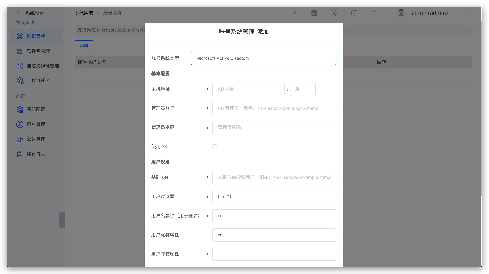
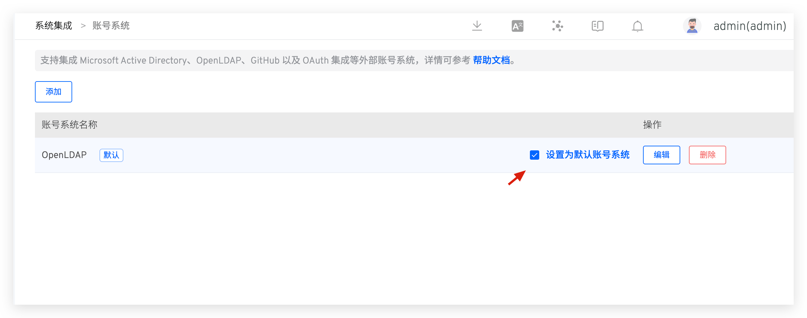
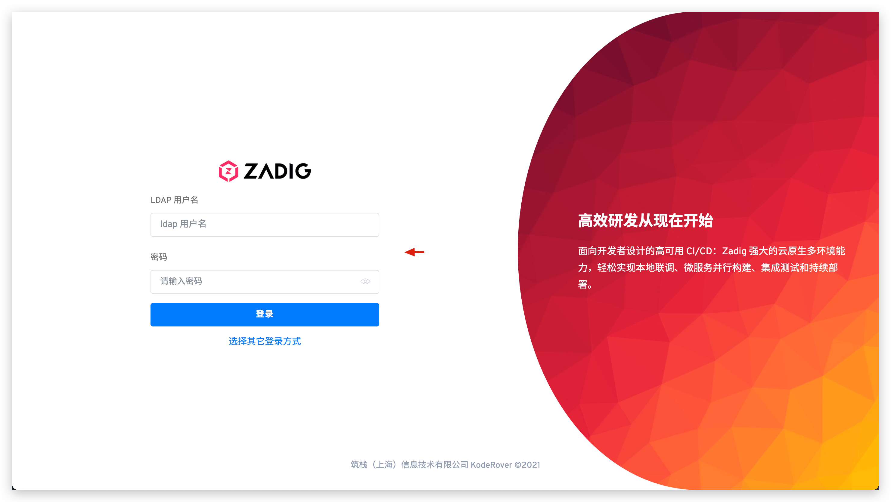

LDAP（Lightweight Directory Access Protocol - 轻量目录访问协议）是一个 Web 应用程序的网络协议，可以从 LDAP 服务上访问和查找用户和用户组信息。
集成 LDAP 目录服务器到 Zadig 后，可实现用户和用户组的同步。目前支持主流的 LDAP 目录服务器：

- Microsoft Active Directory
- OpenLDAP

## 如何集成

**配置说明：**

1. 管理员访问 `系统设置` -> `系统集成` -> `账号系统`，进入账号系统集成页面。
2. 点击添加按钮，选择一个账号系统类型：
    - Microsoft Active Directory
    - OpenLDAP
3. 根据参数配置，输入需要配置的参数
4. 保存设置

**参数说明：**
| 参数名             | 描述 |
|-------------------|----------|
| 账户类型           | 选择你将要连接的 LDAP 目录服务器类型。  |
| 主机地址            | 目录服务器的主机名。例如：  ad.example.com  ldap.example.com  opends.example.com  |
| 端口               | 你目录服务器正在监听的端口。例如：   389  10389   636（针对 SSL） |
| 管理员账号            | 注意区分该用户名和 Zadig 用户名，该用户名被用来连接目录服务器。例如：  cn=administrator,cn=users,dc=ad,dc=example,dc=com   cn=user,dc=domain,dc=name   user@domain.name |
| 管理员密码               | 上述指定连接目录服务器用户的密码。 |
| 使用 SSL           | 如果目录服务器使用了 SSL（Secure Sockets Layer），则需要勾选这个选项。  备注：如果希望使用这个选项，你需要配置 SSL 证书。  |
|**用户规则**||
| 基础 DN | 根专有名称（DN）将会在你在目录服务器上运行查询的时候使用到。例如：  o=example,c=com   cn=users,dc=ad,dc=example,dc=com  针对 Microsoft Active Directory，使用下面的格式来指定基本 DN：  dc=domain1,dc=local   可以根据实际的需求配置来修改 domain1 和 local。  与此同时 Microsoft Server 提供了一个名为 ldp.exe 工具，管理员可以使用该工具在 LDAP 服务器上进行查找和配置。 |
| 用户过滤器         | 用户过滤器，关于 LDAP Filter 请参考 [https://ldap.com/ldap-filters/](https://ldap.com/ldap-filters/)|
| 用户名属性（用于登录）|用于登录的用户名称属性|
| 用户昵称属性|用户昵称属性，选填|
| 用户邮箱属性|用户邮箱属性|
|**组规则**||
| 组基础 DN | 根专有名称（DN）将会在你在目录服务器上运行查询的时候使用到。 |
| 组过滤器   | 组过滤器，关于 LDAP Filter 请参考 [https://ldap.com/ldap-filters/](https://ldap.com/ldap-filters/)|  
| 组名称属性 | 组名称属性 |

::: tip 扩展阅读
- LDAP 配置无误后，登录 Zadig 即可将对应 LDAP 账号同步到 Zadig 系统中
- 在 Zadig 上删除 LDAP 账号会清理其在 Zadig 系统中的权限，但并不会同步删除 LDAP 系统中的数据
:::

## [可选]设置为默认账号系统
账号系统集成成功后，可将其设置为默认账号系统。

设置后，将会使用默认账号系统对应的登录页作为系统默认登录页。

::: tip
- 若修改了默认账号系统后，对应的账号系统不可用或者忘记该系统中登录账号信息导致无法成功登入 Zadig，可通过快速访问 `{Zadig 安装地址}/login/password`，并使用在 Zadig 系统中创建的管理员账号和密码登录即可。
- 若安装 Zadig 系统时未修改，则默认的管理员账号/密码为 `admin`/`Zadig123`。
:::
