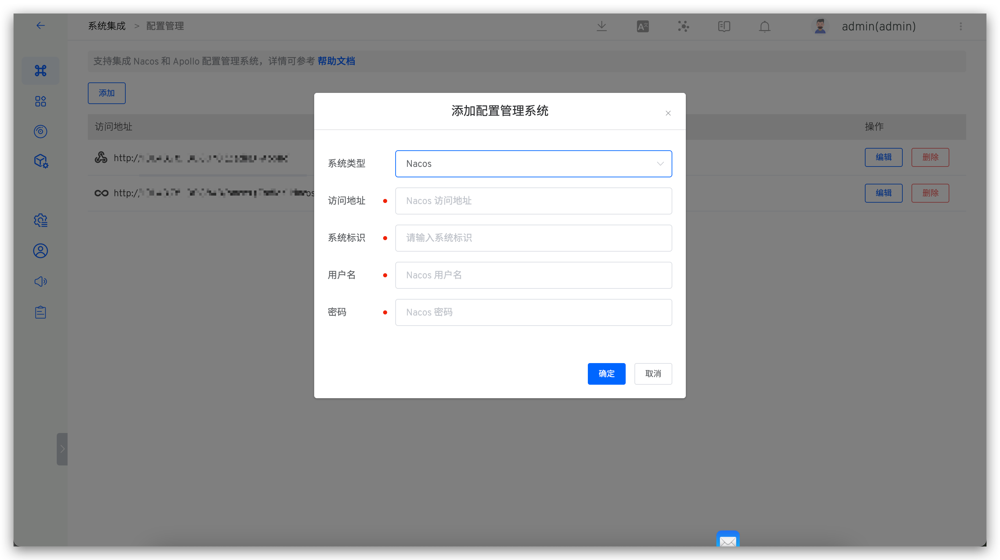

本文主要介绍如何在 Zadig 中集成和使用 Nacos，实现高效稳定的配置变更管理。

## 如何集成

访问 `系统设置`-> `系统集成` -> `配置管理`，添加 Nacos 配置并通过系统连通性校验即可。

参数说明：

- `系统类型`：选择 `Nacos`
- `访问地址`：企业内部 Nacos 系统的地址，比如：`https://nacos.koderover.com`
- `系统标识`：自定义，方便在 Zadig 系统中快速识别，系统标识信息需唯一
- `用户名`：登录 Nacos 系统的账号用户名
- `密码`：登录 Nacos 系统的账号密码

## 如何使用

在自定义工作流中编排 Nacos 配置变更任务即可实现 Nacos 配置自动变更，参考文档：[Nacos 配置变更](/cn/Zadig%20v3.4/project/workflow-jobs/#nacos-配置变更)。
