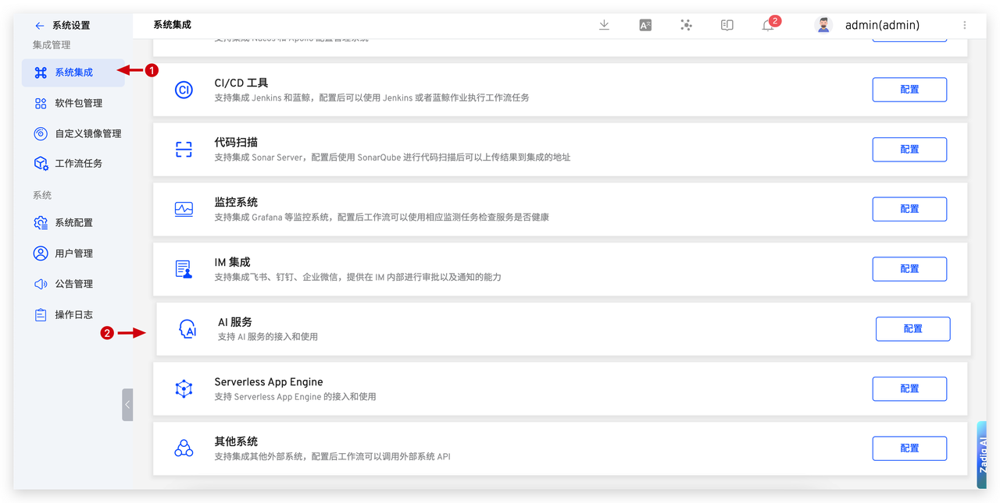
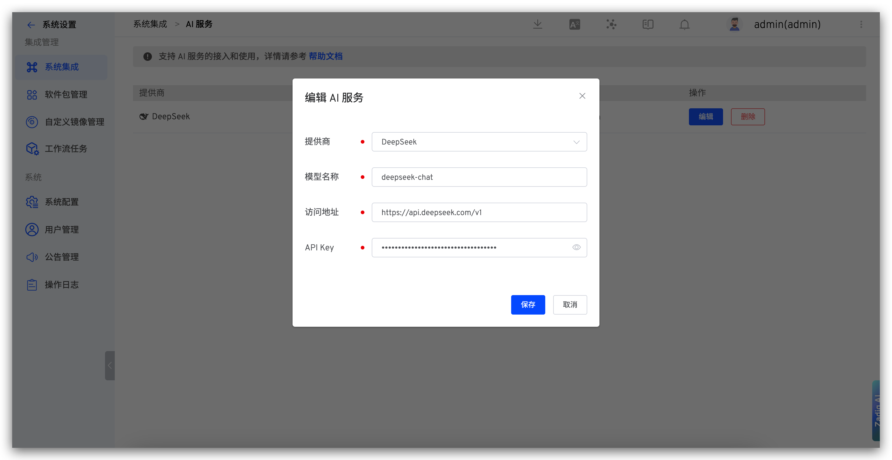
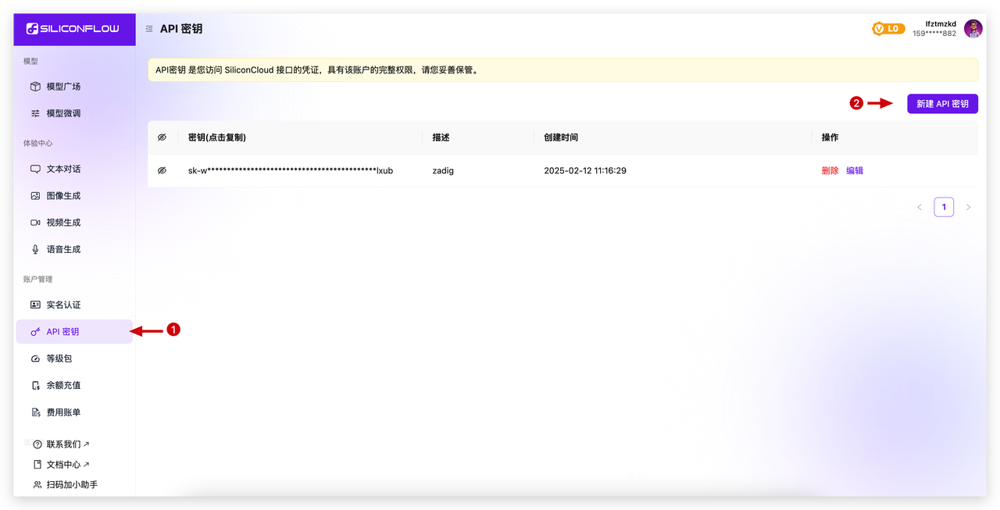
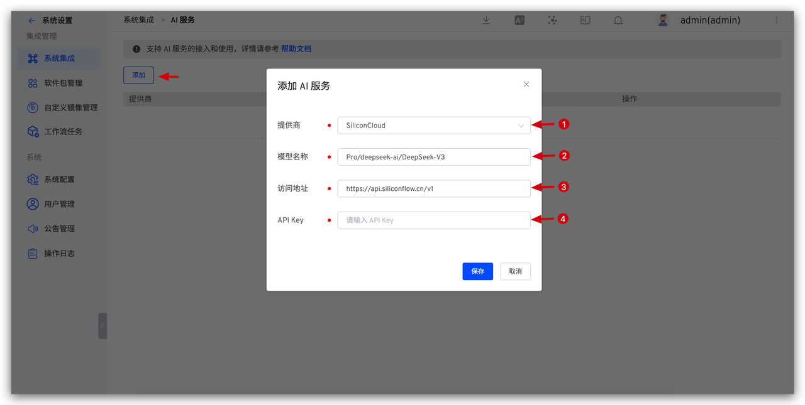

本文介绍在 Zadig 系统上集成 AI 服务。

主要应用场景：
- AI 效能诊断
- AI 环境巡检
- AI Pilot

## DeepSeek

1. 在 DeepSeek 上完成注册，生成 [API Key](https://platform.deepseek.com/api_keys)，创建新的 API Key 并复制。

2. 在 Zadig 上，访问`系统设置` -> `系统集成` -> `AI 服务`，添加 DeepSeek AI 服务。

**参数说明：**

1. 提供商：选择 DeepSeek
2. 模型名称：输入 DeepSeek 上提供的模型
3. 访问地址：https://api.deepseek.com/v1
4. API Key：上一步中获取的 API Key

## SiliconCloud

1. 在 SiliconCloud 上完成注册，生成 [API 密钥](https://cloud.siliconflow.cn/account/ak)，创建新的 API 密钥并复制。

2. 在 Zadig 上，访问 `系统设置` -> `系统集成`  -> `AI 服务`，添加 AI 服务。

**参数说明：**

1. 提供商：选择 SiliconCloud
2. 模型名称：输入 SiliconCloud 上提供的模型
3. 访问地址：https://api.siliconflow.cn/v1
4. API Key：上一步中获取的 API 密钥