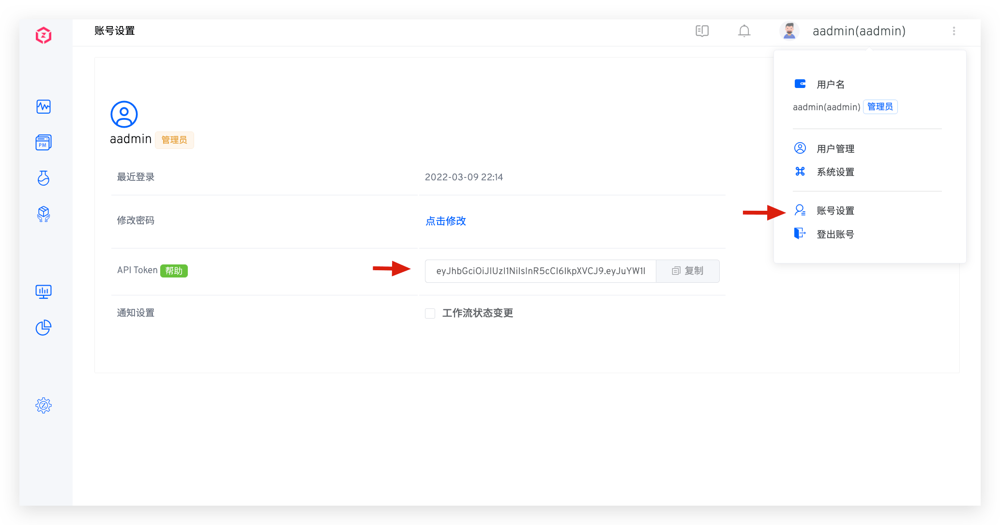

除了支持 Zadig 基础版 API 以外，还提供更多扩展 API 的支持，帮助开发者对接企业内部系统。如有更多需要，请[联系官方](https://www.koderover.com/contacts)以获取更多支持。

## API 调用方式

**第一步：获取 API Token**

点击右上角用户，在菜单中选择 `账号设置`，复制 API Token。



**第二步：调用 API**

在请求的 HTTP Header 中，加入指定的 Authorization 信息，即可在 HTTP Client 中调用 Zadig API，示例如下：

> 提示：示例中的 `yours.zadig.com` 是 Zadig 系统访问地址，请求前请视实际情况替换。

``` bash
curl -H 'Authorization: Bearer your-token' http://yours.zadig.com/api/aslan/system/notification/subscribe
```

## API 概览
### 项目

| API 功能描述           | API 链接                                                                                      |
| :--------------------- | :-------------------------------------------------------------------------------------------- |
| 创建空项目             | [POST /openapi/projects/project](/cn/Zadig%20v3.4/api/project/#创建项目)                         |
| 创建 YAML 项目并初始化 | [POST /openapi/projects/project/init/yaml](/cn/Zadig%20v3.4/api/project/#创建-yaml-项目并初始化) |
| 创建 Helm 项目并初始化 | [POST /openapi/projects/project/init/helm](/cn/Zadig%20v3.4/api/project/#创建-helm-项目并初始化) |
| 获取项目列表           | [GET /openapi/projects/project](/cn/Zadig%20v3.4/api/project/#获取项目列表)                      |
| 获取指定项目详情       | [GET /openapi/projects/project/detail](/cn/Zadig%20v3.4/api/project/#获取指定项目详情)           |
| 删除项目               | [DELETE /openapi/projects/project](/cn/Zadig%20v3.4/api/project/#删除项目)                       |

### 工作流
| 模块       | API 功能描述       | API 链接                                                                                                |
| :--------- | :----------------- | :------------------------------------------------------------------------------------------------------ |
| 工作流     | 获取工作流列表     | [GET /openapi/workflows](/cn/Zadig%20v3.4/api/workflow/#获取工作流列表)                                    |
|            | 获取工作流详情     | [GET /openapi/workflows/custom/:workflowKey/detail](/cn/Zadig%20v3.4/api/workflow/#获取工作流详情)         |
|            | 获取工作流任务列表 | [GET /openapi/workflows/custom/:workflowName/tasks](/cn/Zadig%20v3.4/api/workflow/#获取工作流任务列表)     |
|            | 获取工作流任务详情 | [GET /openapi/workflows/custom/task](/cn/Zadig%20v3.4/api/workflow/#获取工作流任务详情)                    |
|            | 执行工作流         | [POST /openapi/workflows/custom/task](/cn/Zadig%20v3.4/api/workflow/#执行工作流)                           |
|            | 取消工作流任务     | [DELETE /openapi/workflows/custom/task](/cn/Zadig%20v3.4/api/workflow/#取消工作流任务)                     |
|            | 重试工作流任务     | [POST /openapi/workflows/custom/:workflowName/task/:taskID](/cn/Zadig%20v3.4/api/workflow/#重试工作流任务) |
|            | 审批工作流         | [POST /openapi/workflows/custom/task/approve](/cn/Zadig%20v3.4/api/workflow/#审批工作流)                   |
|            | 创建工作流         | [POST /api/aslan/workflow/v4](/cn/Zadig%20v3.4/api/workflow/#创建工作流)                                   |
|            | 更新工作流         | [PUT /api/aslan/workflow/v4/:name](/cn/Zadig%20v3.4/api/workflow/#更新工作流)                              |
|            | 删除工作流         | [DELETE /openapi/workflows/custom](/cn/Zadig%20v3.4/api/workflow/#删除工作流)                              |
| 工作流视图 | 获取工作流视图列表 | [GET /openapi/workflows/view](/cn/Zadig%20v3.4/api/workflow/#获取工作流视图列表)                           |
|            | 创建工作流视图     | [POST /openapi/workflows/view](/cn/Zadig%20v3.4/api/workflow/#创建工作流视图)                              |
|            | 编辑工作流视图     | [PUT /openapi/workflows/view/:viewName](/cn/Zadig%20v3.4/api/workflow/#编辑工作流视图)                     |
|            | 删除工作流视图     | [DELETE /openapi/workflows/view/:viewName](/cn/Zadig%20v3.4/api/workflow/#删除工作流视图)                  |

### 环境

| 模块         | API 功能描述                 | API 链接                                                                                                                                                                                                                                         |
| :----------- | :--------------------------- | :----------------------------------------------------------------------------------------------------------------------------------------------------------------------------------------------------------------------------------------------- |
| 环境增删改查 | 查看环境列表                 | 测试环境：[GET /openapi/environments](/cn/Zadig%20v3.4/api/env/#测试环境)<br>生产环境：[GET /openapi/environments/production](/cn/Zadig%20v3.4/api/env/#生产环境)                                                                                      |  |
|              | 查看环境详情                 | 测试环境：[GET /openapi/environments/:envName](/cn/Zadig%20v3.4/api/env/#测试环境-2)<br>生产环境：[GET /openapi/environments/production/:envName](/cn/Zadig%20v3.4/api/env/#生产环境-2)                                                                |
|              | 查看环境服务详情             | 测试环境：[GET /openapi/environments/:envName/services/:serviceName](/cn/Zadig%20v3.4/api/env/#测试环境-3)<br>生产环境：[GET /openapi/environments/production/:envName/services/:serviceName](/cn/Zadig%20v3.4/api/env/#生产环境-3)                    |
|              | 新建环境                     | 测试环境：[POST /openapi/environments](/cn/Zadig%20v3.4/api/env/#测试环境-4)<br>生产环境：[POST /openapi/environments/production](/cn/Zadig%20v3.4/api/env/#生产环境-4)                                                                                |
|              | 编辑环境                     | 测试环境：[PUT /openapi/environments/:envName](/cn/Zadig%20v3.4/api/env/#测试环境-5)<br>生产环境：[PUT /openapi/environments/production/:envName](/cn/Zadig%20v3.4/api/env/#生产环境-5)                                                                |
|              | 删除环境                     | 测试环境：[DELETE /openapi/environments/:envName](/cn/Zadig%20v3.4/api/env/#测试环境-6)<br>生产环境：[DELETE /openapi/environments/production/:envName](/cn/Zadig%20v3.4/api/env/#生产环境-6)                                                          |
|              | 列出事件                     | [GET /openapi/environments/kube/events](/cn/Zadig%20v3.4/api/env/#列出事件)                                                                                                                                                                         |
| 管理服务     | 添加服务                     | 测试环境：[POST /openapi/environments/service/yaml](/cn/Zadig%20v3.4/api/env/#测试环境-7)<br>生产环境：[POST /openapi/environments/production/service/yaml](/cn/Zadig%20v3.4/api/env/#生产环境-7)                                                      |
|              | 更新服务                     | 测试环境：[PUT /openapi/environments/service/yaml](/cn/Zadig%20v3.4/api/env/#测试环境-8)<br>生产环境：[PUT /openapi/environments/production/service/yaml](/cn/Zadig%20v3.4/api/env/#生产环境-8)                                                        |
|              | 删除服务                     | 测试环境：[DELETE /openapi/environments/service/yaml](/cn/Zadig%20v3.4/api/env/#测试环境-9)<br>生产环境：[DELETE /openapi/environments/production/service/yaml](/cn/Zadig%20v3.4/api/env/#生产环境-9)                                                  |
| 环境配置     | 添加环境配置                 | 测试环境：[POST /openapi/environments/:envName/envcfgs](/cn/Zadig%20v3.4/api/env/#测试环境-12)<br>生产环境：[POST /openapi/environments/production/:envName/envcfgs](/cn/Zadig%20v3.4/api/env/#生产环境-12)                                            |
|              | 查看环境配置列表             | 测试环境：[GET /openapi/environments/:envName/envcfgs](/cn/Zadig%20v3.4/api/env/#测试环境-13)<br>生产环境：[GET /openapi/environments/production/:envName/envcfgs](/cn/Zadig%20v3.4/api/env/#生产环境-13)                                              |
|              | 查看环境配置详情             | 测试环境：[GET /openapi/environments/:envName/envcfgs](/cn/Zadig%20v3.4/api/env/#测试环境-14)<br>生产环境：[GET /openapi/environments/production/:envName/envcfgs](/cn/Zadig%20v3.4/api/env/#生产环境-14)                                              |
|              | 更新环境配置                 | [PUT /openapi/environments/envcfgs](/cn/Zadig%20v3.4/api/env/#更新环境配置)                                                                                                                                                                         |
|              | 删除环境配置                 | 测试环境：[DELETE /openapi/environments/:envName/envcfgs](/cn/Zadig%20v3.4/api/env/#测试环境-15)<br>生产环境：[DELETE /openapi/environments/production/:envName/envcfgs](/cn/Zadig%20v3.4/api/env/#生产环境-15)                                        |
| 全局变量     | 查看全局变量                 | 测试环境：[GET /openapi/environments/:envName/variable](/cn/Zadig%20v3.4/api/env/#测试环境-10)<br>生产环境：[GET /openapi/environments/production/:envName/variable](/cn/Zadig%20v3.4/api/env/#生产环境-10)                                            |
|              | 更新全局变量                 | 测试环境：[PUT /openapi/environments/:envName/variable](/cn/Zadig%20v3.4/api/env/#测试环境-11)<br>生产环境：[PUT /openapi/environments/production/:envName/variable](/cn/Zadig%20v3.4/api/env/#生产环境-11)                                            |
| 服务实例     | 调整副本数                   | [POST /openapi/environments/scale](/cn/Zadig%20v3.4/api/env/#调整服务实例副本数)                                                                                                                                                                    |
|              | 重启服务实例                 | 测试环境：[POST /openapi/environments/:envName/service/:serviceName/restart](/cn/Zadig%20v3.4/api/env/#测试环境-16) <br>生产环境：[POST /openapi/environments/production/:envName/service/:serviceName/restart](/cn/Zadig%20v3.4/api/env/#生产环境-16) |  |
| 更新镜像     | 更新 Deployment 镜像         | [POST /openapi/environments/image/deployment/:envName](/cn/Zadig%20v3.4/api/env/#更新-deployment-镜像)                                                                                                                                              |
|              | 更新 Statefulset 镜像        | [POST /openapi/environments/image/statefulset/:envName](/cn/Zadig%20v3.4/api/env/#更新-statefulset-镜像)                                                                                                                                            |
|              | 更新 Cronjob 镜像            | [POST /openapi/environments/image/cronjob/:envName](/cn/Zadig%20v3.4/api/env/#更新-cronjob-镜像)                                                                                                                                                    |
| 子环境       | 检查 Workload 的 K8S Service | [GET /openapi/environments/:envName/check/workloads/k8sservices](/cn/Zadig%20v3.4/api/env/#检查-workload-的-k8s-service)                                                                                                                            |
|              | 开启子环境                   | [POST /openapi/environments/:envName/share/enable](/cn/Zadig%20v3.4/api/env/#开启子环境)                                                                                                                                                            |
|              | 关闭子环境                   | [DELETE /openapi/environments/:envName/share/enable](/cn/Zadig%20v3.4/api/env/#关闭子环境)                                                                                                                                                          |
|              | 检查子环境 Ready             | [GET /openapi/environments/:name/check/sharenv/:op/ready](/cn/Zadig%20v3.4/api/env/#检查子环境-ready)                                                                                                                                               |
|              | 获取入口服务                 | [GET /openapi/environments/:name/share/portal/:serviceName](/cn/Zadig%20v3.4/api/env/#获取入口服务)                                                                                                                                                 |
|              | 设置入口服务                 | [POST /openapi/environments/:name/share/portal/:serviceName](/cn/Zadig%20v3.4/api/env/#设置入口服务)                                                                                                                                                |
| 日志         | 查看容器实时日志             | [GET /openapi/logs/sse/pods/:podName/containers/:containerName](/cn/Zadig%20v3.4/api/env/#查看容器实时日志)                                                                                                                                         |

### 服务

| API 功能描述         | API 链接                                                                                                                                                                                                            |
| :------------------- | :------------------------------------------------------------------------------------------------------------------------------------------------------------------------------------------------------------------ |
| 获取服务列表         | 测试服务：[GET /openapi/service/yaml/services](/cn/Zadig%20v3.4/api/service/#测试服务) <br> 生产服务：[GET /openapi/service/yaml/production/services](/cn/Zadig%20v3.4/api/service/#生产服务)                             |
| 获取服务详情         | 测试服务：[GET /openapi/service/yaml/:serviceName](/cn/Zadig%20v3.4/api/service/#测试服务-2)<br>生产服务：[GET /openapi/service/yaml/production/:serviceName](/cn/Zadig%20v3.4/api/service/#生产服务-2)                   |
| 新建服务（使用模板） | 测试服务：[POST /openapi/service/template/load/yaml](/cn/Zadig%20v3.4/api/service/#测试服务-3)<br>生产服务：[POST /openapi/service/template/production/load/yaml](/cn/Zadig%20v3.4/api/service/#生产服务-3)               |
| 新建服务（手动输入） | 测试服务：[POST /openapi/service/yaml/raw](/cn/Zadig%20v3.4/api/service/#测试服务-5)<br>生产服务：[POST /openapi/service/yaml/production/raw](/cn/Zadig%20v3.4/api/service/#生产服务-4)                                   |
| 更新服务配置         | 测试服务：[PUT /openapi/service/yaml/:serviceName](/cn/Zadig%20v3.4/api/service/#测试服务-5)<br>生产服务：[PUT /openapi/service/yaml/production/:serviceName](/cn/Zadig%20v3.4/api/service/#生产服务-5)                   |
| 更新服务变量         | 测试服务：[PUT /openapi/service/yaml/:serviceName/variable](/cn/Zadig%20v3.4/api/service/#测试服务-6)<br>生产服务：[PUT /openapi/service/yaml/production/:serviceName/variable](/cn/Zadig%20v3.4/api/service/#生产服务-6) |
| 删除服务             | 测试服务：[DELETE /openapi/service/yaml/:serviceName](/cn/Zadig%20v3.4/api/service/#测试服务-7)<br>生产服务：[DELETE /openapi/service/yaml/production/:serviceName](/cn/Zadig%20v3.4/api/service/#生产服务-7)             |

### 构建

| API 功能描述         | API 链接                                                                      |
| :------------------- | :---------------------------------------------------------------------------- |
| 使用构建模板创建构建 | [POST /openapi/build](/cn/Zadig%20v3.4/api/build/#从模板创建构建)                |
| 查询构建列表         | [GET /openapi/build](/cn/Zadig%20v3.4/api/build/#查询构建列表)                   |
| 获取构建详情         | [GET /openapi/build/:buildName/detail](/cn/Zadig%20v3.4/api/build/#获取构建详情) |
| 删除构建             | [DELETE /openapi/build](/cn/Zadig%20v3.4/api/build/#删除构建)                    |

### 测试

| API 功能描述     | API 链接                                                                                        |
| :--------------- | :---------------------------------------------------------------------------------------------- |
| 执行测试任务     | [POST /openapi/quality/testing/task](/cn/Zadig%20v3.4/api/test/#执行测试任务)                      |
| 获取测试任务详情 | [GET /openapi/quality/testing/:testName/task/:taskID](/cn/Zadig%20v3.4/api/test/#获取测试任务详情) |


### 代码扫描

| API 功能描述         | API 链接                                                                                             |
| :------------------- | :--------------------------------------------------------------------------------------------------- |
| 创建代码扫描         | [POST /openapi/quality/codescan](/cn/Zadig%20v3.4/api/scan/#创建代码扫描)                               |
| 执行代码扫描任务     | [POST /openapi/quality/codescan/:scanName/task](/cn/Zadig%20v3.4/api/scan/#执行代码扫描任务)            |
| 获取代码扫描任务详情 | [GET /openapi/quality/codescan/:scanName/task/:taskID](/cn/Zadig%20v3.4/api/scan/#获取代码扫描任务详情) |

### 版本管理

| API 功能描述            | API 链接                                                                                    |
| :---------------------- | :------------------------------------------------------------------------------------------ |
| 列出版本                | [GET /openapi/delivery/releases](/cn/Zadig%20v3.4/api/delivery/#列出版本)                      |
| 获取版本详情            | [GET /openapi/delivery/releases/:id](/cn/Zadig%20v3.4/api/delivery/#获取版本详情)              |
| 删除版本                | [DELETE /openapi/delivery/releases/:id](/cn/Zadig%20v3.4/api/delivery/#删除版本)               |
| K8s YAML 项目创建版本   | [POST /openapi/delivery/releases/k8s](/cn/Zadig%20v3.4/api/delivery/#k8s-yaml-项目创建版本)    |
| Helm Chart 项目创建版本 | [POST /openapi/delivery/releases/helm](/cn/Zadig%20v3.4/api/delivery/#helm-chart-项目创建版本) |


### 发布计划

| API 功能描述     | API 链接                                                                             |
| :--------------- | :----------------------------------------------------------------------------------- |
| 创建发布计划     | [POST /openapi/release_plan/v1](/cn/Zadig%20v3.4/api/release-plan/#创建发布计划)        |
| 获取发布计划列表 | [GET /openapi/release_plan/v1](/cn/Zadig%20v3.4/api/release-plan/#获取发布计划列表)     |
| 获取发布计划详情 | [GET /openapi/release_plan/v1/:id](/cn/Zadig%20v3.4/api/release-plan/#获取发布计划详情) |


### 制品管理

| API 功能描述 | API 链接                                                                            |
| :----------- | :---------------------------------------------------------------------------------- |
| 获取版本列表 | [GET /api/aslan/delivery/releases](/cn/Zadig%20v3.4/api/delivery-center/#获取版本列表) |

<!-- | 获取交付物追踪信息 | [GET /api/directory/dc/artifact](/cn/Zadig%20v3.4/api/delivery-center/#获取交付物追踪信息) | -->


### 集群

| API 功能描述        | API 链接                                                                               |
| :------------------ | :------------------------------------------------------------------------------------- |
| 列出集群信息        | [GET /openapi/system/cluster](/cn/Zadig%20v3.4/api/cluster/#列出集群信息)                 |
| 创建集群            | [POST /openapi/system/cluster](/cn/Zadig%20v3.4/api/cluster/#创建集群)                    |
| 更新指定集群        | [PUT /openapi/system/cluster/:id](/cn/Zadig%20v3.4/api/cluster/#更新指定集群)             |
| 删除指定集群        | [DELETE /openapi/system/cluster/:id](/cn/Zadig%20v3.4/api/cluster/#删除指定集群)          |
| 检查集群 Istio 安装 | [GET /openapi/cluster/istio/check/:id](/cn/Zadig%20v3.4/api/cluster/#检查集群-istio-安装) |

### 镜像仓库

| API 功能描述         | API 链接                                                                             |
| :------------------- | :----------------------------------------------------------------------------------- |
| 集成镜像仓库         | [POST /openapi/system/registry](/cn/Zadig%20v3.4/api/registry/#集成镜像仓库)            |
| 列出镜像仓库信息     | [GET /openapi/system/registry](/cn/Zadig%20v3.4/api/registry/#列出镜像仓库信息)         |
| 获取指定镜像仓库信息 | [GET /openapi/system/registry/:id](/cn/Zadig%20v3.4/api/registry/#获取指定镜像仓库信息) |
| 更新指定镜像仓库信息 | [PUT /openapi/system/registry/:id](/cn/Zadig%20v3.4/api/registry/#更新指定镜像仓库信息) |


### 效能洞察

| API 功能描述         | API 链接                                                                              |
| :------------------- | :------------------------------------------------------------------------------------ |
| 数据概览             | [GET /openapi/statistics/overview](/cn/Zadig%20v3.4/api/insight/#数据概览)               |
| 构建数据统计         | [GET /openapi/statistics/build](/cn/Zadig%20v3.4/api/insight/#构建数据统计)              |
| 部署数据统计         | [GET /openapi/statistics/deploy](/cn/Zadig%20v3.4/api/insight/#部署数据统计)             |
| 测试数据统计         | [GET /openapi/statistics/test](/cn/Zadig%20v3.4/api/insight/#测试数据统计)               |
| 生产环境发布数据统计 | [GET /openapi/statistics/v2/release](/cn/Zadig%20v3.4/api/insight/#生产环境发布数据统计) |


### 用户及权限

| API 功能描述       | API 链接                                                                                          |
| :----------------- | :------------------------------------------------------------------------------------------------ |
| 列出用户信息       | [GET /openapi/users](/cn/Zadig%20v3.4/api/user/#列出用户信息)                                        |
| 列出用户组信息     | [GET /openapi/user-groups](/cn/Zadig%20v3.4/api/user/#列出用户组信息)                                |
| 列出项目权限定义   | [GET /openapi/policy/resource-actions](/cn/Zadig%20v3.4/api/policy/#列出项目权限项定义)              |
| 列出角色信息       | [GET /openapi/policy/roles](/cn/Zadig%20v3.4/api/policy/#列出项目角色信息)                           |
| 获取角色详情       | [GET /openapi/policy/roles/:name](/cn/Zadig%20v3.4/api/policy/#获取项目角色详情)                     |
| 创建项目角色       | [POST /openapi/policy/roles](/cn/Zadig%20v3.4/api/policy/#创建项目角色)                              |
| 编辑项目角色       | [PUT /openapi/policy/roles/:name](/cn/Zadig%20v3.4/api/policy/#编辑项目角色)                         |
| 删除项目角色       | [DELETE /openapi/policy/roles/:name](/cn/Zadig%20v3.4/api/policy/#删除项目角色)                      |
| 列出项目成员       | [GET /openapi/policy/role-bindings](/cn/Zadig%20v3.4/api/policy/#列出项目成员)                       |
| 增加项目成员       | [POST /openapi/policy/role-bindings](/cn/Zadig%20v3.4/api/policy/#增加项目成员)                      |
| 更新项目成员权限   | [POST /openapi/policy/role-bindings/user/:uid](/cn/Zadig%20v3.4/api/policy/#更新项目成员角色)        |
| 删除项目成员       | [DELETE /openapi/policy/role-bindings/user/:uid](/cn/Zadig%20v3.4/api/policy/#删除项目成员)          |
| 更新项目用户组权限 | [POST /openapi/policy/role-bindings/group/:gid](/cn/Zadig%20v3.4/api/policy/#更新项目用户组成员角色) |
| 删除项目用户组成员 | [DELETE /openapi/policy/role-bindings/group/:gid](/cn/Zadig%20v3.4/api/policy/#删除项目用户组成员)   |


### 系统

| API 功能描述     | API 链接                                                                        |
| :--------------- | :------------------------------------------------------------------------------ |
| 列出系统操作日志 | [GET /openapi/system/operation](/cn/Zadig%20v3.4/api/system/#列出系统操作日志)     |
| 列出环境操作日志 | [GET /openapi/system/operation/env](/cn/Zadig%20v3.4/api/system/#列出环境操作日志) |