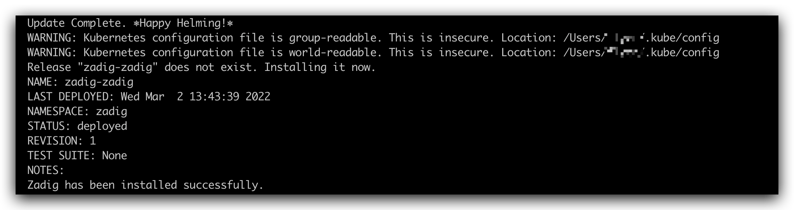

本文适用于在单台云主机或虚拟机上快速部署 Kubernetes 和 Zadig，适合初学者体验。

::: danger
All in One 安装不支持版本升级和高可用配置，不适用于正式使用。
:::

## 步骤 1：准备 Linux 机器

::: warning
建议使用全新系统，避免因软件冲突导致安装失败。
:::

### 硬件要求

| 操作系统 | 推荐配置 |
| --- | --- |
| **Ubuntu** 16.04,18.04,20.04 | CPU: 8 核  内存: 16 GB  硬盘: 50 GB |
| **CentOS** 7.4~8.3 | CPU: 8 核  内存: 16 GB  硬盘: 50 GB |

> 推荐配置：8C16G （Zadig 本身消耗 4C8G，可支撑两条工作流任务的并发执行）

### 网络要求
- 服务器需能访问外网

### 其他
- 需使用 Root 用户安装，勿用 `sudo`
- 需支持 `curl` 命令
- 防火墙需开放 30000-32767 端口
::: tip
- 若通过 SSH 登录，建议在本地 `~/.ssh/config` 添加 `ServerAliveInterval 60`，防止连接超时。
:::

## 步骤 2：下载安装脚本

根据网络环境选择下载源，赋予脚本执行权限。

GitHub 源：

```bash
curl -LO https://github.com/koderover/zadig/releases/download/v4.0.0/all_in_one_install_quickstart.sh
chmod +x ./all_in_one_install_quickstart.sh
```

官方下载源：

```bash
curl -L https://download.koderover.com/install?type=all-in-one -o all_in_one_install_quickstart.sh
chmod +x ./all_in_one_install_quickstart.sh
```

::: tip
下表为安装脚本支持的环境变量，均有默认值。如需自定义，可在执行前设置。
:::

```bash
# 配置 IP 访问地址示例
export IP=<node external ip>
export PORT=<30000~32767 任一端口>
```

| 变量名称                    | 默认值                       | 是否必填         | 说明                                                                                                   |
|-------------------------| ---------------------------- | ---              |------------------------------------------------------------------------------------------------------|
| NAMESPACE               | zadig                        | 否               | Kubernetes 命名空间                                                                                      |
| IP                      |                              | 和 DOMAIN 二选一 | 服务器 IP 地址，用于访问 Zadig 系统                                                                              |
| PORT                    |                              | 使用 IP 访问必填 | 任意合法的 Kubernetes 端口， K8S 默认端口范围为 30000 - 32767                                                              |
| SERVICE_TYPE            | NodePort                     | 否               | Zadig 网关的服务暴露方式，可选值： NodePort, LoadBalancer。 默认值： NodePort                                           |
| ENCRYPTION_KEY          |                              | 否               | 由安装过程生成，用于数据加密解密，<font color=#FF000 >**第一次安装后请妥善保存**</font>。重装系统时需设置 ENCRYPTION_KEY，才能保证之前的数据可以被正确解密 |

## 步骤 3：开始安装

执行安装脚本：

```bash
# 服务器 IP 地址，用于访问 Zadig 系统
# 如果你有自己的域名，可以配置你可用的域名 export DOMAIN = <DOMAIN>
# 如果出现端口占用情况，换一个端口再尝试
# all_in_one_install_quickstart.sh 替换成实际下载的脚本

export IP=<IP>
export PORT=< 30000 - 32767 任一端口>
./all_in_one_install_quickstart.sh
```



安装约需 30 分钟，具体视硬件和网络情况而定。出现如图所示输出即安装完成。

## 步骤 4：验证安装

查看服务状态：

```bash
kubectl -n zadig get po
```

## 步骤 5：访问系统


安装完成后，终端会输出访问地址。

::: tip
许可证获取与配置详见：[许可证](/cn/Zadig%20v4.0/enterprise-mgr/#许可证)
:::

## Zadig 卸载

可通过脚本一键卸载 Zadig：

```bash
export NAMESPACE=zadig
#根据实际安装的版本，选择对应版本的卸载脚本
curl -SsL https://github.com/koderover/zadig/releases/download/v4.0.0/uninstall.sh |bash
```
