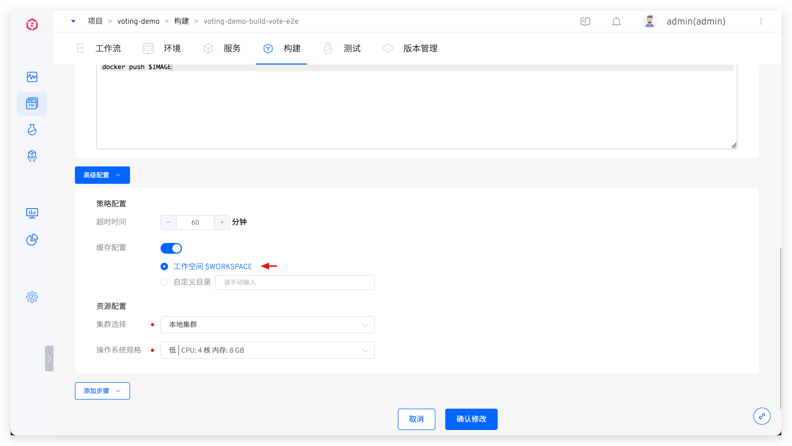

本文介绍 Zadig 工作流构建、测试、代码扫描任务的缓存机制，使用缓存可以提升工作流构建效率。

Zadig 工作流任务支持：
- 构建依赖及中间产物缓存：构建、测试、代码扫描任务拉取的依赖包及生成的产物可缓存在**对象存储**或**集群资源**中。
- 软件包缓存：任务依赖的软件包缓存在内置的对象存储中。
- 镜像缓存：镜像构建使用的基础镜像及构建产物缓存在 dind 组件中。

## 构建依赖及中间产物缓存

### 步骤 1：配置缓存介质

具体配置参考 [缓存资源配置](/cn/Zadig%20v4.0/pages/cluster_manage/#缓存资源配置)。

### 步骤 2：配置缓存目录

开启高级配置中的缓存配置，选中`工作空间$WORKSPACE`或者`缓存自定义目录`，工作流执行构建任务、测试、代码扫描工作流执行测试任务时会将本次任务拉取的依赖包或者生成的产物缓存到对应的存储介质中。

工作空间可能包含以下内容：
1. 构建时拉取的代码和依赖
2. 构建过程产生的一些临时文件
3. 构建产物

某些业务场景下可能不希望使用缓存，或者临时不使用历史缓存进行构建，那么可以通过调整缓存配置达到不使用缓存的目的。

* 如果在构建中长期不使用缓存，可以在`项目` -> `构建`，选择对应构建脚本，关闭 `缓存配置`，如下图所示。

## 软件包缓存

在 Zadig 系统上执行服务构建以及测试时，一般都需要根据实际业务去安装必要的软件包环境。比如编译后端相关代码就需要 Go 环境、Java 环境等，编译前端代码可能需要 NodeJS 等软件包，具体配置参考 [软件包管理](/cn/Zadig%20v4.0/settings/app/)。这些软件包会被缓存在系统内置的对象存储中。

## 不同技术栈的最佳实践

下面以 Java/Golang/NodeJS 项目为例，提供配置构建缓存目录的最佳实践，以供参考。

### Java
以 Maven 构建工具为例，其默认配置文件位于 `${M2_HOME}/conf/settings.xml` 文件中，可在 [软件包管理](/cn/Zadig%20v4.0/settings/app/) 中指定 `localRepository` 来设置缓存目录，并在构建配置中指定缓存目录。

**Maven 软件包配置**

指定 `localRepository` 为 `$WORKSPACE/.m2/repository`。

**构建配置**

使用 Maven 软件包，开启缓存配置并设置自定义目录。

### Golang

Golang 缓存路径通过 `$GOCACHE` 环境变量控制，可在构建脚本中显式修改。
在应用构建缓存配置的自定义目录中，可以填写上述配置的 `$GOCACHE` 路径。

### NodeJS

在构建脚本中使用 `npm install <*> -g --prefix <指定目录>`，再在高级配置中将目录缓存即可。

