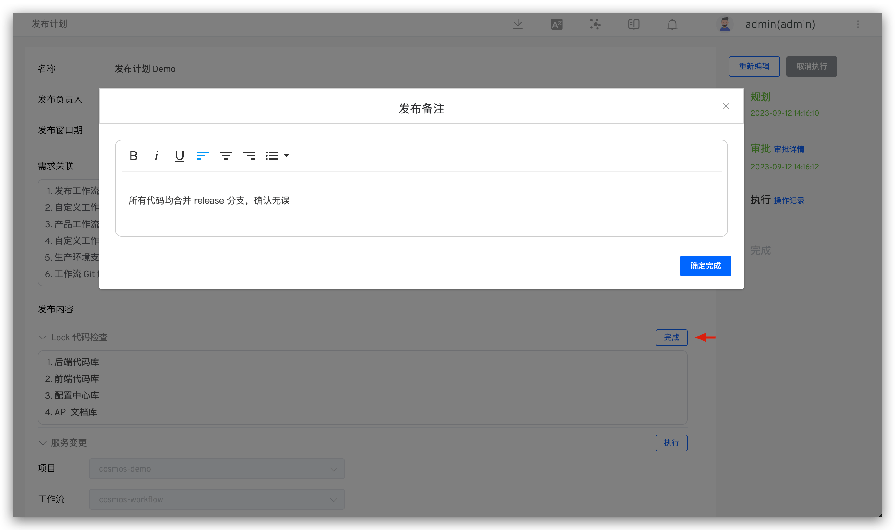
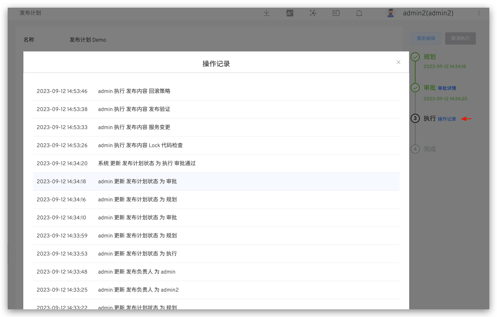

本文主要介绍如何使用 Zadig 的发布计划功能，包括发布计划的规划、审批和执行，以及追踪详细的操作记录。

## 规划
访问管理 -> 发布计划，新建发布计划并填写内容后保存草稿即可，支持多人协同合作规划发布计划。


参数说明：

- `名称`：发布计划名称
- `发布负责人`：负责此次发布的负责人，发布计划制定后，仅负责人可执行发布
- `发布窗口期`：可以进行发布操作的时间窗口
- `定时执行`：在指定时间执行发布项中的工作流
- `需求关联`：发布关联的需求清单，支持关联多个 JIRA 冲刺
- `发布内容`：具体的发布内容，可创建多个，包含富文本和工作流两种类型
    - `富文本类型`：输入内容
    - `工作流类型`：选择 Zadig 中的项目和工作流，按需配置工作流参数
- `审批配置`：按需配置审批，支持 Zadig、飞书、钉钉三种审批方式
    - `Zadig`：审批申请将会发送到 Zadig 账号对应的邮箱中，具体审批配置可参考 [Zadig 审批](/cn/Zadig%20v4.0/workflow/approval/#zadigx-审批/)
    - `飞书`：审批申请将会发送到飞书中，具体审批配置可参考 [飞书审批](/cn/Zadig%20v4.0/workflow/approval/飞书审批/)
    - `钉钉`：审批申请将会发送到钉钉中，具体审批配置可参考 [钉钉审批](/cn/Zadig%20v4.0/workflow/approval/钉钉审批/)

## 审批

> 适用于发布计划中包含审批配置的场景。

发布负责人提交审批后，由审批人负责审批。审批通过后发布负责人才可以操作发布。

::: tip
如果审批拒绝，可再次编辑发布计划的内容，重新规划发布计划。
:::


## 执行

::: tip
1. 在发布时间窗口内可操作执行。
2. 仅发布负责人可操作执行。
:::

对于富文本类型的发布内容，点击右侧的`完成`，输入发布备注即可。



对于工作流类型的发布内容，点击右侧的`执行`即可自动触发工作流执行，点击链接可跳转查看工作流执行详情。
<!-- 终版 ok 后再展开说明工作流执行参数 -->


对于需要跳过执行的发布项，可点`跳过`，所有发布项完成执行或者跳过，发布计划自动为完成。

## 操作记录

系统中详细记录了发布计划的操作日志，点击`操作记录`即可查看。



## Hook 外部系统与 CallBack

###  Hook 外部系统

**请求**

```
POST
```

**body 参数说明**

| 参数名                  | 类型                                           | 描述                                                           |
| ----------------------- | ---------------------------------------------- | -------------------------------------------------------------- |
| `id`                    | string                                         | 发布计划 id                                                    |
| `index`                 | string                                         | 发布计划索引                                                   |
| `name`                  | string                                         | 发布计划名称                                                   |
| `event_name`            | string                                         | 事件名称，枚举值：finish_planning, start_execute, all_job_done |
| `description`           | string                                         | 需求关联                                                       |
| `manager`               | string                                         | 发布负责人                                                     |
| `manager_id`            | string                                         | 发布负责人 ID                                                  |
| `instance_code`         | string                                         | 实例 Code（每次编辑后不同）                                    |
| `start_time`            | int                                            | 发布窗口期-开始时间                                            |
| `end_time`              | int                                            | 发布窗口期-结束时间                                            |
| `schedule_execute_time` | int                                            | 定时执行时间                                                   |
| `approval_time`         | int                                            | 审批时间                                                       |
| `planning_time`         | int                                            | 规划时间                                                       |
| `executing_time`        | int                                            | 执行时间                                                       |
| `success_time`          | int                                            | 成功时间                                                       |
| `status`                | string                                         | 状态                                                           |
| `jobs`                  | [][HookReleasePlanJob](#hook-release-plan-job) | 发布内容列表                                                   |
| `created_by`            | string                                         | 创建者                                                         |
| `create_time`           | int                                            | 创建时间                                                       |
| `updated_by`            | string                                         | 更新者                                                         |
| `update_time`           | int                                            | 更新时间                                                       |


<h4 id="release-status">发布计划状态说明</h4>

| 名称                                             | 描述                             |
| ------------------------------------------------ | -------------------------------- |
| `planning`                                       | 规划中                           |
| `finished_planning`                              | 规划完成                         |
| `wait_for_approval`                              | 等待审批                         |
| `executing`                                      | 执行中                           |
| `denied`                                         | 拒绝                             |
| `timeout`                                        | 超时                             |
| `success`                                        | 成功                             |
| `wait_for_finish_planning_external_check`        | 等待规划完成的外部检测           |
| `wait_for_execute_external_check`                | 等待执行的外部检测               |
| `wait_for_all_done_external_check`               | 等待发布项全部完成的外部检测     |
| `wait_for_finish_planning_external_check_failed` | 等待规划完成的外部检测失败       |
| `wait_for_execute_external_check_failed`         | 等待执行的外部检测失败           |
| `wait_for_all_done_external_check_failed`        | 等待发布项全部完成的外部检测失败 |
| `cancel`                                         | 取消                             |

<h4 id="hook-release-plan-job">HookReleasePlanJob 参数说明</h4>

| 参数名          | 类型           | 说明                                                                                                                                                                         |
| --------------- | -------------- | ---------------------------------------------------------------------------------------------------------------------------------------------------------------------------- |
| `id`            | string         | 发布任务 id                                                                                                                                                                  |
| `name`          | string         | 发布任务名称                                                                                                                                                                 |
| `status`        | string         | 发布任务状态                                                                                                                                                                 |
| `type`          | string         | 发布任务类型，包括 text 和 workflow                                                                                                                                          |
| `spec`          | ReleaseJobSpec | 发布任务规格，当类型为 text 时规格为 [TextReleasePlanJob](#hook-text-release-plan-job)，当类型为 workflow 时规格为 [WorkflowReleasePlanJob](#hook-workflow-release-plan-job) |
| `executed_by`   | string         | 执行人                                                                                                                                                                       |
| `executed_time` | string         | 执行时间                                                                                                                                                                     |

<h4 id="release-plan-job-status">发布计划任务状态说明</h4>

| 名称      | 描述   |
| --------- | ------ |
| `todo`    | 未开始 |
| `done`    | 完成   |
| `skipped` | 已跳过 |
| `failed`  | 拒绝   |
| `running` | 运行中 |

<h4 id="hook-text-release-plan-job">TextReleasePlanJob 参数说明</h4>

| 参数名    | 类型   | 说明 |
| --------- | ------ | ---- |
| `content` | string | 内容 |
| `remark`  | string | 备注 |

<h4 id="hook-workflow-release-plan-job">WorkflowReleasePlanJob 参数说明</h4>

| 参数名     | 类型                       | 说明                                                                                                       |
| ---------- | -------------------------- | ---------------------------------------------------------------------------------------------------------- |
| `workflow` | [Workflow](#hook-workflow) | 工作流                                                                                                     |
| `status`   | string                     | 任务状态包括：created(创建中)、running(运行中)、passed(通过)、failed(失败)、timeout(超时)、cancelled(取消) |
| `task_id`  | int                        | 工作流任务 ID                                                                                              |

<h4 id="hook-workflow">Workflow 参数说明</h4>

| 参数名         | 类型                                    | 说明           |
| -------------- | --------------------------------------- | -------------- |
| `name`         | string                                  | 工作流标识     |
| `display_name` | string                                  | 工作流显示名称 |
| `disabled`     | bool                                    | 是否禁用       |
| `params`       | [][WorkflowParam](#hook-workflow-param) | 全局变量列表   |
| `stages`       | [][WorkflowStage](#hook-workflow-stage) | 阶段           |
| `project`      | string                                  | 项目标识       |
| `description`  | string                                  | 描述           |
| `created_by`   | string                                  | 创建者         |
| `create_time`  | int                                     | 创建时间       |
| `updated_by`   | string                                  | 更新者         |
| `update_time`  | int                                     | 更新时间       |
| `remark`       | string                                  | 备注           |

<h4 id="hook-workflow-param">WorkflowParam 全局变量参数说明</h4>

| 参数名           | 类型                        | 说明                                            |
| ---------------- | --------------------------- | ----------------------------------------------- |
| `name`           | string                      | 变量名称                                        |
| `description`    | string                      | 变量描述                                        |
| `type`           | string                      | 变量类型，支持 string/text/choice/repo 类型     |
| `value`          | string                      | 变量值                                          |
| `repo`           | [Repo](#hook-workflow-repo) | repo 类型的变量值，仅当类型为 repo 时使用该字段 |
| `choice_options` | []string                    | 选项可选值                                      |
| `choice_value`   | []string                    | 选项值                                          |
| `default`        | string                      | 默认值                                          |
| `is_credential`  | bool                        | 是否为敏感信息                                  |
| `source`         | string                      | 来源，支持 runtime/fixed/reference              |

<h4 id="hook-workflow-repo">Repo 参数说明</h4>

| 参数名           | 类型   | 说明         |
| ---------------- | ------ | ------------ |
| `source`         | string | 来源         |
| `repo_owner`     | string | 仓库所有者   |
| `repo_namespace` | string | 仓库命名空间 |
| `repo_name`      | string | 仓库名称     |
| `remote_name`    | string | 远程名称     |
| `branch`         | string | 分支名称     |
| `prs`            | []int  | PR编号列表   |
| `tag`            | string | 标签名称     |
| `commit_id`      | string | 提交ID       |
| `commit_message` | string | 提交信息     |
| `checkout_path`  | string | 检查路径     |
| `codehost_id`    | int    | 代码源ID     |
| `address`        | string | 地址         |

<h4 id="hook-workflow-stage">WorkflowStage 参数说明</h4>

| 参数名 | 类型                                | 说明     |
| ------ | ----------------------------------- | -------- |
| `name` | string                              | 名称     |
| `jobs` | [][WorkflowJob](#hook-workflow-job) | 任务列表 |

<h4 id="hook-workflow-job">WorkflowJob 参数说明</h4>

| 参数名       | 类型                                       | 说明                                                                                                                            |
| ------------ | ------------------------------------------ | ------------------------------------------------------------------------------------------------------------------------------- |
| `name`       | string                                     | 名称                                                                                                                            |
| `type`       | [WorkflowJobType](#hook-workflow-job-type) | 类型，支持 zadig-build/zadig-deploy/zadig-vm-deploy/zadig-test/zadig-scanning/zadig-distribute-image/freestyle/apollo/nacos/sql |
| `spec`       | any                                        | 任务规格                                                                                                                        |
| `run_policy` | string                                     | 运行策略，支持 default_not_run/force_run/skip，如为空则为默认运行                                                               |

<h4 id="hook-workflow-job-type">WorkflowJobType 参数说明</h4>

| 参数名                   | 对应 Spec                                                                  | 说明              |
| ------------------------ | -------------------------------------------------------------------------- | ----------------- |
| `zadig-build`            | [WorkflowBuildJobSpec](#hook-workflow-build-job-spec)                      | 构建任务 Spec     |
| `zadig-deploy`           | [WorkflowDeployJobSpec](#hook-workflow-deploy-job-spec)                    | 部署任务 Spec     |
| `zadig-vm-deploy`        | [WorkflowVmDeployJobSpec](#hook-workflow-vm-deploy-job-spec)               | 主机部署任务 Spec |
| `zadig-test`             | [WorkflowTestingJobSpec](#hook-workflow-testing-job-spec)                  | 测试任务 Spec     |
| `zadig-scanning`         | [WorkflowScanningJobSpec](#hook-workflow-scanning-job-spec)                | 扫描任务 Spec     |
| `zadig-distribute-image` | [WorkflowDistributeImageJobSpec](#hook-workflow-distribute-image-job-spec) | 分发镜像任务 Spec |
| `freestyle`              | [WorkflowFreestyleJobSpec](#hook-workflow-freestyle-job-spec)              | 通用任务 Spec     |
| `apollo`                 | [WorkflowApolloJobSpec](#hook-workflow-apollo-job-spec)                    | Apollo 任务 Spec  |
| `nacos`                  | [WorkflowNacosJobSpec](#hook-workflow-nacos-job-spec)                      | Nacos 任务 Spec   |
| `sql`                    | [WorkflowSqlJobSpec](#hook-workflow-sql-job-spec)                          | SQL 任务 Spec     |

<h4 id="hook-workflow-build-job-spec">WorkflowBuildJobSpec 参数说明</h4>

| 参数名               | 类型              | 说明                                    |
| -------------------- | ----------------- | --------------------------------------- |
| `source`             | string            | 来源，可选值为：runtime/fixed/fromjob   |
| `job_name`           | string            | 引用的任务名称，当来源为 fromjob 时使用 |
| `ref_repos`          | bool              | 是否引用所选任务代码信息                |
| `service_and_builds` | []ServiceAndBuild | 服务和构建列表                          |

<h4 id="hook-workflow-service-and-build">ServiceAndBuild 参数说明</h4>

| 参数名           | 类型                               | 说明         |
| ---------------- | ---------------------------------- | ------------ |
| `service_name`   | string                             | 服务名称     |
| `service_module` | string                             | 服务组件     |
| `build_name`     | string                             | 构建名称     |
| `image`          | string                             | 镜像地址     |
| `package`        | string                             | 二进制包地址 |
| `image_name`     | string                             | 镜像名称     |
| `key_vals`       | [][KeyVal](#hook-workflow-key-val) | 构建变量列表 |
| `repos`          | [][Repo](#hook-workflow-repo)      | 仓库列表     |

<h4 id="hook-workflow-key-val">KeyVal 参数说明</h4>

| 参数名          | 类型     | 说明                                                        |
| --------------- | -------- | ----------------------------------------------------------- |
| `key`           | string   | 变量名称                                                    |
| `value`         | string   | 变量值                                                      |
| `type`          | string   | 变量类型，可选值为：string/choice/multi-select/image/script |
| `registry_id`   | string   | 镜像仓库 ID                                                 |
| `script`        | string   | 脚本                                                        |
| `call_function` | string   | 调用函数                                                    |
| `choice_option` | []string | 选项可选值                                                  |
| `choice_value`  | []string | 选项值                                                      |
| `is_credential` | bool     | 是否为敏感信息                                              |
| `description`   | string   | 描述                                                        |
| `source`        | string   | 来源，可选值为：runtime/fixed/reference                     |

<h4 id="hook-workflow-deploy-job-spec">WorkflowDeployJobSpec 参数说明</h4>

| 参数名            | 类型                                                      | 说明                                                                                |
| ----------------- | --------------------------------------------------------- | ----------------------------------------------------------------------------------- |
| `env`             | string                                                    | 环境名称                                                                            |
| `production`      | bool                                                      | 是否为生产环境                                                                      |
| `deploy_type`     | string                                                    | 部署类型                                                                            |
| `source`          | string                                                    | 来源，fromjob/runtime, runtime 表示运行时输入，fromjob 表示从上游构建任务中获取     |
| `env_source`      | string                                                    | 环境来源，fromjob/runtime, runtime 表示运行时输入，fromjob 表示从上游构建任务中获取 |
| `deploy_contents` | []string                                                  | 部署内容，包括 image/vars/config                                                    |
| `job_name`        | string                                                    | 引用的任务名称，当来源为 fromjob 时使用                                             |
| `version_name`    | string                                                    | 版本名称，当从版本导入时使用                                                        |
| `services`        | [][DeployServiceInfo](#hook-workflow-deploy-service-info) | 服务列表                                                                            |

<h4 id="hook-workflow-deploy-service-info">DeployServiceInfo 参数说明</h4>

| 参数名                 | 类型                                                    | 说明                                                             |
| ---------------------- | ------------------------------------------------------- | ---------------------------------------------------------------- |
| `service_name`         | string                                                  | 服务名称                                                         |
| `modules`              | [][DeployModuleInfo](#hook-workflow-deploy-module-info) | 模块列表                                                         |
| `deployed`             | bool                                                    | 是否已部署                                                       |
| `auto_sync`            | bool                                                    | 环境中是否开启自动同步                                           |
| `update_config`        | bool                                                    | 是否更新配置                                                     |
| `updatable`            | bool                                                    | 是否可更新                                                       |
| `variable_kvs`         | [][DeployVariableKv](#hook-workflow-deploy-variable-kv) | 变量列表                                                         |
| `variable_yaml`        | string                                                  | 最终的变量 Yaml，用于 Helm 和 K8S Yaml 服务                      |
| `value_merge_strategy` | string                                                  | Values 合并策略，用于 Helm 服务，可选项为：override/reuse-values |
| `override_kvs`         | string                                                  | 键值对变量，用于 Helm 服务，json 编码的键值对值                  |

<h4 id="hook-workflow-deploy-module-info">DeployModuleInfo 参数说明</h4>

| 参数名           | 类型   | 说明     |
| ---------------- | ------ | -------- |
| `service_module` | string | 服务组件 |
| `image`          | string | 镜像地址 |
| `image_name`     | string | 镜像名称 |


<h4 id="hook-workflow-deploy-variable-kv">DeployVariableKv 参数说明</h4>

| 参数名                | 类型   | 说明                                      |
| --------------------- | ------ | ----------------------------------------- |
| `key`                 | string | 变量名称                                  |
| `value`               | string | 镜像地址                                  |
| `type`                | string | 变量类型，可选值为：string/bool/enum/yaml |
| `options`             | string | 选项可选值，当 type 为 enum 时使用        |
| `desc`                | string | 描述                                      |
| `use_global_variable` | bool   | 是否使用全局变量                          |

<h4 id="hook-workflow-vm-deploy-job-spec">WorkflowVmDeployJobSpec 参数说明</h4>

| 参数名                   | 类型                                                         | 说明                                                                            |
| ------------------------ | ------------------------------------------------------------ | ------------------------------------------------------------------------------- |
| `env`                    | string                                                       | 环境名称                                                                        |
| `production`             | bool                                                         | 是否为生产环境                                                                  |
| `env_alias`              | string                                                       | 环境别名                                                                        |
| `source`                 | string                                                       | 来源，fromjob/runtime, runtime 表示运行时输入，fromjob 表示从上游构建任务中获取 |
| `job_name`               | string                                                       | 引用的任务名称，当来源为 fromjob 时使用                                         |
| `ref_repos`              | bool                                                         | 是否引用所选任务代码信息                                                        |
| `service_and_vm_deploys` | [][ServiceAndVmDeploy](#hook-workflow-service-and-vm-deploy) | 服务和主机部署列表                                                              |

<h4 id="hook-workflow-service-and-vm-deploy">ServiceAndVmDeploy 参数说明</h4>

| 参数名                 | 类型                               | 说明                                       |
| ---------------------- | ---------------------------------- | ------------------------------------------ |
| `service_name`         | string                             | 服务名称                                   |
| `service_module`       | string                             | 服务组件                                   |
| `deploy_name`          | string                             | 部署名称                                   |
| `deploy_artifact_type` | string                             | 部署交付物类型，可选值为：image/file/other |
| `artifact_url`         | string                             | 部署交付物地址                             |
| `file_name`            | string                             | 部署交付物文件名称                         |
| `image`                | string                             | 部署交付物镜像地址                         |
| `key_vals`             | [][KeyVal](#hook-workflow-key-val) | 变量列表                                   |
| `repos`                | [][Repo](#hook-workflow-repo)      | 仓库列表                                   |

<h4 id="hook-workflow-freestyle-job-spec">WorkflowFreestyleJobSpec 参数说明</h4>

| 参数名           | 类型                                                             | 说明                                                                            |
| ---------------- | ---------------------------------------------------------------- | ------------------------------------------------------------------------------- |
| `freestyle_type` | string                                                           | 通用任务类型，值为空时为单服务，值为 service_freestyle 时为多服务               |
| `source`         | string                                                           | 来源，fromjob/runtime, runtime 表示运行时输入，fromjob 表示从上游构建任务中获取 |
| `job_name`       | string                                                           | 引用的任务名称，当来源为 fromjob 时使用                                         |
| `ref_repos`      | bool                                                             | 是否引用所选任务代码信息                                                        |
| `repos`          | [][Repo](#hook-workflow-repo)                                    | 仓库列表，单服务时使用                                                          |
| `envs`           | [][KeyVal](#hook-workflow-key-val)                               | 变量列表，单服务时使用                                                          |
| `services`       | [][FreeStyleServiceInfo](#hook-workflow-free-style-service-info) | 服务列表                                                                        |

<h4 id="hook-workflow-free-style-service-info">FreeStyleServiceInfo 参数说明</h4>

| 参数名           | 类型                               | 说明     |
| ---------------- | ---------------------------------- | -------- |
| `service_name`   | string                             | 服务名称 |
| `service_module` | string                             | 服务组件 |
| `repos`          | [][Repo](#hook-workflow-repo)      | 仓库列表 |
| `key_vals`       | [][KeyVal](#hook-workflow-key-val) | 变量列表 |

<h4 id="hook-workflow-testing-job-spec">WorkflowTestingJobSpec 参数说明</h4>

| 参数名              | 类型                                                | 说明                                                                            |
| ------------------- | --------------------------------------------------- | ------------------------------------------------------------------------------- |
| `testing_type`      | string                                              | 测试任务类型，值为空时为单服务，值为 service_test 时为多服务                    |
| `source`            | string                                              | 来源，fromjob/runtime, runtime 表示运行时输入，fromjob 表示从上游构建任务中获取 |
| `job_name`          | string                                              | 引用的任务名称，当来源为 fromjob 时使用                                         |
| `ref_repos`         | bool                                                | 是否引用所选任务代码信息                                                        |
| `service_and_tests` | [][ServiceAndTest](#hook-workflow-service-and-test) | 服务和测试列表，测试任务类型为多服务时使用                                      |
| `test_modules`      | [][TestModule](#hook-workflow-test-module)          | 测试模块列表，测试任务类型为单服务时使用                                        |

<h4 id="hook-workflow-service-and-test">ServiceAndTest 参数说明</h4>

| 参数名           | 类型                               | 说明     |
| ---------------- | ---------------------------------- | -------- |
| `name`           | string                             | 测试名称 |
| `service_name`   | string                             | 服务名称 |
| `service_module` | string                             | 服务组件 |
| `repos`          | [][Repo](#hook-workflow-repo)      | 仓库列表 |
| `key_vals`       | [][KeyVal](#hook-workflow-key-val) | 变量列表 |

<h4 id="hook-workflow-test-module">TestModule 参数说明</h4>

| 参数名     | 类型                               | 说明     |
| ---------- | ---------------------------------- | -------- |
| `name`     | string                             | 测试名称 |
| `repos`    | [][Repo](#hook-workflow-repo)      | 仓库列表 |
| `key_vals` | [][KeyVal](#hook-workflow-key-val) | 变量列表 |

<h4 id="hook-workflow-scannings-job-spec">WorkflowScanningsJobSpec 参数说明</h4>

| 参数名                  | 类型                                                          | 说明                                                                            |
| ----------------------- | ------------------------------------------------------------- | ------------------------------------------------------------------------------- |
| `scannings_type`        | string                                                        | 扫描任务类型，值为空时为单服务，值为 service_scannings 时为多服务               |
| `source`                | string                                                        | 来源，fromjob/runtime, runtime 表示运行时输入，fromjob 表示从上游构建任务中获取 |
| `job_name`              | string                                                        | 引用的任务名称，当来源为 fromjob 时使用                                         |
| `ref_repos`             | bool                                                          | 是否引用所选任务代码信息                                                        |
| `service_and_scannings` | [][ServiceAndScannings](#hook-workflow-service-and-scannings) | 服务和扫描列表，扫描任务类型为多服务时使用                                      |
| `scannings_modules`     | [][ScanningsModule](#hook-workflow-scannings-module)          | 扫描模块列表，扫描任务类型为单服务时使用                                        |

<h4 id="hook-workflow-service-and-scannings">ServiceAndScannings 参数说明</h4>

| 参数名           | 类型                               | 说明     |
| ---------------- | ---------------------------------- | -------- |
| `name`           | string                             | 扫描名称 |
| `service_name`   | string                             | 服务名称 |
| `service_module` | string                             | 服务组件 |
| `repos`          | [][Repo](#hook-workflow-repo)      | 仓库列表 |
| `key_vals`       | [][KeyVal](#hook-workflow-key-val) | 变量列表 |

<h4 id="hook-workflow-scannings-module">ScanningsModule 参数说明</h4>

| 参数名     | 类型                               | 说明     |
| ---------- | ---------------------------------- | -------- |
| `name`     | string                             | 扫描名称 |
| `repos`    | [][Repo](#hook-workflow-repo)      | 仓库列表 |
| `key_vals` | [][KeyVal](#hook-workflow-key-val) | 变量列表 |

<h4 id="hook-workflow-nacos-job-spec">WorkflowNacosJobSpec 参数说明</h4>

| 参数名         | 类型                                     | 说明                                                          |
| -------------- | ---------------------------------------- | ------------------------------------------------------------- |
| `nacos_id`     | string                                   | Nacos ID                                                      |
| `namespace_id` | string                                   | Nacos 命名空间 ID                                             |
| `source`       | string                                   | 来源，fixed/runtime, runtime 表示运行时输入，fixed 表示固定值 |
| `nacos_datas`  | [][NacosData](#hook-workflow-nacos-data) | Nacos 数据列表                                                |

<h4 id="hook-workflow-nacos-data">NacosData 参数说明</h4>

| 参数名             | 类型   | 说明               |
| ------------------ | ------ | ------------------ |
| `data_id`          | string | 数据 ID            |
| `group`            | string | 数据组             |
| `desc`             | string | 数据描述           |
| `format`           | string | 数据格式           |
| `content`          | string | 数据内容           |
| `original_content` | string | 原始数据内容       |
| `namespace_id`     | string | Nacos 命名空间 ID  |
| `namespace_name`   | string | Nacos 命名空间名称 |

<h4 id="hook-workflow-apollo-job-spec">WorkflowApolloJobSpec 参数说明</h4>

| 参数名           | 类型                                                 | 说明                |
| ---------------- | ---------------------------------------------------- | ------------------- |
| `apollo_id`      | string                                               | Apollo ID           |
| `namespace_list` | [][ApolloNamespace](#hook-workflow-apollo-namespace) | Apollo 命名空间列表 |

<h4 id="hook-workflow-apollo-namespace">ApolloNamespace 参数说明</h4>

| 参数名            | 类型                                   | 说明       |
| ----------------- | -------------------------------------- | ---------- |
| `app_id`          | string                                 | 应用 ID    |
| `cluster_id`      | string                                 | 集群 ID    |
| `env`             | string                                 | 环境       |
| `namespace`       | string                                 | 命名空间   |
| `type`            | string                                 | 类型       |
| `original_config` | [][ApolloKV](#hook-workflow-apollo-kv) | 原始配置   |
| `kv`              | [][ApolloKV](#hook-workflow-apollo-kv) | 键值对列表 |

<h4 id="hook-workflow-apollo-kv">ApolloKV 参数说明</h4>

| 参数名 | 类型   | 说明 |
| ------ | ------ | ---- |
| `key`  | string | 键   |
| `val`  | string | 值   |

<h4 id="hook-workflow-sql-job-spec">WorkflowSqlJobSpec 参数说明</h4>

| 参数名   | 类型   | 说明                                                          |
| -------- | ------ | ------------------------------------------------------------- |
| `id`     | string | 数据库实例 ID                                                 |
| `type`   | string | 数据库实例类型，mysql/mariadb                                 |
| `sql`    | string | SQL 语句                                                      |
| `source` | string | 来源，fixed/runtime, runtime 表示运行时输入，fixed 表示固定值 |

<h4 id="hook-workflow-distribute-image-job-spec">WorkflowDistributeImageJobSpec 参数说明</h4>

| 参数名                         | 类型                                                              | 说明                                                                            |
| ------------------------------ | ----------------------------------------------------------------- | ------------------------------------------------------------------------------- |
| `source`                       | string                                                            | 来源，fromjob/runtime, runtime 表示运行时输入，fromjob 表示从上游构建任务中获取 |
| `job_name`                     | string                                                            | 引用的任务名称，当来源为 fromjob 时使用                                         |
| `distribute_method`            | string                                                            | 分发镜像方式，image_push/cloud_sync                                             |
| `targets`                      | [][DistributeImageTarget](#hook-workflow-distribute-image-target) | 镜像分发目标列表                                                                |
| `enable_target_image_tag_rule` | string                                                            | 是否启用镜像版本规则                                                            |
| `target_image_tag_rule`        | string                                                            | 镜像版本规则                                                                    |

<h4 id="hook-workflow-distribute-image-target">DistributeImageTarget 参数说明</h4>

| 参数名           | 类型   | 说明                                              |
| ---------------- | ------ | ------------------------------------------------- |
| `service_name`   | string | 服务名称                                          |
| `service_module` | string | 服务组件                                          |
| `source_tag`     | string | 源镜像标签                                        |
| `target_tag`     | string | 镜像版本                                          |
| `image_name`     | string | 镜像名称                                          |
| `source_image`   | string | 源镜像                                            |
| `target_image`   | string | 目标镜像                                          |
| `update_tag`     | bool   | 如果 UpdateTag 为 false，则使用源标签作为目标标签 |

**body 参数示例**

::: details

```json
{
  "object_kind": "release_plan",
  "event": "release_plan",
  "workflow": null,
  "release_plan": {
    "id": "68b7ec363306e52e21b2dbe6",
    "index": 52,
    "name": "workflow-plan-3",
    "event_name": "all_job_done",
    "manager": "patrick",
    "manager_id": "14790d50-37b3-11f0-b3aa-ee39782dea6e",
    "start_time": 1756883513,
    "end_time": 1757488313,
    "schedule_execute_time": 1756893020,
    "description": "<p><br></p>",
    "created_by": "patrick",
    "create_time": 1756884022,
    "updated_by": "系统",
    "update_time": 1756893023,
    "jobs": [
      {
        "id": "e092f96c-4f78-410e-88bb-7afa881471d9",
        "name": "all",
        "type": "workflow",
        "spec": {
          "workflow": {
            "name": "release-plan-hook-2",
            "display_name": "release-plan-hook-2",
            "disabled": false,
            "category": "",
            "params": [],
            "stages": [
              {
                "name": "build",
                "jobs": [
                  {
                    "name": "build",
                    "type": "zadig-build",
                    "spec": {
                      "source": "runtime",
                      "job_name": "",
                      "ref_repos": false,
                      "service_and_builds": [
                        {
                          "service_name": "service1",
                          "service_module": "service1",
                          "build_name": "yaml-general-build",
                          "image": "{{.job.build.service1.service1.output.IMAGE}}",
                          "package": "{{.job.build.service1.service1.output.PKG_FILE}}",
                          "image_name": "service1",
                          "key_vals": [
                            {
                              "key": "gggg",
                              "value": "gggg",
                              "type": "string",
                              "registry_id": "",
                              "is_credential": false,
                              "description": "",
                              "source": "runtime"
                            }
                          ],
                          "repos": [
                            {
                              "source": "gitlab",
                              "repo_owner": "kr-test-org1",
                              "repo_namespace": "kr-test-org1",
                              "repo_name": "multi-service-demo",
                              "remote_name": "origin",
                              "branch": "patrick-01",
                              "tag": "",
                              "commit_id": "311fa899187a674a2e7fbf76cf2eeecdc8a51ac1",
                              "commit_message": "update service2 values\n",
                              "checkout_path": "",
                              "submodules": false,
                              "codehost_id": 1,
                              "address": "https://gitlab.com/",
                            }
                          ]
                        },
                        {
                          "service_name": "service2",
                          "service_module": "service2",
                          "build_name": "yaml-general-build",
                          "image": "{{.job.build.service2.service2.output.IMAGE}}",
                          "package": "{{.job.build.service2.service2.output.PKG_FILE}}",
                          "image_name": "service2",
                          "key_vals": [
                            {
                              "key": "gggg",
                              "value": "gggg",
                              "type": "string",
                              "registry_id": "",
                              "is_credential": false,
                              "description": "",
                              "source": "runtime"
                            }
                          ],
                          "repos": [
                            {
                              "source": "gitlab",
                              "repo_owner": "kr-test-org1",
                              "repo_namespace": "kr-test-org1",
                              "repo_name": "multi-service-demo",
                              "remote_name": "origin",
                              "branch": "main",
                              "tag": "",
                              "commit_id": "1d85022328d6c4d8f6df5890dd0efa48f0e52cea",
                              "commit_message": "Edit deployment.yaml",
                              "checkout_path": "",
                              "submodules": false,
                              "codehost_id": 1,
                              "address": "https://gitlab.com/",
                            }
                          ]
                        }
                      ]
                    },
                    "run_policy": ""
                  }
                ]
              },
              {
                "name": "deploy",
                "jobs": [
                  {
                    "name": "deploy",
                    "type": "zadig-deploy",
                    "spec": {
                      "env": "dev",
                      "production": false,
                      "deploy_type": "k8s",
                      "source": "fromjob",
                      "env_source": "runtime",
                      "deploy_contents": [
                        "image",
                        "vars"
                      ],
                      "job_name": "build",
                      "version_name": "",
                      "services": [
                        {
                          "service_name": "service1",
                          "modules": [
                            {
                              "service_module": "service1",
                              "image": "{{.job.build.service1.service1.output.IMAGE}}",
                              "image_name": ""
                            }
                          ],
                          "deployed": false,
                          "auto_sync": false,
                          "update_config": false,
                          "updatable": false,
                          "variable_kvs": [
                            {
                              "key": "port",
                              "value": "20221",
                              "type": "string",
                              "options": [],
                              "desc": "",
                              "use_global_variable": false,
                              "is_reference_variable": false
                            },
                            {
                              "key": "targetport",
                              "value": "20221",
                              "type": "string",
                              "options": [],
                              "desc": "",
                              "use_global_variable": false,
                              "is_reference_variable": false
                            },
                            {
                              "key": "replica",
                              "value": "1",
                              "type": "string",
                              "options": [],
                              "desc": "",
                              "use_global_variable": false,
                              "is_reference_variable": false
                            }
                          ],
                          "variable_yaml": "",
                          "value_merge_strategy": "reuse-values",
                          "override_kvs": ""
                        },
                        {
                          "service_name": "service2",
                          "modules": [
                            {
                              "service_module": "service2",
                              "image": "{{.job.build.service2.service2.output.IMAGE}}",
                              "image_name": ""
                            }
                          ],
                          "deployed": false,
                          "auto_sync": false,
                          "update_config": false,
                          "updatable": false,
                          "variable_kvs": [
                            {
                              "key": "port",
                              "value": "20222",
                              "type": "string",
                              "options": [],
                              "desc": "",
                              "use_global_variable": false,
                              "is_reference_variable": false
                            },
                            {
                              "key": "targetport",
                              "value": "20222",
                              "type": "string",
                              "options": [],
                              "desc": "",
                              "use_global_variable": false,
                              "is_reference_variable": false
                            },
                            {
                              "key": "replica",
                              "value": "1",
                              "type": "string",
                              "options": [],
                              "desc": "",
                              "use_global_variable": false,
                              "is_reference_variable": false
                            }
                          ],
                          "variable_yaml": "",
                          "value_merge_strategy": "reuse-values",
                          "override_kvs": ""
                        }
                      ]
                    },
                    "run_policy": ""
                  }
                ]
              },
              {
                "name": "scanning",
                "jobs": [
                  {
                    "name": "scanning",
                    "type": "zadig-scanning",
                    "spec": {
                      "scanning_type": "service_scanning",
                      "source": "fromjob",
                      "job_name": "build",
                      "ref_repos": true,
                      "scannings": [],
                      "service_and_scannings": [
                        {
                          "service_name": "service2",
                          "service_module": "service2",
                          "name": "go-scanner",
                          "repos": [
                            {
                              "source": "gitlab",
                              "repo_owner": "kr-poc",
                              "repo_namespace": "kr-poc",
                              "repo_name": "multi-service-demo",
                              "remote_name": "origin",
                              "branch": "feature-3",
                              "tag": "",
                              "commit_id": "d53a92ffe24ba285151c094e41e3faba620ff1e4",
                              "commit_message": "Add new file",
                              "checkout_path": "",
                              "submodules": false,
                              "codehost_id": 1,
                              "address": "https://gitlab.com/",
                            }
                          ],
                          "key_vals": [
                            {
                              "key": "eee",
                              "value": "qrew3rw3r",
                              "type": "text",
                              "registry_id": "",
                              "is_credential": false,
                              "description": "",
                              "source": ""
                            }
                          ]
                        },
                        {
                          "service_name": "service1",
                          "service_module": "service1",
                          "name": "go-scanner",
                          "repos": [
                            {
                              "source": "gitlab",
                              "repo_owner": "kr-poc",
                              "repo_namespace": "kr-poc",
                              "repo_name": "multi-service-demo",
                              "remote_name": "origin",
                              "branch": "feature-3",
                              "tag": "",
                              "commit_id": "d53a92ffe24ba285151c094e41e3faba620ff1e4",
                              "commit_message": "Add new file",
                              "checkout_path": "",
                              "submodules": false,
                              "codehost_id": 1,
                              "address": "https://gitlab.com/",
                            }
                          ],
                          "key_vals": [
                            {
                              "key": "eee",
                              "value": "qrew3rw3r",
                              "type": "text",
                              "registry_id": "",
                              "is_credential": false,
                              "description": "",
                              "source": ""
                            }
                          ]
                        }
                      ]
                    },
                    "run_policy": ""
                  },
                  {
                    "name": "product-scanning",
                    "type": "zadig-scanning",
                    "spec": {
                      "scanning_type": "",
                      "source": "runtime",
                      "job_name": "",
                      "ref_repos": false,
                      "scannings": [
                        {
                          "name": "go-scanner",
                          "repos": [
                            {
                              "source": "gitlab",
                              "repo_owner": "kr-poc",
                              "repo_namespace": "kr-poc",
                              "repo_name": "multi-service-demo",
                              "remote_name": "origin",
                              "branch": "feature-3",
                              "tag": "",
                              "commit_id": "d53a92ffe24ba285151c094e41e3faba620ff1e4",
                              "commit_message": "Add new file",
                              "checkout_path": "",
                              "submodules": false,
                              "codehost_id": 1,
                              "address": "https://gitlab.com/",
                            }
                          ],
                          "key_vals": [
                            {
                              "key": "eee",
                              "value": "qrew3rw3r",
                              "type": "text",
                              "registry_id": "",
                              "is_credential": false,
                              "description": "",
                              "source": ""
                            }
                          ]
                        }
                      ],
                      "service_and_scannings": []
                    },
                    "run_policy": ""
                  }
                ]
              },
              {
                "name": "testing",
                "jobs": [
                  {
                    "name": "testing",
                    "type": "zadig-test",
                    "spec": {
                      "test_type": "service_test",
                      "source": "fromjob",
                      "job_name": "build",
                      "ref_repos": true,
                      "service_and_tests": [
                        {
                          "service_name": "service1",
                          "service_module": "service1",
                          "name": "pytest-yaml",
                          "key_vals": [],
                          "repos": [
                            {
                              "source": "gitlab",
                              "repo_owner": "kr-poc",
                              "repo_namespace": "kr-poc",
                              "repo_name": "num_test",
                              "remote_name": "origin",
                              "branch": "master",
                              "tag": "",
                              "commit_id": "3d9fe02a2775caa25f5c1da925239f9e96f9900a",
                              "commit_message": "Add new file",
                              "checkout_path": "",
                              "submodules": false,
                              "codehost_id": 1,
                              "address": "https://gitlab.com/",
                            }
                          ]
                        },
                        {
                          "service_name": "service2",
                          "service_module": "service2",
                          "name": "pytest-yaml",
                          "key_vals": [],
                          "repos": [
                            {
                              "source": "gitlab",
                              "repo_owner": "kr-poc",
                              "repo_namespace": "kr-poc",
                              "repo_name": "num_test",
                              "remote_name": "origin",
                              "branch": "master",
                              "tag": "",
                              "commit_id": "3d9fe02a2775caa25f5c1da925239f9e96f9900a",
                              "commit_message": "Add new file",
                              "checkout_path": "",
                              "submodules": false,
                              "codehost_id": 1,
                              "address": "https://gitlab.com/",
                            }
                          ]
                        }
                      ],
                      "test_modules": []
                    },
                    "run_policy": ""
                  },
                  {
                    "name": "product-testing",
                    "type": "zadig-test",
                    "spec": {
                      "test_type": "",
                      "source": "runtime",
                      "job_name": "",
                      "ref_repos": false,
                      "service_and_tests": [],
                      "test_modules": [
                        {
                          "name": "pytest-yaml",
                          "key_vals": [],
                          "repos": [
                            {
                              "source": "gitlab",
                              "repo_owner": "kr-poc",
                              "repo_namespace": "kr-poc",
                              "repo_name": "num_test",
                              "remote_name": "origin",
                              "branch": "master",
                              "tag": "",
                              "commit_id": "3d9fe02a2775caa25f5c1da925239f9e96f9900a",
                              "commit_message": "Add new file",
                              "checkout_path": "",
                              "submodules": false,
                              "codehost_id": 1,
                              "address": "https://gitlab.com/",
                            }
                          ]
                        }
                      ]
                    },
                    "run_policy": ""
                  }
                ]
              },
              {
                "name": "freestyle",
                "jobs": [
                  {
                    "name": "freestyle",
                    "type": "freestyle",
                    "spec": {
                      "freestyle_type": "service_freestyle",
                      "source": "fromjob",
                      "job_name": "build",
                      "ref_repos": false,
                      "repos": [
                        {
                          "source": "gitlab",
                          "repo_owner": "kr-test-org1",
                          "repo_namespace": "kr-test-org1",
                          "repo_name": "multi-service-demo",
                          "remote_name": "origin",
                          "branch": "patrick-01",
                          "tag": "",
                          "commit_id": "311fa899187a674a2e7fbf76cf2eeecdc8a51ac1",
                          "commit_message": "update service2 values\n",
                          "checkout_path": "",
                          "submodules": false,
                          "codehost_id": 1,
                          "address": "https://gitlab.com/",
                        }
                      ],
                      "envs": [
                        {
                          "key": "a",
                          "value": "b",
                          "type": "string",
                          "registry_id": "",
                          "is_credential": true,
                          "description": "",
                          "source": "runtime"
                        }
                      ],
                      "services": [
                        {
                          "service_name": "service1",
                          "service_module": "service1",
                          "repos": [
                            {
                              "source": "gitlab",
                              "repo_owner": "kr-test-org1",
                              "repo_namespace": "kr-test-org1",
                              "repo_name": "multi-service-demo",
                              "remote_name": "origin",
                              "branch": "patrick-01",
                              "tag": "",
                              "commit_id": "311fa899187a674a2e7fbf76cf2eeecdc8a51ac1",
                              "commit_message": "update service2 values\n",
                              "checkout_path": "",
                              "submodules": false,
                              "codehost_id": 1,
                              "address": "https://gitlab.com/",
                            }
                          ],
                          "key_vals": [
                            {
                              "key": "a",
                              "value": "b",
                              "type": "string",
                              "registry_id": "",
                              "is_credential": true,
                              "description": "",
                              "source": "runtime"
                            }
                          ]
                        },
                        {
                          "service_name": "service2",
                          "service_module": "service2",
                          "repos": [
                            {
                              "source": "gitlab",
                              "repo_owner": "kr-test-org1",
                              "repo_namespace": "kr-test-org1",
                              "repo_name": "multi-service-demo",
                              "remote_name": "origin",
                              "branch": "patrick-01",
                              "tag": "",
                              "commit_id": "311fa899187a674a2e7fbf76cf2eeecdc8a51ac1",
                              "commit_message": "update service2 values\n",
                              "checkout_path": "",
                              "submodules": false,
                              "codehost_id": 1,
                              "address": "https://gitlab.com/",
                            }
                          ],
                          "key_vals": [
                            {
                              "key": "a",
                              "value": "b",
                              "type": "string",
                              "registry_id": "",
                              "is_credential": true,
                              "description": "",
                              "source": "runtime"
                            }
                          ]
                        }
                      ]
                    },
                    "run_policy": ""
                  },
                  {
                    "name": "s-freestyle",
                    "type": "freestyle",
                    "spec": {
                      "freestyle_type": "",
                      "source": "runtime",
                      "job_name": "",
                      "ref_repos": false,
                      "repos": [
                        {
                          "source": "gitlab",
                          "repo_owner": "kr-test-org1",
                          "repo_namespace": "kr-test-org1",
                          "repo_name": "multi-service-demo",
                          "remote_name": "origin",
                          "branch": "patrick-01",
                          "tag": "",
                          "commit_id": "311fa899187a674a2e7fbf76cf2eeecdc8a51ac1",
                          "commit_message": "update service2 values\n",
                          "checkout_path": "",
                          "submodules": false,
                          "codehost_id": 1,
                          "address": "https://gitlab.com/",
                        }
                      ],
                      "envs": [],
                      "services": []
                    },
                    "run_policy": ""
                  }
                ]
              },
              {
                "name": "dist-image",
                "jobs": [
                  {
                    "name": "dist-image",
                    "type": "zadig-distribute-image",
                    "spec": {
                      "source": "fromjob",
                      "job_name": "build",
                      "distribute_method": "image_push",
                      "targets": [
                        {
                          "service_name": "service1",
                          "service_module": "service1",
                          "source_image": "{{.job.build.service1.service1.output.IMAGE}}",
                          "target_image": "{{.job.dist-image.service1.service1.output.IMAGE}}",
                          "update_tag": false
                        },
                        {
                          "service_name": "service2",
                          "service_module": "service2",
                          "source_image": "{{.job.build.service2.service2.output.IMAGE}}",
                          "target_image": "{{.job.dist-image.service2.service2.output.IMAGE}}",
                          "update_tag": false
                        }
                      ],
                      "enable_target_image_tag_rule": false,
                      "target_image_tag_rule": ""
                    },
                    "run_policy": ""
                  }
                ]
              },
              {
                "name": "sql",
                "jobs": [
                  {
                    "name": "sql",
                    "type": "sql",
                    "spec": {
                      "id": "68b7e9f9ce13fa85ce223363",
                      "type": "mysql",
                      "sql": "show databases;",
                      "source": "runtime"
                    },
                    "run_policy": ""
                  }
                ]
              },
              {
                "name": "nacos",
                "jobs": [
                  {
                    "name": "nacos",
                    "type": "nacos",
                    "spec": {
                      "nacos_id": "68352725c2caad781e1b473e",
                      "namespace_id": "123456abcdefg",
                      "source": "fixed",
                      "nacos_datas": [
                        {
                          "data_id": "service1",
                          "group": "DEFAULT_GROUP",
                          "format": "YAML",
                          "content": "ASLAN_DB: zadig_ee_dev\nCLIENT_ID: zadig\nCLIENT_SECRET: ZXhhbXBsZS1hcHAtc2VjcmV0\nREDIS_HOST: kr-redis\nREDIS_PASSWORD: \"\"\nREDIS_PORT: \"6379\"\nREDIS_USER_TOKEN_DB: \"112\"\nREDIS_USERNAME: \"\"\nSCOPES: openid,profile,email,offline_access,groups,federated:id\nTOKEN_EXPIRES_AT: \"10001\"",
                          "original_content": "ASLAN_DB: zadig_ee_dev\nCLIENT_ID: zadig\nCLIENT_SECRET: ZXhhbXBsZS1hcHAtc2VjcmV0\nREDIS_HOST: kr-redis\nREDIS_PASSWORD: \"\"\nREDIS_PORT: \"6379\"\nREDIS_USER_TOKEN_DB: \"112\"\nREDIS_USERNAME: \"\"\nSCOPES: openid,profile,email,offline_access,groups,federated:id\nTOKEN_EXPIRES_AT: \"10001\"",
                          "namespace_id": "123456abcdefg",
                          "namespace_name": "public"
                        }
                      ]
                    },
                    "run_policy": ""
                  }
                ]
              },
              {
                "name": "apollo",
                "jobs": [
                  {
                    "name": "apollo",
                    "type": "apollo",
                    "spec": {
                      "apolloID": "68352738c2caad781e1b473f",
                      "namespaceList": [
                        {
                          "appID": "poc",
                          "clusterID": "prod",
                          "env": "REGION1",
                          "namespace": "application",
                          "type": "properties",
                          "original_config": [
                            {
                              "key": "spring.datasource.maxWait",
                              "val": "300021"
                            },
                            {
                              "key": "multipart.maxFileSize",
                              "val": "8013"
                            },
                            {
                              "key": "server.port",
                              "val": "202113"
                            },
                            {
                              "key": "server.context-path",
                              "val": "/hera/poc/dev"
                            },
                            {
                              "key": "logging.level.root",
                              "val": "INFEVV"
                            }
                          ],
                          "kv": [
                            {
                              "key": "spring.datasource.maxWait",
                              "val": "300021"
                            },
                            {
                              "key": "multipart.maxFileSize",
                              "val": "8013"
                            },
                            {
                              "key": "server.port",
                              "val": "202113"
                            },
                            {
                              "key": "server.context-path",
                              "val": "/hera/poc/dev"
                            },
                            {
                              "key": "logging.level.root",
                              "val": "INFEVV"
                            }
                          ]
                        }
                      ]
                    },
                    "run_policy": ""
                  }
                ]
              }
            ],
            "project": "yaml",
            "description": "",
            "created_by": "patrick",
            "create_time": 1756883358,
            "updated_by": "patrick",
            "update_time": 1756883481,
            "remark": "",
            "enable_approval_ticket": false,
            "approval_ticket_id": ""
          },
          "status": "prepare",
          "task_id": 3
        },
        "status": "failed",
        "executed_by": "系统",
        "executed_time": 1756893022
      },
      {
        "id": "85970d24-5e47-4ef7-aa15-6afbf8c79a78",
        "name": "helm",
        "type": "workflow",
        "spec": {
          "workflow": {
            "name": "multi-chart-ops-workflow",
            "display_name": "multi-chart-ops-workflow",
            "disabled": false,
            "category": "",
            "params": [],
            "stages": [
              {
                "name": "部署",
                "jobs": [
                  {
                    "name": "部署",
                    "type": "zadig-deploy",
                    "spec": {
                      "env": "dev",
                      "production": false,
                      "deploy_type": "helm",
                      "source": "runtime",
                      "env_source": "",
                      "deploy_contents": [
                        "vars",
                        "image"
                      ],
                      "job_name": "",
                      "version_name": "",
                      "services": [
                        {
                          "service_name": "service1",
                          "modules": [
                            {
                              "service_module": "service1",
                              "image": "koderover.tencentcloudcr.com/koderover-demo/service1:latest",
                              "image_name": "service1"
                            }
                          ],
                          "deployed": false,
                          "auto_sync": false,
                          "update_config": false,
                          "updatable": false,
                          "variable_kvs": [],
                          "variable_yaml": "image:\n  repository: koderover.tencentcloudcr.com/koderover-demo/service1\n  tag: latest\n",
                          "value_merge_strategy": "reuse-values",
                          "override_kvs": ""
                        }
                      ]
                    },
                    "run_policy": ""
                  }
                ]
              }
            ],
            "project": "multi-chart",
            "description": "",
            "created_by": "system",
            "create_time": 1748227788,
            "updated_by": "patrick",
            "update_time": 1756865603,
            "remark": "",
            "enable_approval_ticket": false,
            "approval_ticket_id": ""
          },
          "status": "prepare",
          "task_id": 43
        },
        "status": "done",
        "executed_by": "系统",
        "executed_time": 1756893023
      },
      {
        "id": "79dfeb46-8135-4a3d-9b86-66d199ba1a76",
        "name": "vm",
        "type": "workflow",
        "spec": {
          "workflow": {
            "name": "vm-workflow-dev",
            "display_name": "vm-workflow-dev",
            "disabled": false,
            "category": "",
            "params": [],
            "stages": [
              {
                "name": "构建",
                "jobs": [
                  {
                    "name": "构建",
                    "type": "zadig-build",
                    "spec": {
                      "source": "",
                      "job_name": "",
                      "ref_repos": false,
                      "service_and_builds": [
                        {
                          "service_name": "backend",
                          "service_module": "backend",
                          "build_name": "backend-build",
                          "image": "{{.job.构建.backend.backend.output.IMAGE}}",
                          "package": "{{.job.构建.backend.backend.output.PKG_FILE}}",
                          "image_name": "",
                          "key_vals": [
                            {
                              "key": "x",
                              "value": "a,b",
                              "type": "multi-select",
                              "registry_id": "",
                              "choice_option": [
                                "a",
                                "b",
                                "c"
                              ],
                              "choice_value": [
                                "a",
                                "b"
                              ],
                              "is_credential": false,
                              "description": "",
                              "source": "runtime"
                            }
                          ],
                          "repos": [
                            {
                              "source": "gitlab",
                              "repo_owner": "kr-poc",
                              "repo_namespace": "kr-poc",
                              "repo_name": "zadig",
                              "remote_name": "origin",
                              "branch": "main",
                              "tag": "",
                              "commit_id": "9a4594d4a76fd62b6e25cbdb65c35579f816e720",
                              "commit_message": "update spring-cloud-piggymetrics example\n\nSigned-off-by: lilianzhu <zhujiali@koderover.com>\n",
                              "checkout_path": "",
                              "submodules": false,
                              "codehost_id": 1,
                              "address": "https://gitlab.com/",
                            }
                          ]
                        }
                      ]
                    },
                    "run_policy": ""
                  }
                ]
              },
              {
                "name": "主机部署",
                "jobs": [
                  {
                    "name": "主机部署",
                    "type": "zadig-vm-deploy",
                    "spec": {
                      "env": "dev",
                      "production": false,
                      "env_alias": "",
                      "ref_repos": true,
                      "service_and_vm_deploys": [
                        {
                          "repos": [
                            {
                              "source": "gitlab",
                              "repo_owner": "kr-poc",
                              "repo_namespace": "kr-poc",
                              "repo_name": "microservice-demo",
                              "remote_name": "origin",
                              "branch": "main",
                              "tag": "",
                              "commit_id": "",
                              "commit_message": "",
                              "checkout_path": "",
                              "submodules": false,
                              "codehost_id": 1,
                              "address": "",
                            }
                          ],
                          "service_name": "backend",
                          "service_module": "backend",
                          "deploy_name": "",
                          "deploy_artifact_type": "file",
                          "artifact_url": "",
                          "file_name": "{{.job.构建.backend.backend.output.PKG_FILE}}",
                          "image": "{{.job.构建.backend.backend.output.IMAGE}}",
                          "key_vals": [
                            {
                              "key": "k1",
                              "value": "v33",
                              "type": "string",
                              "registry_id": "",
                              "is_credential": false,
                              "description": "",
                              "source": "runtime"
                            },
                            {
                              "key": "k2",
                              "value": "b",
                              "type": "choice",
                              "registry_id": "",
                              "choice_option": [
                                "a",
                                "b",
                                "c"
                              ],
                              "is_credential": false,
                              "description": "",
                              "source": "runtime"
                            },
                            {
                              "key": "k3",
                              "value": "1,2",
                              "type": "multi-select",
                              "registry_id": "",
                              "choice_option": [
                                "1",
                                "2",
                                "a"
                              ],
                              "choice_value": [
                                "1",
                                "2"
                              ],
                              "is_credential": false,
                              "description": "",
                              "source": "runtime"
                            }
                          ]
                        }
                      ],
                      "source": "fromjob",
                      "job_name": "构建"
                    },
                    "run_policy": ""
                  }
                ]
              }
            ],
            "project": "vm",
            "description": "",
            "created_by": "system",
            "create_time": 1748237133,
            "updated_by": "lilian",
            "update_time": 1750645287,
            "remark": "",
            "enable_approval_ticket": false,
            "approval_ticket_id": ""
          },
          "status": "prepare",
          "task_id": 20
        },
        "status": "done",
        "executed_by": "系统",
        "executed_time": 1756893023
      },
      {
        "id": "3110fea4-39f4-49e1-a0a8-b010358db3ae",
        "name": "text",
        "type": "text",
        "spec": {
          "content": "<p>text</p>",
          "remark": "<p><br></p>"
        },
        "status": "done",
        "executed_by": "patrick",
        "executed_time": 1756892908
      }
    ],
    "status": "wait_for_success_external_check",
    "planning_time": 1756892886,
    "approval_time": 0,
    "executing_time": 1756892896,
    "success_time": 1756893100
  }
}
```

:::

###  发布计划 CallBack

**请求**

```
POST /api/callback/release_plan
```

**body 参数说明**

| 参数名            | 类型   | 描述                                                            | 是否必须 | 默认值 |
| ----------------- | ------ | --------------------------------------------------------------- | -------- | ------ |
| `hook_event`      | string | Hook 事件，枚举值：finish_planning, start_execute, all_job_done | 是       | 无     |
| `release_plan_id` | string | 发布计划 ID                                                     | 是       | 无     |
| `instance_code`   | string | 实例 Code                                                       | 是       | 无     |
| `result`          | string | 结果，枚举值：success, failed                                   | 是       | 无     |
| `failed_reason`   | string | 失败原因                                                        | 否       | 无     |

**body 参数示例**

```json
{
    "hook_event": "all_job_done",
    "release_plan_id": "68b7ec363306e52e21b2dbe6",
    "instance_code": "e52e21b68b7ec3",
    "result": "success",
    "failed_reason": ""
}
```

**正常返回**

```json
{
  "id": "6895627bd3a843cb7423728a"
}
```
