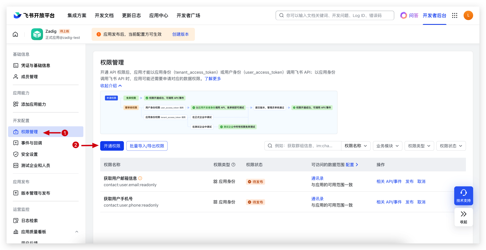
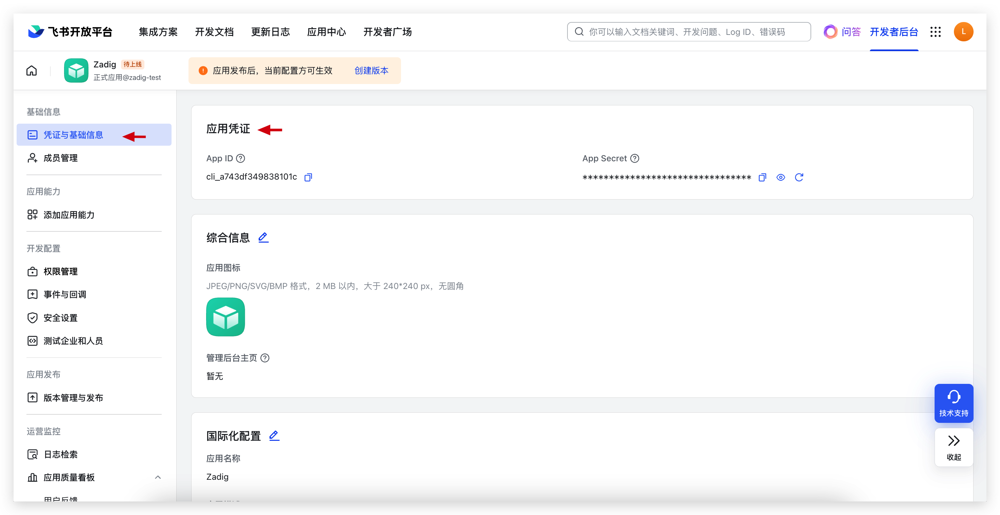
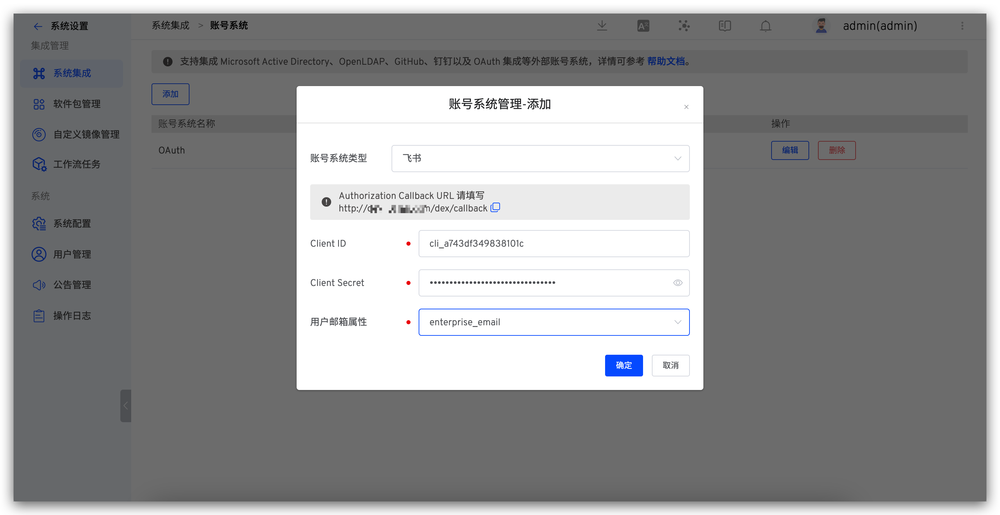
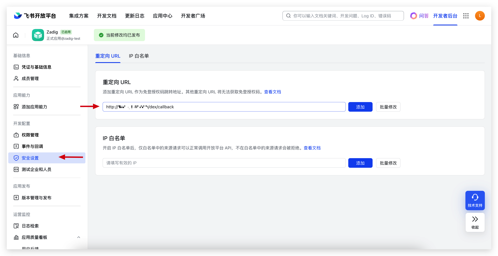

Zadig 账号系统支持集成飞书账号，用户可以通过配置飞书应用，实现飞书账号登录 Zadig。

## 步骤 1：创建飞书应用

1. 访问[飞书开放平台](https://open.feishu.cn/)，创建「企业自建应用」，如下图所示。

2. 在权限管理中配置权限范围，如下图所示。

需要的权限项如下：

- `contact:user.email:readonly`
- `contact:user.phone:readonly`

3. 获取 `App ID` 和 `App Secret`，如下图所示。
   

4. 创建版本，发布飞书应用。

## 步骤 2：配置 Zadig 账号集成

访问 Zadig，点击`系统设置`->`系统集成`->`账号系统`，选择 `飞书`，填入步骤 1 中获取的 `App ID` 和 `App Secret`，如下图所示。

获取其中的 Callback 地址，在飞书开放平台中配置回调地址，如下图所示。

