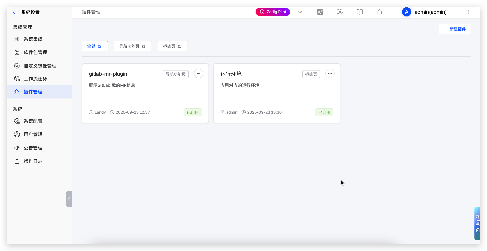
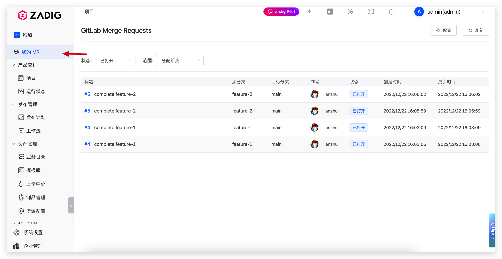
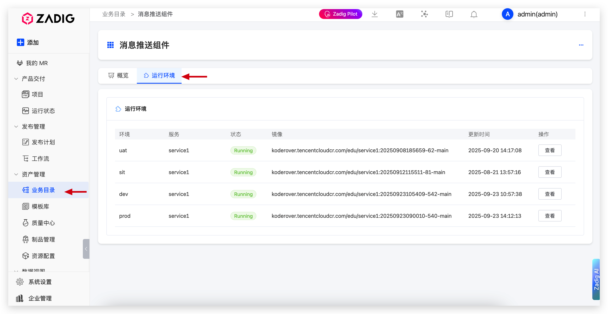

# 插件管理

Zadig 提供插件管理功能，允许用户根据业务需求自定义和扩展平台功能，增强用户体验。

## 功能概述

插件管理提供了灵活的扩展机制，让用户能够：

- **功能扩展**：通过插件扩展系统功能，满足个性化需求
- **界面定制**：自定义导航菜单和业务页面，提升用户体验
- **集成增强**：集成第三方工具和服务，实现更丰富的功能集成
- **灵活配置**：支持插件的启用和禁用

## 插件类型

插件支持两种主要类型，每种类型有不同的显示位置和用途：

### 导航功能页

导航功能页插件会出现在系统侧边栏菜单中，作为独立的导航项，提供独立的功能页面。

### 标签页

标签页插件会在业务目录的标签区域显示，在现有业务页面中添加额外的标签页内容。

## 插件管理

### 查看插件列表

在系统设置 → 插件管理中，可以查看所有已安装的插件，包括：
- 插件名称和描述
- 插件类型（导航功能页/标签页）
- 启用状态
- 操作按钮

### 安装新插件

1. 点击"新建插件"按钮
2. 填写插件信息：
   - **插件名称**：插件的显示名称
   - **插件类型**：选择导航功能页或标签页
   - **路由路径**：插件的访问路径（仅导航功能页需要）
   - **插件描述**：简要描述插件功能
   - **插件状态**：启用或禁用
3. 上传插件文件（plugin.js）
4. 点击"创建"完成安装

### 管理插件状态

- **启用插件**：插件在系统中可见且可用
- **禁用插件**：插件在系统中隐藏，配置信息保留
- **删除插件**：完全移除插件及其配置