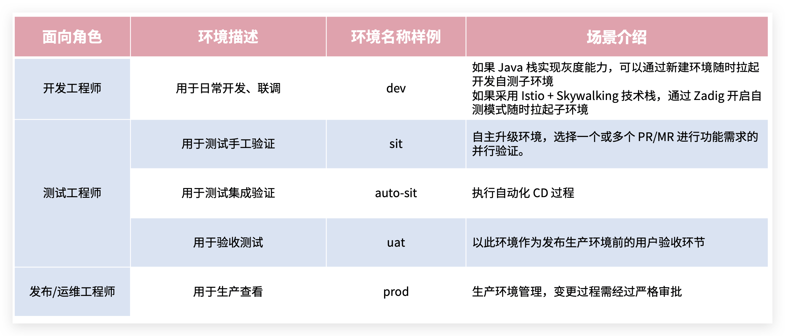
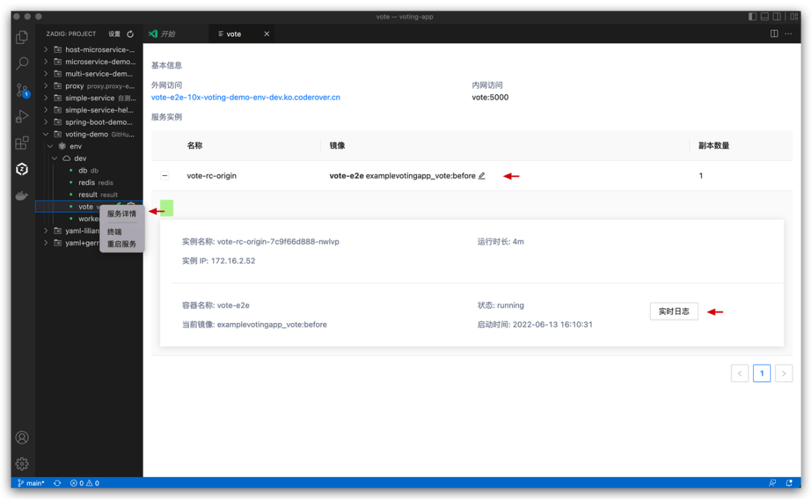
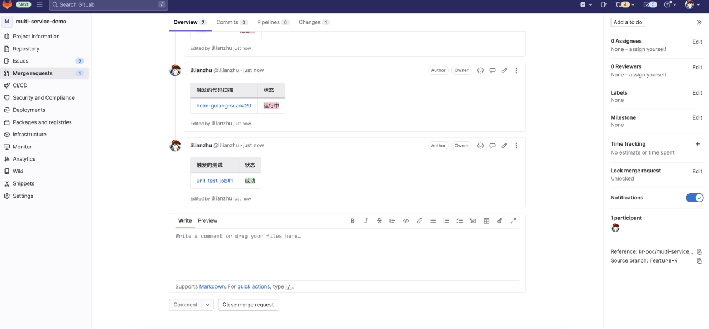
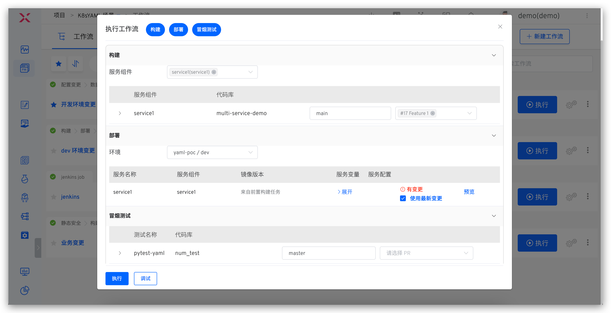
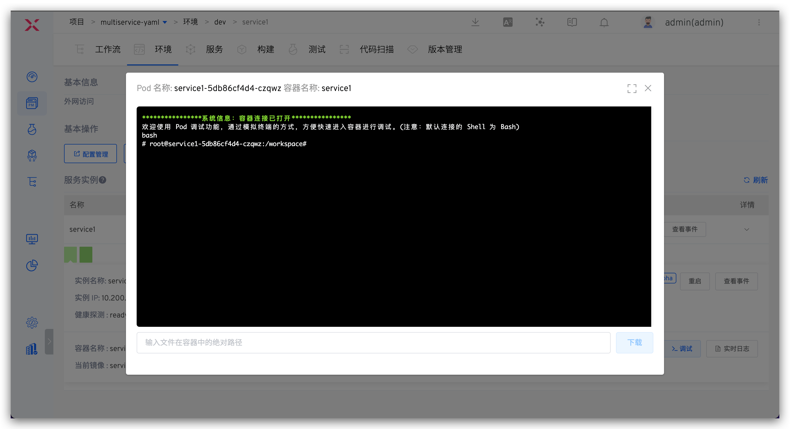
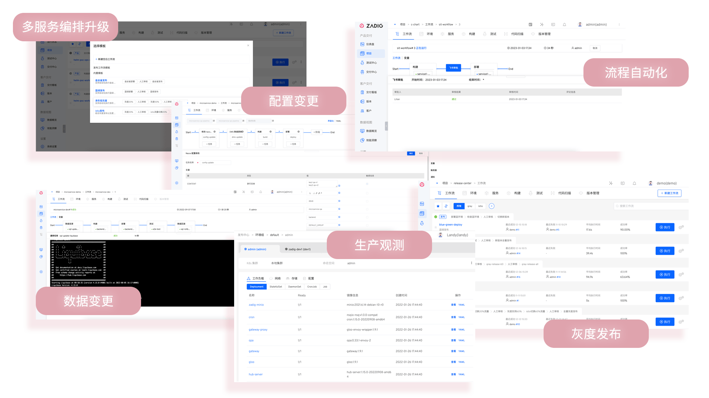
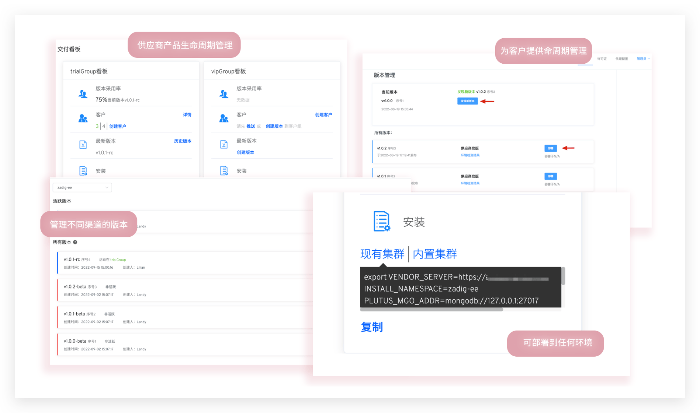

软件交付过程涉及人员、技术、流程和工具等多方面要素，常见挑战包括：开发环境模拟难、多业务联调复杂、研发效率低、手工测试占比高、环境不稳定、自动化难以落地、运维工具繁杂、手工操作频繁、交付效率低、跨部门沟通与流程制定耗时等。Zadig 通过平台工程和技术升级，提升组织效能，建立全流程一体化工程协同基线，助力企业高效完成软件交付，提升团队生产力。

## Zadig 产研协同方案

Zadig 提供工程底座，产研团队可统一协作实现敏捷交付，覆盖需求开发、测试、发布全生命周期。支持自定义流程、工具扩展、测试服务、IT 服务、安全服务等能力编排，通过 Zadig 实现自动化交付，提升工程效率。

## 核心场景使用介绍

开发、测试、运维工程师基于 Zadig 统一协作平面，使用自动化工作流和云原生环境进行交付。此外，业务负责人/企业管理人员可以在效能看板中分析项目整体运行情况，分析项目各个过程中的效能短板。以下面向不同角色展开介绍。

### 管理员准备

管理员（如运维工程师）在 Zadig 中配置团队协作所需的工程基础，包括研发、测试、运维等角色所需的环境和工作流。

**工作流示例**

**环境示例**

### 开发工程师

#### 本地自测

IDE 热部署，本地编写完代码热部署到远端环境，参考 [VSCode 插件使用指南](/cn/Zadig%20v4.1/zadig-toolkit/overview/)。

#### 提交代码及 CI 过程

1. 本地基于 develop 分支新建分支，完成代码开发后推送至远程仓库，并创建 PR/MR（Pull Request/Merge Request）。
2. 系统自动触发 CI 流程，包括单元测试、代码风格检查和代码扫描。
3. CI 执行结果将在 PR/MR 页面反馈。

#### 单个工程师自测

手动或自动触发 dev 工作流，包含：构建、部署 dev 环境、冒烟测试、IM 通知。

#### 多人集成联调

执行 dev 工作流，选择多个服务和对应的代码变更。

#### 更新同一个服务

执行 dev 工作流，选择服务及其多个代码变更。

#### 更新业务配置

> 适用场景：改动涉及到配置变更

以 Nacos 配置为例，执行对应环境的工作流，选择 Nacos 配置并修改。

#### 更新项目管理任务状态

> 适用场景：功能实现完毕后一键修改跟踪任务的状态

以 Jira 为例，执行工作流，选择对应的 Jira 任务。

#### 更新数据库

> 适用场景：改动涉及到数据变更（如表结构变更、表字段变更...）

以 MySQL 数据库为例，通过工作流输入 SQL 语句完成数据更新。

#### 服务调试

查看环境和服务状态。

查看服务实时日志。

进入容器调试。

临时替换服务镜像。

调整副本数量或重启实例。

### 测试工程师

#### 管理测试用例

1. 本地编写测试用例脚本并针对 sit 环境自测。
2. 自测通过后提交到代码仓库。

#### sit 发布验证

执行 sit 工作流更新环境进行集成验证，包括：构建、部署 sit 环境、接口测试、IM 通知。

#### uat 发布验证

执行 uat 工作流做预发布验证，包含：质量门禁、构建、Nacos 配置变更、部署 uat 环境、回归测试、IM 通知。

#### 自动化测试结果分析

分析自动化测试结果，基于覆盖情况持续优化自动化测试套件。

### 发布工程师

#### 生产环境发布

> 支持多种发布策略。

**滚动发布**

执行 prod 工作流更新生产环境，包含：发布审批、Nacos 配置变更、部署。

**蓝绿发布**

执行工作流更新生产环境，包含：部署蓝环境、审批、切换生产版本。

**金丝雀发布**

执行工作流更新生产环境，包含：部署金丝雀、随机测试、审批、新版本全量发布。

**分批次灰度发布**

执行工作流更新生产环境，包含：灰度 20%、审批、灰度 60%、审批、新版本全量发布。

**Istio 发布**

执行工作流更新生产环境，包含：部署新版本 20% 流量导入新版本、审批、100% 流量导入新版本。

### 项目/企业管理人员

企业管理人员可通过效能看板查看企业项目整体运行状况。

分析项目各环境变化过程及效能瓶颈。

## 更多产品特性

### 开源 Zadig 的一切

支持云原生 CI/CD、产研高效工程协作，快速响应业务迭代。

参考：

- [Zadig 最佳实践](https://mp.weixin.qq.com/mp/appmsgalbum?action=getalbum&__biz=Mzg4NDY0NTMyNw==&scene=1&album_id=2315406414233927682&count=3#wechat_redirect)
- [Zadig 企业案例](https://mp.weixin.qq.com/mp/appmsgalbum?action=getalbum&__biz=Mzg4NDY0NTMyNw==&scene=1&album_id=2408445357925269505&count=3#wechat_redirect)

### 发布中心

可灵活编排多种发布策略，支持蓝绿、金丝雀、分批次灰度、Istio 等发布策略，以及 APISIX + MSE 等灰度发布方案。配合人工审批可实现一键自动化、安全可靠发布。

参考：

- [Zadig 发布策略](/cn/Zadig%20v4.1/project/release-workflow/)
- [Zadig 工作流审批](/cn/Zadig%20v4.1/workflow/approval/)

### 客户交付

面向大客户全天候响应、全地域升级部署，提供自运维和专用服务通道，实现稳定高效交付和服务保障。

参考：

- [客户交付](/cn/Zadig%20v4.1/plutus/overview/)

