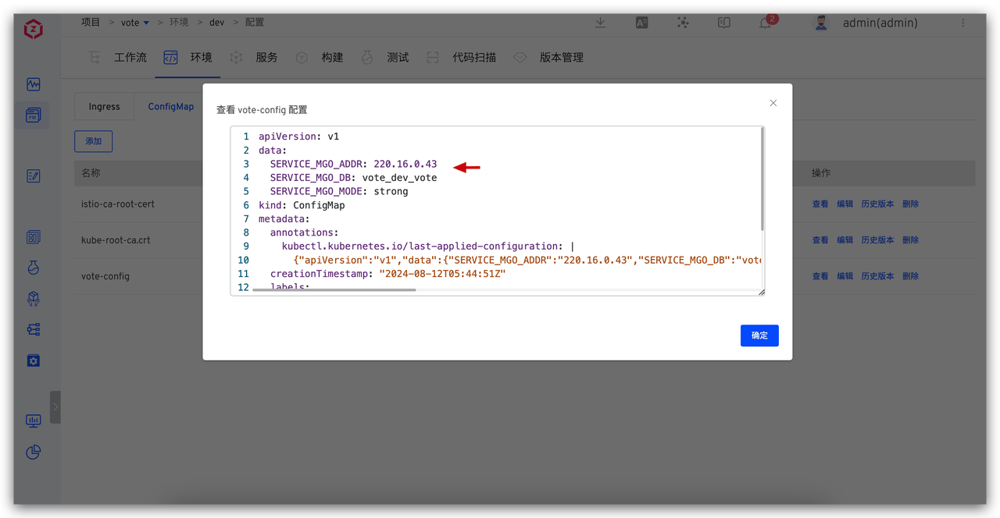
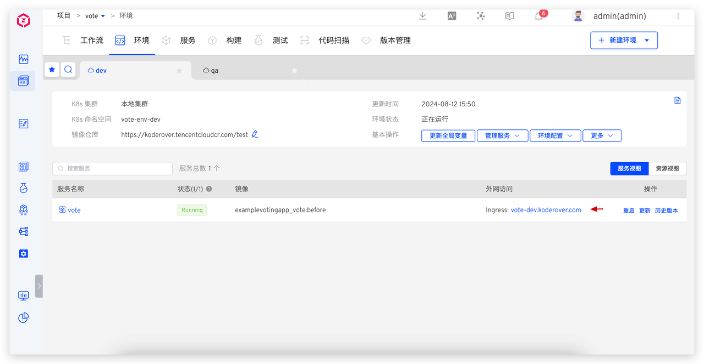

本文介绍如何使用 Zadig K8s YAML 项目的变量配置能力，通过一套配置实现多环境隔离和全局配置管理。主要应用场景包括：

- **数据库隔离**：每个环境的业务数据独立存放在不同的数据库中，互不影响
- **差异化域名访问**：使用不同的域名地址访问不同的环境
- **差异化业务配置**：业务配置管理在 Nacos、Apollo 等配置中心，不同环境使用不同的配置
- **全局管理共享配置**：对多个服务共享的同一组配置进行全局管理

Zadig 提供了系统内置变量和自定义变量来区分不同环境的变量值。下面详细介绍以上配置在 Zadig 系统中的实践方法。

## 数据库隔离

> **适用场景**：不同环境的业务数据需要互相隔离，适用于一个数据库对应多个连接地址，或连接不同数据库的情况。

### 配置服务变量

以 `vote` 服务为例，该服务的数据库配置管理在 ConfigMap 中，并通过 volume 挂载到应用中。在 Zadig 中，我们将数据库配置项抽取为自定义变量：

- **`mgo_addr`**：数据库地址，默认值设置为 `220.16.0.43`（可根据实际情况调整）
- **`mgo_db`**：数据库名称，默认值设置为 `$Product$_$EnvName$_vote`

其中使用了系统内置全局变量：
- `$Product$`：项目名称
- `$EnvName$`：环境名称


### 使用服务变量

新建环境时，配置中的变量可以使用默认值，也可以重新指定。


环境创建时，变量会被自动渲染。例如：
- dev 环境：`vote-dev-vote`
- qa 环境：`vote-qa-vote`




**示例 YAML 配置：**
:::details
```yaml
apiVersion: apps/v1
kind: Deployment
metadata:
  labels:
    app: vote
  name: vote-rc-origin
spec:
  replicas: 1
  selector:
    matchLabels:
      app: vote
      version: rc-origin
  template:
    metadata:
      labels:
        app: vote
        version: rc-origin
    spec:
      containers:
      - image: dockersamples/examplevotingapp_vote:before
        name: vote-e2e
        ports:
        - containerPort: 80
          name: vote
        volumeMounts:
        - name: config-volume
          mountPath: /app/config
      volumes:
      - name: config-volume
        configMap:
          name: vote-config
---
apiVersion: v1
kind: ConfigMap
metadata:
  name: vote-config
data:
  SERVICE_MGO_ADDR: {{.mgo_addr}}
  SERVICE_MGO_DB: {{.mgo_db}}
  SERVICE_MGO_MODE: strong
```
:::

## 差异化域名访问

> **适用场景**：在 Zadig 中创建多套环境，使用不同的域名访问不同的环境。

### 配置泛域名

为集群入口配置一个泛域名，例如：`*.koderover.com`。确保域名 DNS 正确解析到集群 [Ingress 控制器](https://kubernetes.io/zh/docs/concepts/services-networking/ingress-controllers/) LoadBalancer 的外网 IP 上。


### 配置及使用服务变量

为业务入口配置外网访问地址，在 Zadig 中配置全局变量：<span v-pre>{{.domain}}</span>，变量值设为：`vote-$EnvName$.koderover.com`


新建环境时，系统会自动渲染变量：




**示例 YAML 配置：**
:::details
```yaml
apiVersion: apps/v1
kind: Deployment
metadata:
  name: vote-rc-origin
spec:
  replicas: 1
  selector:
    matchLabels:
      app.kubernetes.io/instance: vote
      app.kubernetes.io/name: vote
  template:
    metadata:
      labels:
        app.kubernetes.io/instance: vote
        app.kubernetes.io/name: vote
    spec:
      containers:
      - image: dockersamples/examplevotingapp_vote:before
        name: vote-e2e
        ports:
        - containerPort: 80
          name: vote

---
apiVersion: networking.k8s.io/v1
kind: Ingress
metadata:
  name: vote
  annotations:
    nginx.ingress.kubernetes.io/proxy-body-size: 100m
spec:
  ingressClassName: {{.ingressClass}}
  rules:
  - host: {{.domain}}
    http:
      paths:
      - backend:
          service:
            name: vote
            port:
              number: 5000
        path: /
        pathType: ImplementationSpecific
---
apiVersion: v1
kind: Service
metadata:
  name: vote
spec:
  type: NodePort
  ports:
    - protocol: TCP
      port: 5000
      targetPort: 80
  selector:
    app.kubernetes.io/instance: vote
    app.kubernetes.io/name: vote
```
:::

## 差异化业务配置

> **适用场景**：服务的业务配置在第三方配置中心管理（如 Nacos、Apollo 等），不同环境使用不同的配置项。下面以 Apollo 配置中心为例，说明如何通过 Zadig 管理不同环境的业务配置。

### 配置服务变量

以 `myapp` 服务为例，在 Zadig 中设置 Apollo 配置参数与 Zadig 环境变量的对应关系：

| 配置项 | 说明 | 变量类型 | 默认值 |
|--------|------|----------|--------|
| `APOLLO_APP_NAMESPACE` | Apollo 配置中心的命名空间 | 自定义变量 `apollo_app_namespace` | `zadig.dev` |
| `APOLLO_APP_ID` | Apollo 配置中心的应用 | 系统内置变量 `$Service$` | - |
| `APOLLO_APP_ENV` | Apollo 配置中心的环境 | 系统内置变量 `$EnvName$` | - |
| `APOLLO_APP_CLUSTER` | Apollo 配置中心的集群 | 自定义变量 `apollo_app_cluster` | `local` |


### 使用服务变量

当环境启动或 `myapp` 服务启动时，会从相应的配置中心获取服务配置。

dev 和 qa 环境效果：


**示例 YAML 配置：**
:::details
```yaml
apiVersion: v1
kind: Service
metadata:
  name: a
  labels:
    app: a
spec:
  ports:
  - name: http
    port: 80
    targetPort: 8080
  selector:
    app: a

---

apiVersion: apps/v1
kind: Deployment
metadata:
  name: a
  labels:
    app: a
spec:
  selector:
    matchLabels:
      app: a
  replicas: 1
  template:
    metadata:
      labels:
        app: a
    spec:
      containers:
      - name: myapp-1
        image: koderover.tencentcloudcr.com/koderover-demo/myapp-1:v0.1__linux_amd64
        imagePullPolicy: Always
        command: ["/myapp-1"]
        args: ["--downstream-addr", "$(DOWNSTREAM_ADDR)", "--headers", "$(HEADERS)"]
        env:
          - name: DOWNSTREAM_ADDR
            value: "b"
          - name: HEADERS
            value: "x-request-id"
          - name: APOLLO_APP_NAMESPACE
            value: {{.apollo_app_namespace}}
          - name: APOLLO_APP_ID
            value: $Service$
          - name: APOLLO_APP_ENV
            value: $EnvName$
          - name: APOLLO_APP_CLUSTER
            value: {{.apollo_app_cluster}}
        ports:
        - containerPort: 8080
        resources:
          limits:
            cpu: 100m
            memory: 100Mi
```
:::

## 全局管理共享配置

在实际应用场景中，多个服务经常共享相同的配置信息（如数据库地址、配置管理系统地址等）。为了有效管理这些共享配置并简化维护工作，我们可以使用**全局变量**来统一存储和管理这些变量。

### 优势

- **统一管理**：一次修改，全局生效
- **减少错误**：避免重复配置导致的配置不一致
- **提高效率**：简化配置维护工作

### 配置全局变量

从服务变量中抽取部分变量为全局变量：


### 使用全局变量

新建环境时可以选择服务是否使用全局变量：


环境中全局变量的值可以被修改。一旦全局变量发生变更，所有依赖这些变量的服务将自动同步更新，确保配置的一致性和实时性：


