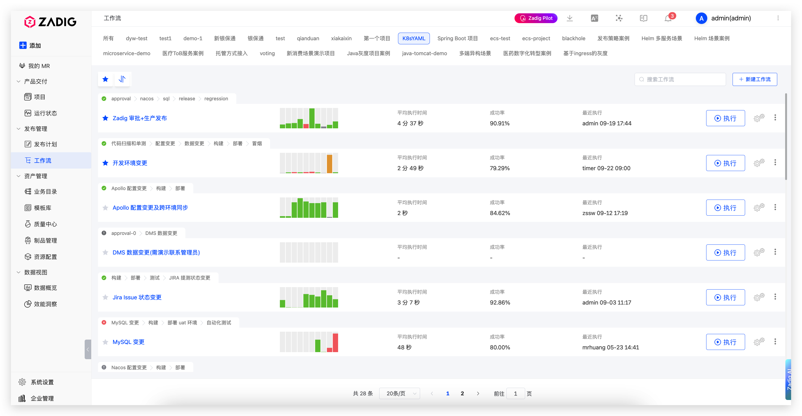

Zadig 提供全局工作流页面，作为统一的工作流管理中心，提供便捷的工作流管理和执行体验。

## 功能概述

全局工作流页面集成了所有项目的工作流，提供统一的管理界面，让工程师能够：

- **统一管理**：在一个页面中查看和管理所有项目的工作流
- **快速访问**：通过搜索和筛选功能快速定位目标工作流
- **状态监控**：实时查看工作流的执行状态和性能指标
- **便捷操作**：一键执行、配置和管理工作流

## 使用场景

### 日常开发流程

工程师可以通过全局工作流页面：

1. **快速执行**：选择对应的工作流一键执行开发、测试、部署等操作
2. **状态监控**：实时查看工作流执行状态和历史记录

### 统一工作流管理

- **统一视图**：在一个界面中管理多个项目的工作流
- **快速切换**：通过项目标签快速切换不同项目的工作流

