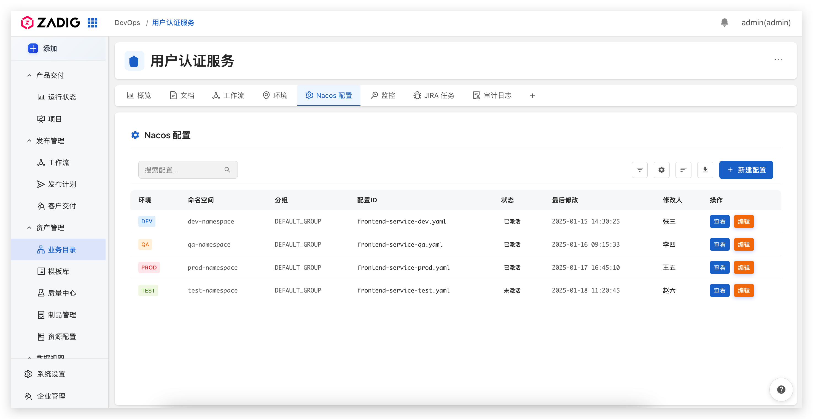

业务目录是 Zadig 系统中的核心服务管理模块，提供统一的服务视角管理能力。通过业务目录，您可以快速检索和查看项目、服务元信息，包括但不限于业务归属、负责人、代码库、语言框架、环境、配置等信息。业务目录还支持自定义业务模型配置和标签页面定制，帮助您构建符合业务需求的服务管理体系。

## 核心价值

- **快速问题定位**：发生问题时，能迅速找到相关服务和负责人，提升故障排查效率。
- **一站式服务管理**：元信息汇总，无需切换系统，即可完成服务迭代工作，简化运维流程。
- **降低新人上手成本**：新员工可以通过导航快速熟悉公司的技术栈和开发环境。

## 自定义业务模型

业务目录支持自定义业务模型配置，您可以根据实际业务需求灵活配置字段信息。

### 预设字段

系统提供以下预设字段，满足基本业务管理需求：

- **名称**：服务的名称
- **标识**：服务的唯一标识符  
- **项目归属**：服务所属的项目
- **类型**：服务的类型
- **负责人**：服务的负责人
- **代码库**：代码仓库信息
- **描述**：服务的详细描述
- **测试配置**：测试环境的配置
- **生产配置**：生产环境的配置

### 自定义字段

除预设字段外，您还可以添加自定义字段，支持以下字段类型：

- **文本**：单行文本
- **数字**：数值类型
- **布尔**：是/否选择
- **日期时间**：日期和时间选择
- **单选**：单选下拉列表
- **多选**：多选下拉列表
- **链接**：URL链接
- **用户**：Zadig 系统内用户
- **用户组**：Zadig 系统内用户组
- **项目**：Zadig 项目

## 标签页面自定义

业务目录详情页中的标签页面支持自定义开发，您可以根据业务需求灵活配置标签展示内容，比如工作流、环境、配置、监控等页面。

自定义插件开发，请参考[插件开发文档](/cn/Zadig%20v4.1/settings/plugin/#插件开发)

<!-- - [官方插件仓库](https://github.com/koderover/zadig-plugins) - 查看 Zadig 官方提供的插件模板 -->
