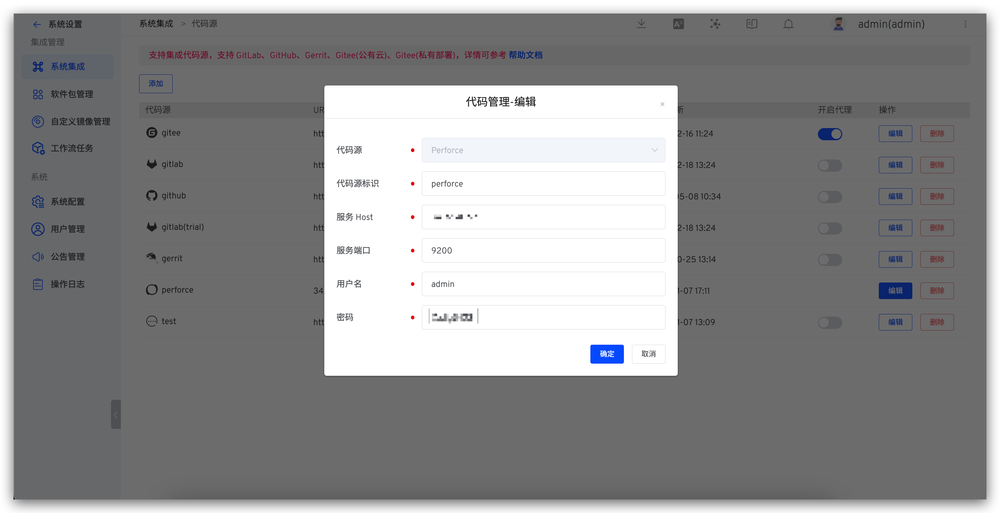

本文主要介绍在 Zadig 上如何集成 Perforce 代码源。

> 目前 Zadig 系统采用 Basic Auth 的方式从 Perforce 获取代码以及调用 Perforce 的 API

- `代码源`：此处选择 `Perforce`
- `代码源标识`：自定义，方便在 Zadig 系统中快速识别出该代码源，该信息在整个系统内唯一
- `服务 Host`： Perforce 服务地址
- `服务端口`： Perforce 服务端口
- `用户名`：Perforce 用户名
- `密码`： Perforce 密码