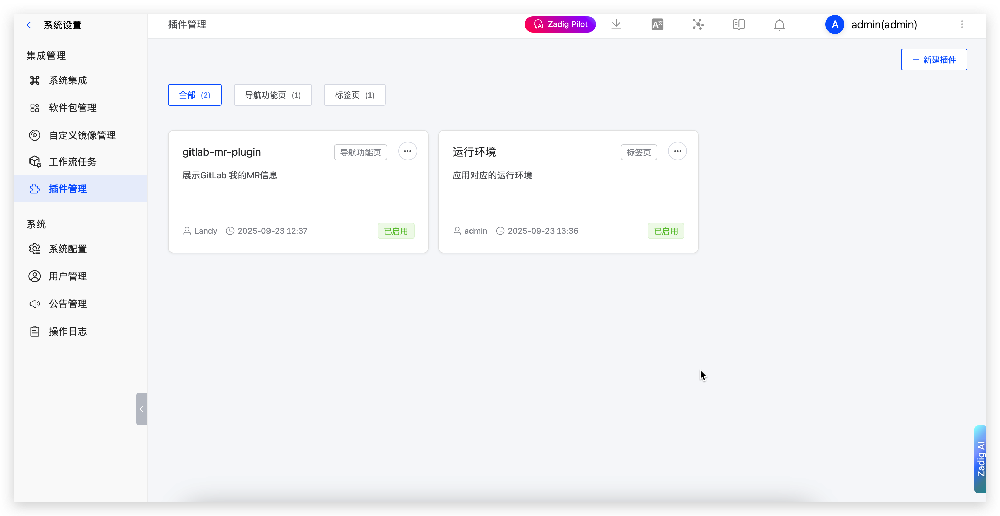
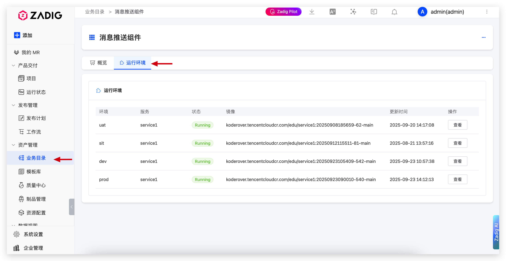

Zadig 提供插件管理功能，允许用户根据业务需求自定义和扩展平台功能，增强用户体验。

## 功能概述

插件管理提供了灵活的扩展机制，让用户能够：

- **功能扩展**：通过插件扩展系统功能，满足个性化需求
- **界面定制**：自定义导航菜单和业务页面，提升用户体验
- **集成增强**：集成第三方工具和服务，实现更丰富的功能集成
- **灵活配置**：支持插件的启用和禁用

## 插件类型

插件支持两种主要类型，每种类型有不同的显示位置和用途：

### 导航功能页

导航功能页插件会出现在系统侧边栏菜单中，作为独立的导航项，提供独立的功能页面。

### 标签页

标签页插件会在业务目录的标签区域显示，在现有业务页面中添加额外的标签页内容。

<!-- ::: 官方插件
官方插件库：https://github.com/koderover/xxx
欢迎贡献自定义插件
::: -->
## 使用场景
### 定制化企业 IDP

插件管理功能为构建企业内部开发者平台（Internal Developer Platform, IDP）提供了强大的扩展能力：

- **统一开发体验**：通过插件整合企业内部的各种开发工具和服务，为开发者提供统一的开发环境
- **个性化定制**：根据企业文化和开发流程，定制符合团队习惯的界面和功能
- **工具链集成**：无缝集成代码管理、CI/CD、监控、日志等开发工具，形成完整的开发工具链
- **标准化流程**：通过插件标准化开发流程，提高团队协作效率
- **知识沉淀**：将企业内部的开发经验和最佳实践通过插件形式固化到平台中

## 插件开发

文档建设中，敬请期待……
<!-- 补充文档 -->

::: tip 开发支持
如需插件开发支持，请联系 Zadig 技术支持团队。
:::
