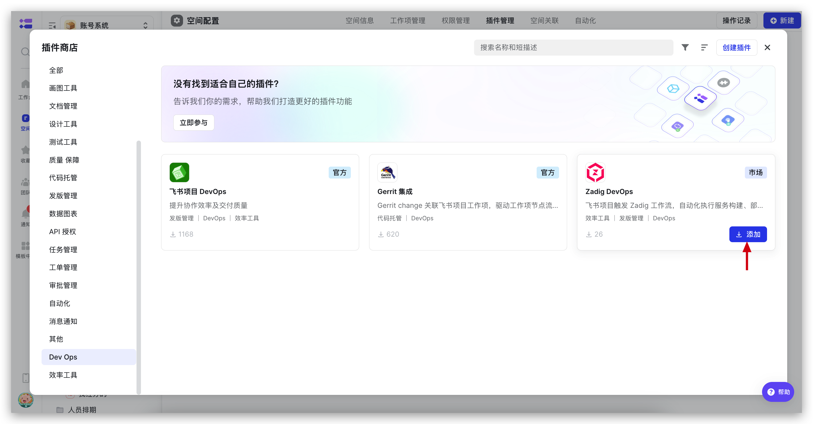
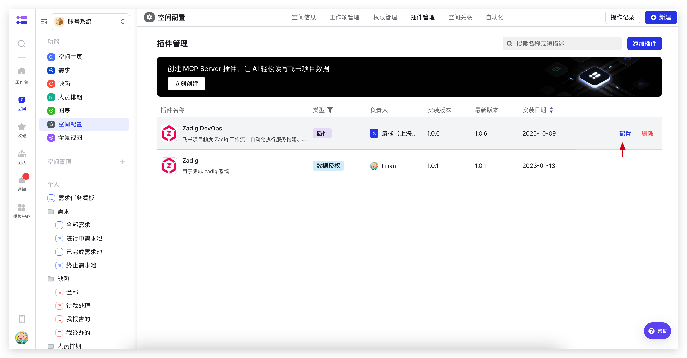
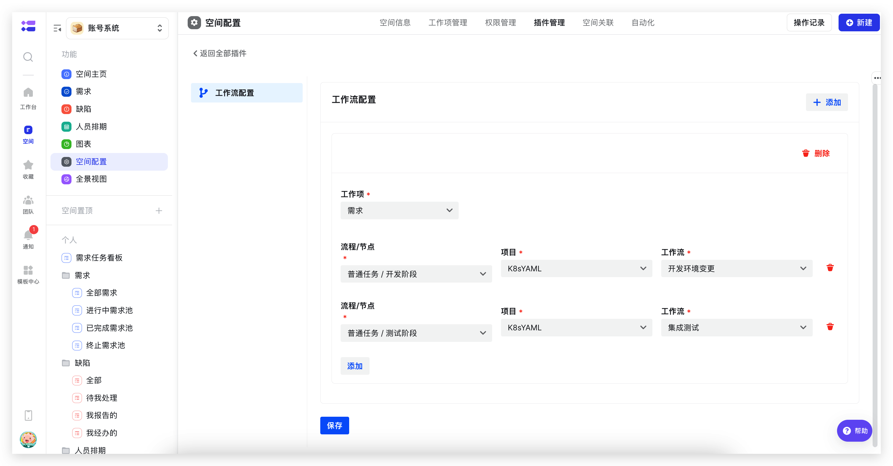
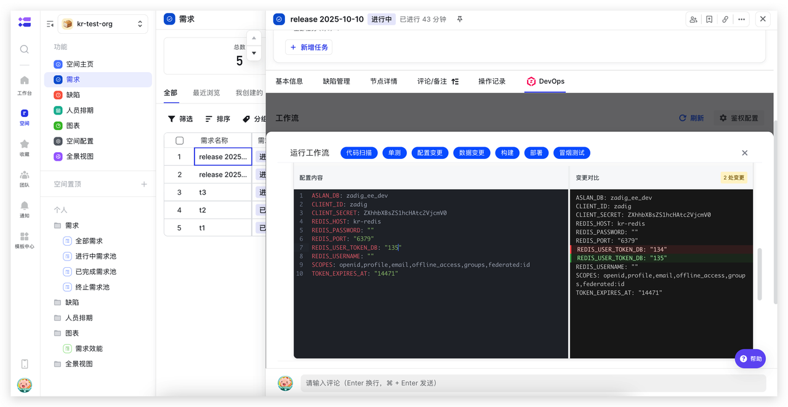
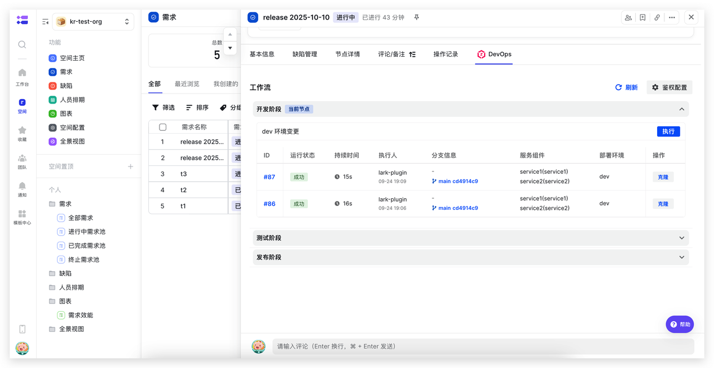
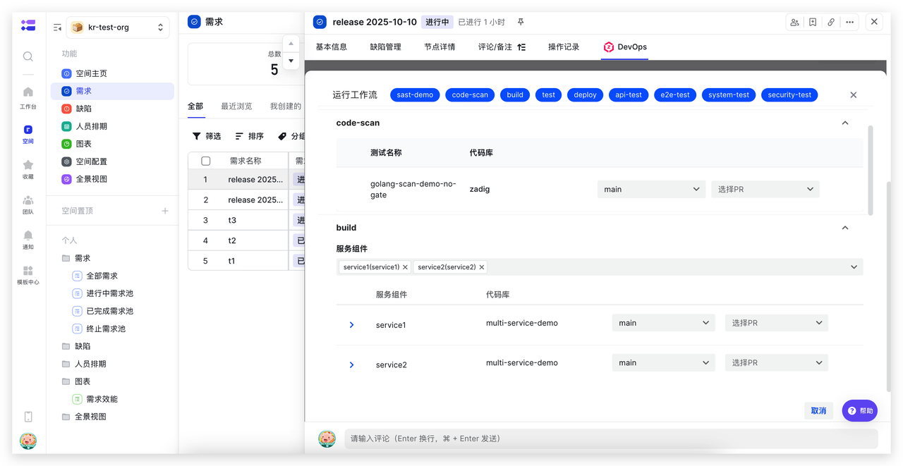
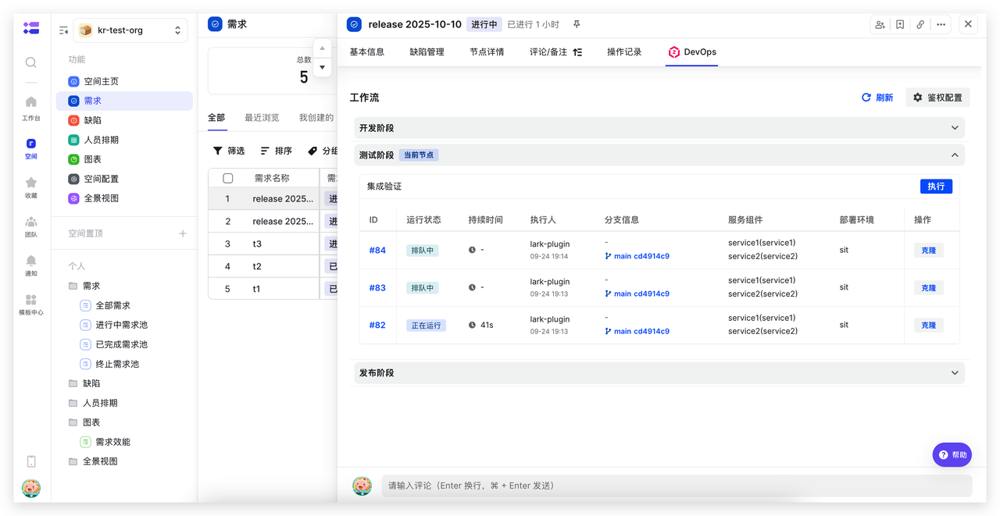
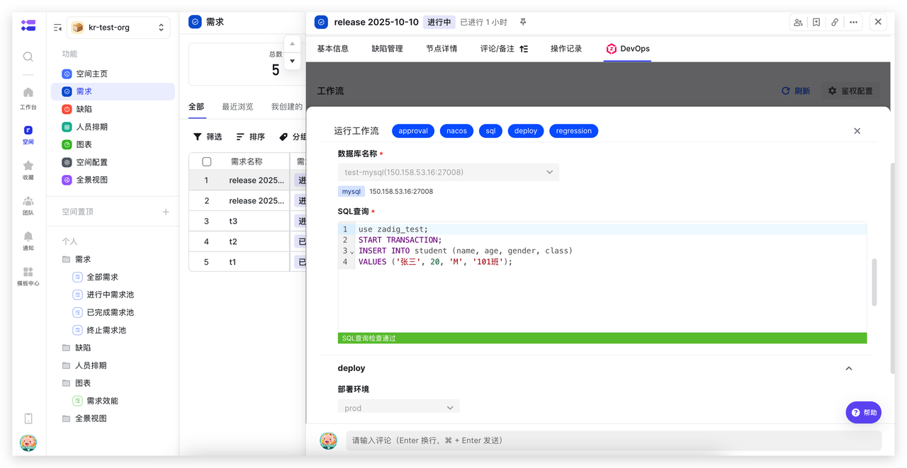
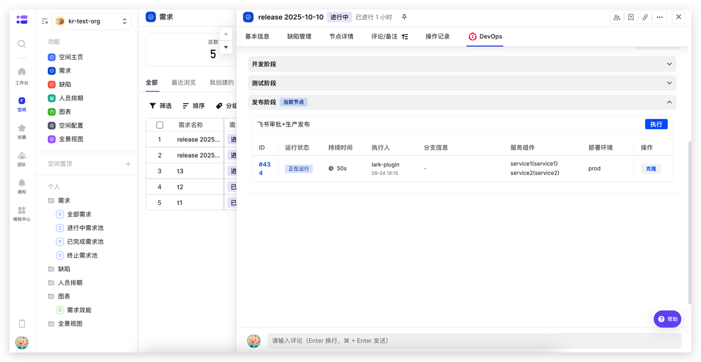

Zadig DevOps 飞书项目插件允许在飞书项目触发 Zadig 工作流，自动化执行服务构建、部署、发布等操作，提升效率保障质量。

## 插件配置

### 安装插件

飞书项目空间管理员在插件管理中找到「Zadig DevOps」插件，点击“添加” 完成安装。

### 插件配置

安装完成后，在插件管理中找到安装好的「Zadig DevOps」插件，点击右侧“配置”开始配置插件。

配置工作项各个节点和 Zadig 工作流的对应关系，如下图所示。

## 使用场景

### 开发自测阶段：更新开发环境并进行自测联调

在飞书项目开发节点上直接执行 Zadig 开发工作流，自动化执行代码扫描、单元测试、构建、部署、冒烟测试等过程，结合配置变更、数据变更等能力实现开发过程一致性变更，减少频繁的系统切换成本，提升研发效率。

### 集成验证阶段：更新测试环境并进行自动化验证

在飞书项目测试节点直接执行 Zadig 测试工作流，自动化完成接口测试、性能测试、安全扫描等全流程，提升测试验证效率和质量。

### 生产发布阶段：结合飞书审批进行生产发布

在飞书项目发布节点直接执行 Zadig 发布工作流，自动化完成服务更新、配置变更、数据变更等过程，结合飞书审批应用，实现高效、稳定的发布。

