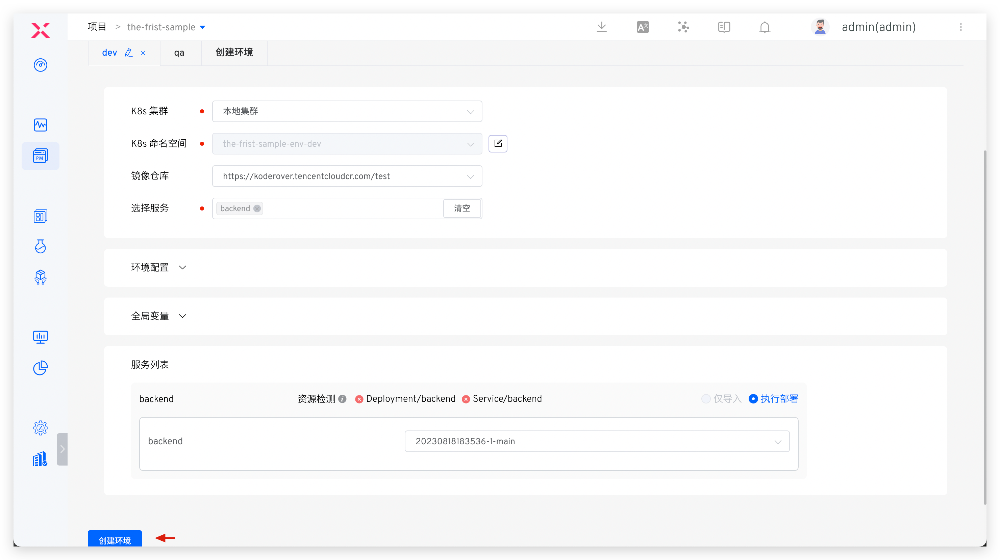

本文以容器化微服务为例，帮助用户快速了解 Zadig 系统的基本能力，涵盖从代码提交到交付的完整流程。

## 准备工作

- 安装 Zadig：[安装文档](/cn/Zadig%20v4.2/install/guide)
- 集成 GitHub 代码源并 fork [案例源码](https://github.com/koderover/zadig/tree/main)，代码源集成参考：[GitHub 集成](/cn/Zadig%20v4.2/settings/codehost/github/)
- 集成镜像仓库：[镜像仓库集成](/cn/Zadig%20v4.2/settings/image-registry/)

::: tip
如未使用 GitHub 代码源，可将代码下载并上传至自有代码源后在 Zadig 中集成，参考：[代码源集成](/cn/Zadig%20v4.2/settings/codehost/overview/)。
:::

## 第 1 步：项目配置

访问 Zadig，点击“项目”->“新建项目”，选择 K8s YAML 项目类型，填写项目信息。


点击“立即新建”，进入项目初始化向导，点击“下一步”新建服务：


## 第 2 步：新建服务
包括新建服务及为服务配置构建，后者用于后续工作流部署更新。

### 新建服务
点击“从代码库同步”，选择服务配置所在的代码库、分支和目录，点击“同步”。

> 本例中选择 `zadig` 库，`main` 分支，指定文件夹为 `examples/microservice-demo/k8s-yaml/backend` 即可。


新建服务后，系统自动校验 YAML 格式，并加载系统变量、自定义变量及服务组件。


### 配置构建

点击“添加构建”，为服务配置构建，选择依赖软件包、代码托管平台、代码库及分支，填写构建脚本后保存。


示例配置：
- 依赖软件包：go 1.20.7
- 代码信息：选择 `zadig` 代码库，`main` 分支
- 通用构建脚本：
``` bash
#!/bin/bash
set -ex

cd zadig/examples/microservice-demo/backend
make build-backend

docker build -t $IMAGE -f Dockerfile .
docker push $IMAGE
```

点击“下一步”进入环境准备。

## 第 3 步：加入环境

点击“新建环境”，系统自动创建 2 套环境和 3 条工作流，分别用于开发和测试环节，工作流自动绑定环境以实现持续交付。

::: tip
新建环境所需时间与服务配置和数量有关，请耐心等待。
:::



环境创建完成后点击“下一步”进入工作流交付。

## 第 4 步：工作流交付

点击运行 `the-first-sample-workflow-dev` 工作流，完成 dev 环境的持续交付。根据需求选择要部署的服务及分支或 pull request，启动任务：


工作流运行结束后，环境中的服务版本自动更新：


其他环境交付方式与 dev 环境类似。

至此，Zadig 基本功能演示完毕，以下为自动触发工作流配置说明。

### 配置自动触发工作流（可选）

点击配置 `the-first-sample-workflow-dev` 工作流：


添加触发器，选择 Git 触发器，填写配置并保存：


在 GitLab 提交 pull request 后，check list 展示对应工作流状态：


点击任务链接可跳转至 Zadig 查看工作流详情并跟踪代码变更：


工作流运行完成后，可见环境服务镜像已更新：


### 配置工作流 IM 状态通知（可选）

工作流支持第三方 Webhook，可配置状态通知，便于及时获取任务状态。目前支持钉钉、飞书、企业微信。

> 钉钉和企业微信配置参考：[通知配置](/cn/Zadig%20v4.2/workflow/im/)。

第 1 步：在飞书添加 Bot，获取 Webhook 地址：


第 2 步：配置工作流，添加通知模块，填写飞书 Bot Webhook 地址，选择通知事件：


通知效果示例：


更多实战项目和案例，参考 [Zadig 教程](https://www.koderover.com/tutorials)。
