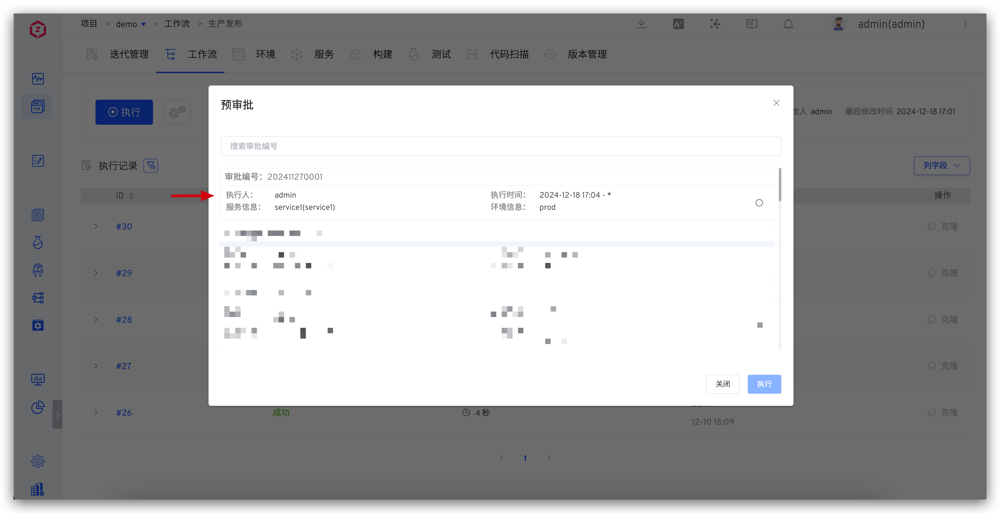

本文介绍 Zadig 如何对接外部审批系统，利用外部审批单的结果作为工作流的执行卡点。

审批卡点及执行可选项限制点：
1. 审批状态
2. 执行人
3. 执行时间
4. 环境
5. 服务

## 步骤 1：调用 OpenAPI 提交审批数据

参考 [创建预审批单 OpenAPI](/cn/Zadig%20v4.2/api/workflow/)文档，提交审批数据到 Zadig 系统。

## 步骤 2：开启工作流预审批

编辑工作流，在「高级配置」- 「预审批」中开启「第三方审批单」，并保存工作流。

## 步骤 3：执行工作流

开启预审批后，执行工作流，需要先选择审批单，才可继续执行工作流。

**说明：**
- 审批单可选限制：
  1. 通审批单状态为有效时，则审批单可选。
  2. 审批单执行人包含当前用户或者未设定执行人，则审批单可选择。
  3. 当前时间在审批单设置的执行时间范围，则审批单可选择。
- 执行工作流变量选择限制：
  1. 环境可选项与审批单设定的环境信息保持一致。
  2. 服务可选项与审批单设定的服务信息保持一致。
  3. 若审批单中未设定服务和环境，则可选择系统中所有环境和服务。
