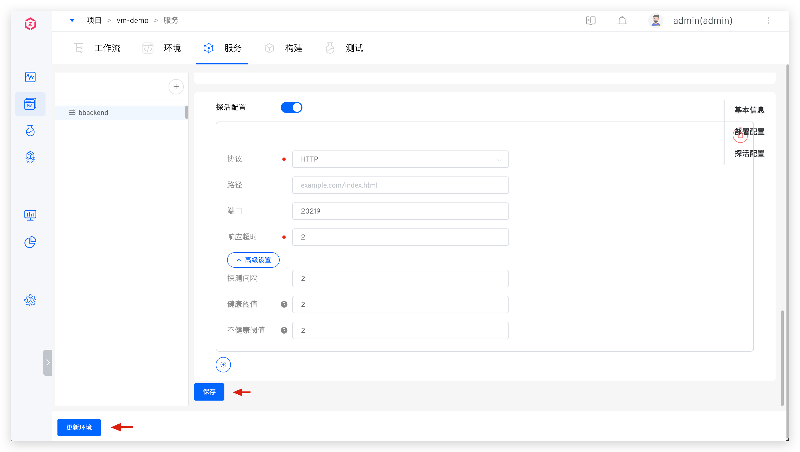
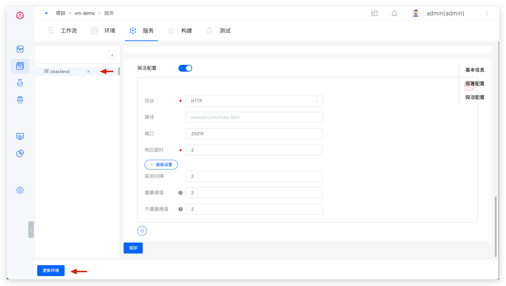

本文介绍自由项目中的主机服务相关操作。

## 添加服务

点击添加服务按钮 -> 输入服务名称 -> 添加构建 -> 配置部署及探活后，保存即可。

### 构建配置

具体详细参考 [构建配置](/cn/Zadig%20v4.2/project/build/)。

> 若使用工作流的主机部署步骤，在服务构建中必须添加「二进制包存储」步骤。

### 部署配置

配置部署方式及部署脚本，定义服务的部署过程。

#### 部署环境

部署任务执行的环境，支持 Kubernetes 和主机两种基础设施。

#### 部署方式
##### 本地直连部署

在 Zadig 中执行部署脚本，利用部署工具（比如：Ansible）将服务部署到目标主机上。需要确保部署工具就绪，Zadig 系统和目标部署主机的网络连通。

##### SSH Agent 远程部署

安全登录到目标机器上执行部署操作。需要提前在系统中配置好主机资源，参考 [主机管理](/cn/Zadig%20v4.2/settings/vm-management/)。

#### 交付物类型

根据不同的实际交付物类型选择，选择后影响「主机部署」任务中交付物的类型。

#### 内置部署变量

除了可使用[构建变量](#构建变量)中的变量，还包括以下变量：

- `ARTIFACT`：部署的交付物包，通过该变量可获取交付物包。
    - 使用工作流部署服务时，交付物包的实体为[更多构建步骤](#更多构建步骤)中增加的二进制包存储，即 $PKG_FILE 文件。
- `IMAGE`： 构建任务输出的镜像名称。
- `ENV_NAME`：环境名称，用于区分不同的环境，系统内置环境：dev，qa。
- `<AGENT_NAME>_PK`：通过 SSH Agent 远程登录主机使用的私钥信息，其中 AGENT_NAME 为 SSH Agent 名称。使用下图例中的主机作为 SSH Agent，则部署脚本中使用 $zadig_PK 即可获得该主机服务器的私钥信息。
- `<AGENT_NAME>_USERNAME`：通过 SSH Agent 远程登录到主机的用户名称，下图例中即为 $zadig_USERNAME。
- `<AGENT_NAME>_IP`：SSH Agent 目标服务器的主机地址（不包含端口），下图例中即为 $zadig_IP。
- `<AGENT_NAME>_PORT`：SSH Agent 目标服务器的主机地址中的端口，下图例中即为 $zadig_PORT。

- `<ENV>_HOST_IPs`：获取特定环境中指定服务关联的所有主机 IP，下图例中，使用 $dev_HOST_IPs 即可获得 dev 环境所关联的所有主机 IP 信息。
- `<ENV>_HOST_NAMEs`：获取特定环境中指定服务关联的所有主机名称，下图例中即为 $dev_HOST_NAMEs。

- `<HOST_NAME>_PK`：HOST_NAME 为具体的主机名称，通过 `<HOST_NAME>_PK` 获得对应主机的私钥信息，下图例中即为 $dev_PK。
- `<HOST_NAME>_USERNAME`：HOST_NAME 为具体的主机名称，通过 `<HOST_NAME>_USERNAME` 获得对应主机的用户名信息，下图例中即为 $dev_USERNAME。
- `<HOST_NAME>_IP`：HOST_NAME 为具体的主机名称，通过 `<HOST_NAME>_IP` 获得对应主机的地址信息(不含端口)，下图例中即为 $dev_IP。
- `<HOST_NAME>_PORT`：HOST_NAME 为具体的主机名称，通过 `<HOST_NAME>_PORT` 获得对应主机地址中的端口信息，下图例中即为 $dev_PORT。
- `$DOCKER_REGISTRY_HOST`：获取镜像仓库地址。
- `$DOCKER_REGISTRY_AK`：获取镜像仓库的 Access Key。
- `$DOCKER_REGISTRY_SK`：获取镜像仓库的 Secret Key。

#### 部署脚本

部署脚本和[通用构建脚本](#通用构建脚本)共享存储卷，在构建脚本中生成的包可直接在部署脚本中使用。可在部署脚本中使用[构建变量](#构建变量)和[内置部署变量](#内置部署变量)。

### 探活配置

服务部署成功后，按照一定规则对服务进行探活检测。

字段说明：
- `协议`：支持 HTTP、HTTPS 和 TCP。
- `路径`：HTTP/HTTPS 请求的健康检查路径。
- `端口`：支持 1 - 65535 端口。
- `响应超时`：超出设定时间，判断为不健康。
- `高级设置`：
    - `探测间隔`：两次探活请求的间隔时间，默认 2s。
    - `健康阈值`：从不健康变为健康的连续探测次数。
    - `不健康阈值`：从健康变为不健康的连续探测次数。

### 启停配置

配置服务启停命令后，可在环境中对服务进行启动、停止、重启操作。

在环境中操作服务启停。

## 更新服务

- 选择需要修改的服务，修改服务配置，点击`保存` -> 点击`更新环境` -> 在弹框中选择需要更新的环境。

## 删除服务

- 点击服务右侧的删除按钮将服务删除。删除服务后，若需将服务从环境中也删除，点击`更新环境`即可。

## 标签管理

通过给服务打标签，帮助快速分类和检索服务元信息，具体配置和使用参考 [文档](/cn/Zadig%20v4.2/project/service/label/)。

## 策略配置

点击`策略`，设置部署服务的超时时间以及交付物命名规则，细节参考 [策略配置](/cn/Zadig%20v4.2/project/service/k8s/#策略配置)。

