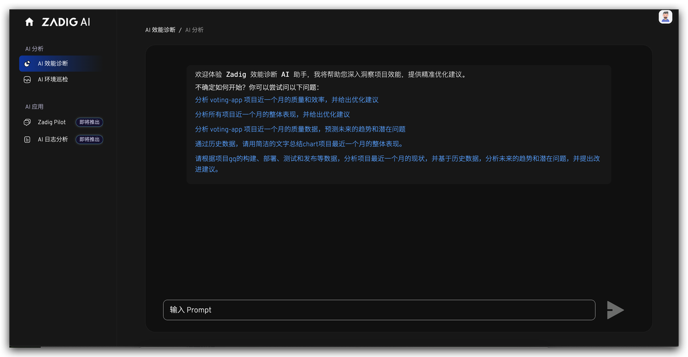
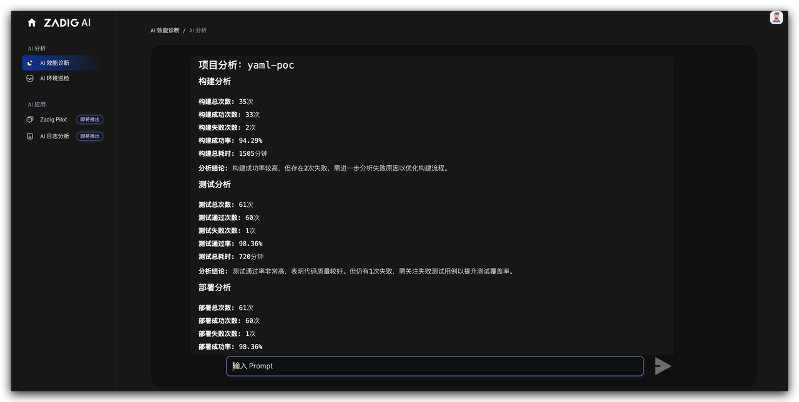

传统工程效能分析往往依赖人工统计与经验判断，效率低且易受主观因素影响，而 Zadig 沉淀了研发过程的构建、部署、测试等大量效能数据，基于 DeepSeek 的 AI 能力，通过智能分析数据，为团队提供客观、可操作的改进建议。

场景价值：
- 无需手动分析海量数据，AI 自动生成效能报告，节省大量时间。
- 通过数据驱动的优化建议，团队可快速落地改进措施，提升交付效率。

## 智能数据分析

通过自然语言交互（Prompt 方式），AI 可快速分析流水线、构建、测试等环节的效能数据，识别瓶颈问题。

## 问题精准定位

无论是构建耗时过长、测试通过率低，还是资源利用率不足，AI 都能清晰指出问题所在并提供详细分析报告。

## 科学改进建议

基于分析结果，AI 提供具体优化建议，如并行测试策略、资源分配调整等，帮助团队快速提升效能。

