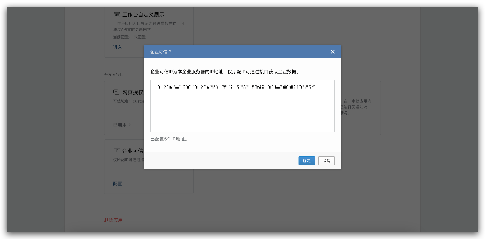

Zadig 账号系统支持集成企业微信账号，用户可以通过配置企业微信应用，实现企业微信账号登录 Zadig。

## 步骤 1：创建企业微信应用

1. 访问[企业微信后台](https://work.weixin.qq.com/wework_admin/frame#apps)，创建应用，如下图所示。

2. 获得 `AgentID` 和 `Secret`。

3. 前往「我的企业」->「企业信息」，获取`企业ID`。

4. 配置可信域名

5. 配置企业可信 IP

## 步骤 2：配置 Zadig 账号集成

访问 Zadig，点击`系统设置`->`系统集成`->`账号系统`，选择 `企业微信`，填入步骤 1 中获取的 `企业ID`、`AgentID` 和 `Secret`，如下图所示。

