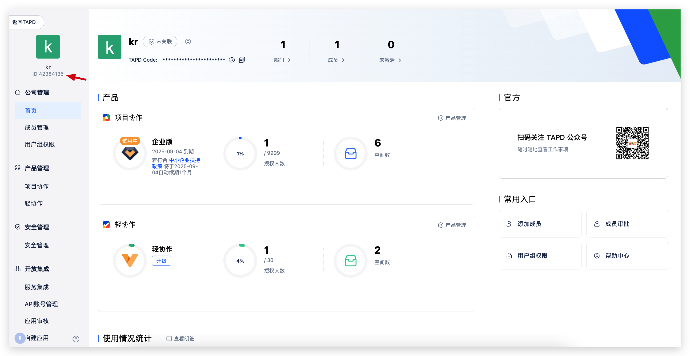
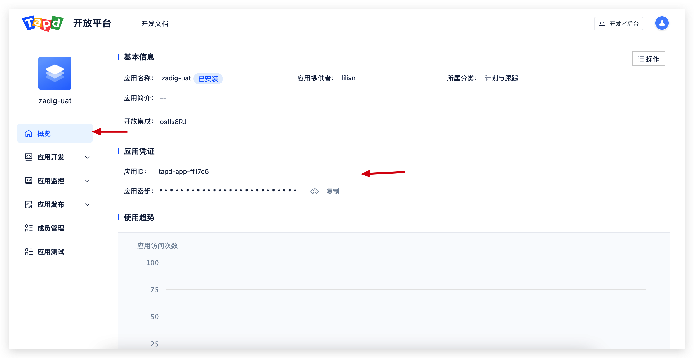
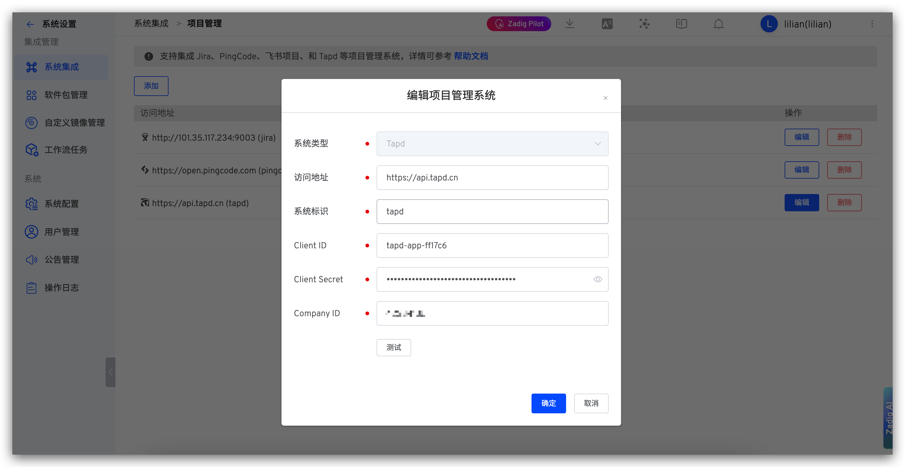

本文介绍如何在 Zadig 系统上集成项目管理系统 Tapd，实现自动变更 Tapd 迭代状态。

## 如何配置

### 步骤一：获取公司 ID

在 Tapd 上公司管理页面左上角获取公司 ID。

### 步骤二：获取 Client ID 和 Client Secret

在 Tapd 上公司管理 ->`自建应用` 创建「网页应用开发」类型应用，配置相应权限。

**权限项：**
- `迭代`：读写
- `项目`：读

在如下位置获取 Client ID 和 Client Secret。

### 步骤三：Zadig 中配置 Tapd 集成

点击`系统设置` -> `集成管理`  -> `项目管理`-> 点击添加。

参数说明：
- `系统类型`：Tapd
- `访问地址`：Tapd 地址，如 `https://api.tapd.cn`。
- `系统标识`：自定义，方便在 Zadig 系统中快速识别，系统标识需唯一
- `Client ID`：Tapd 应用的 Client ID，步骤二中获得
- `Client Secret`：Tapd 应用的 Client Secret，，步骤二中获得
- `Company ID`：Tapd 公司的标识，步骤一中获得

信息确认无误后保存。

