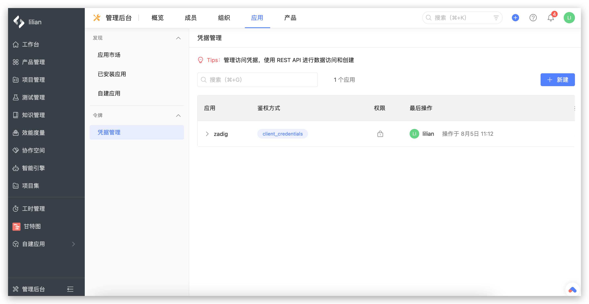
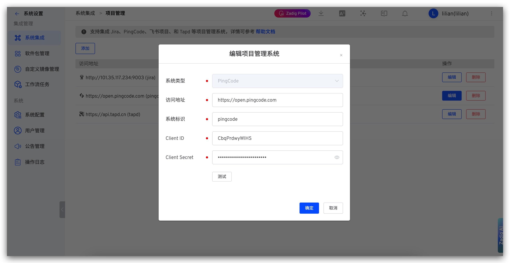

本文介绍如何在 Zadig 系统上集成项目管理系统 PingCode，实现自动变更 PingCode 工作项状态。

## 如何配置

### 步骤一：创建凭证

在 PingCode 管理后台 -> `应用` -> `凭证管理`中创建凭证。

- `鉴权方式`：client_credentials
- `权限`：
    - 项目、项目配置中心：只读
    - 工作项：读写

### 步骤二：Zadig 中配置 PingCode 集成

点击`系统设置` -> `集成管理`  -> `项目管理`-> 点击添加。

参数说明：
- `系统类型`：PingCode
- `访问地址`：PingCode 地址，如 `https://open.pingcode.com`
- `系统标识`：自定义，方便在 Zadig 系统中快速识别，系统标识需唯一
- `Client ID`：PingCode 应用的 Client ID
- `Client Secret`：PingCode 应用的 Client Secret

信息确认无误后保存。
