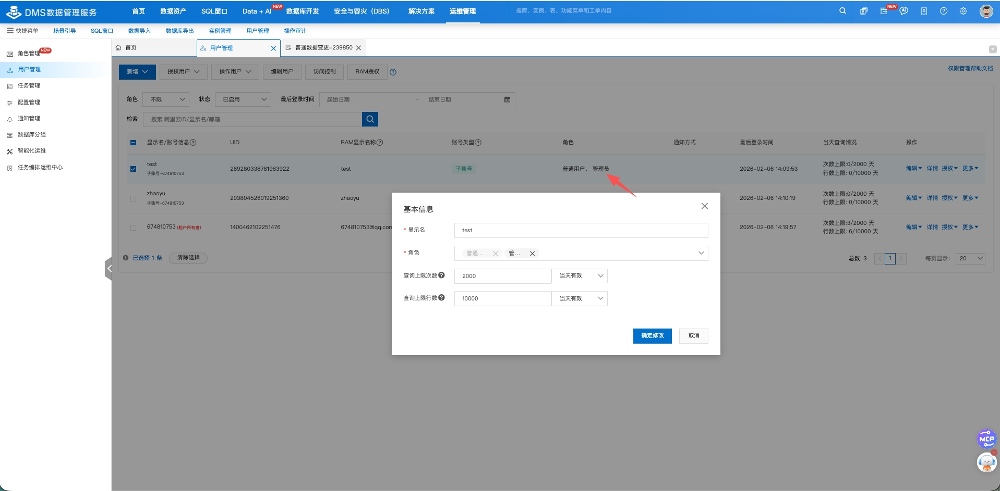

本文介绍在 Zadig 系统上集成云服务。目前支持集成阿里云 DMS 数据管理服务集成。

## 阿里云 DMS 数据管理服务

点击 `系统设置` -> `系统集成` -> `云服务` -> `田家庵`：


参数说明：

- `系统标识`：系统标识，用于标识系统
- `区域`：阿里云 DMS 数据管理服务区域
- `Access Key`：阿里云 DMS 数据管理服务 Access Key
- `Secret Key`：阿里云 DMS 数据管理服务 Secret Key

注意：Access Key 和 Secret Key 需要有 DMS 数据管理服务的读写权限。具体权限配置如下：
```
{
  "Version": "1",
  "Statement": [
    {
      "Effect": "Allow",
      "Action": [
        "dms:ListOrders",
        "dms:ExecuteDataCorrect",
        "dms:GetDataCorrectTaskDetail"
      ],
      "Resource": "*"
    }
  ]
}
```
并且需要在 DMS 上增加`管理员`权限，如图所示：

