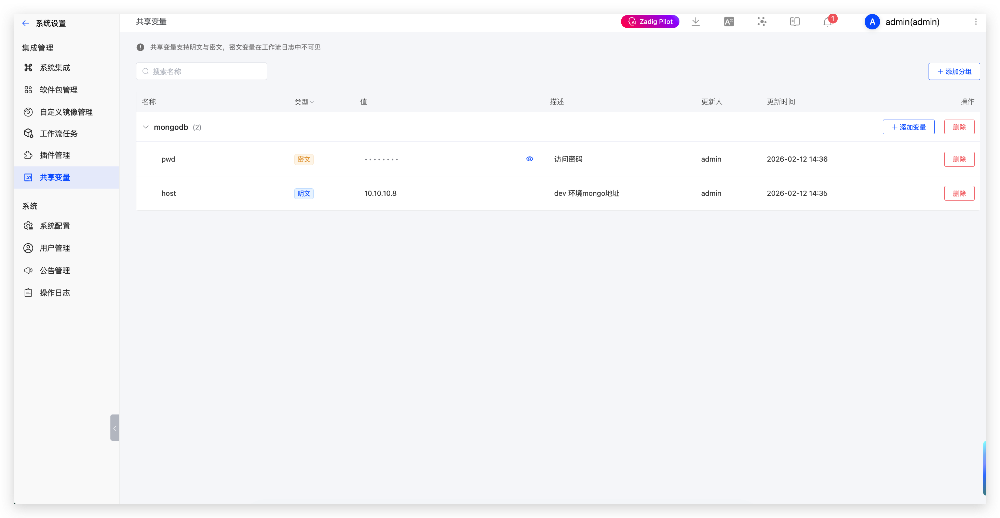

本文介绍在 Zadig 系统中配置和使用共享变量。

## 共享变量配置

Zadig 支持项目级别和系统级别两种共享变量配置方式。

### 配置入口

- **系统级别共享变量**：点击 `系统设置` -> `系统集成` -> `共享变量` -> `添加`
- **项目级别共享变量**：点击项目 -> `配置` -> `共享变量` -> `添加`

### 配置说明

- 共享变量支持分组管理，同一组内变量名称不可重复
- 共享变量类型分为明文和密文，密文类型变量在工作流日志中不可见
- 当存在重复的变量名称时，项目级别的变量优先级高于系统级别

## 共享变量使用

共享变量可在以下场景中使用：
- 构建
- 测试
- 代码扫描
- 工作流

### 使用方式

在配置中通过 `{{.parameter.<变量组名>.<变量名称>}}` 方式引用共享变量。