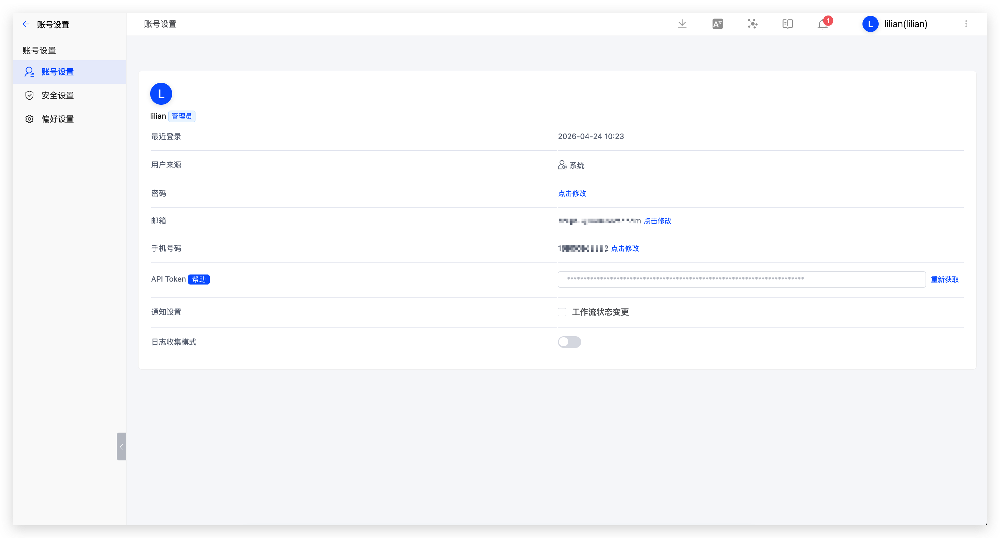
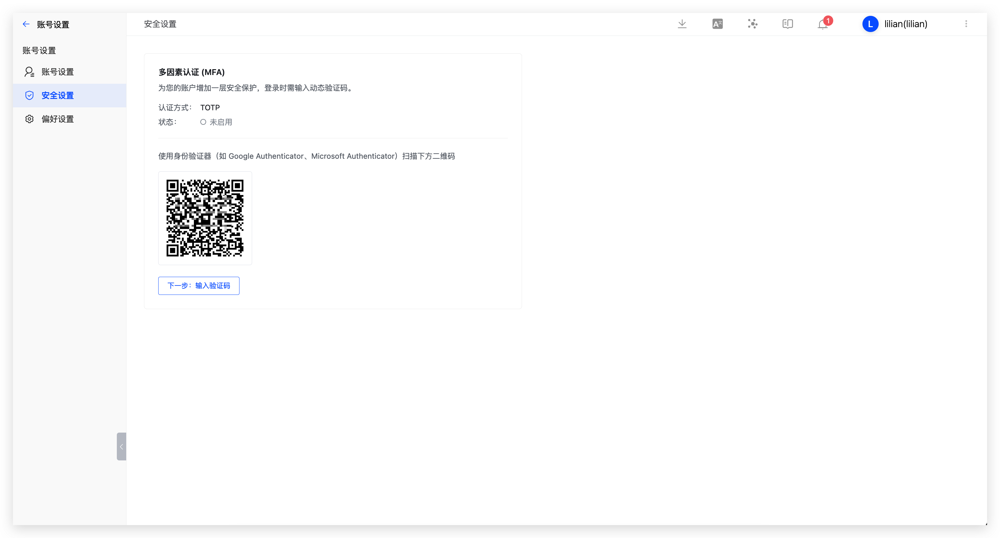
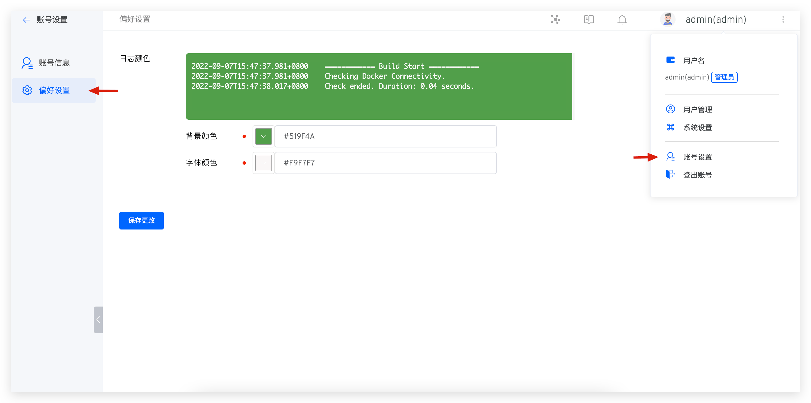

本文主要介绍 Zadig 账号设置功能，包括：

- 账号设置：账号的基本信息、API Token 管理
- 安全设置：多因素认证（MFA）
- 偏好设置：工作流日志、环境日志、环境调试的背景颜色和字体颜色

## 账号设置

点击头像 -> `账号设置`，可以修改账号的基本信息。

### API Token 

::: tip
普通用户需要在管理员授权后获取 API Token。系统管理员访问`系统管理` -> `用户管理`-> 开通 API Token 权限，可对普通用户进行授权。
:::

点击头像 -> `账号设置` -> `API Token`，可以获取 API Token，用于 OpenAPI 调用，只可在生成时查看，请务必妥善保管。

### 系统通知设置

目前会触发通知的事件：

- 环境：包括项目中环境的添加、删除、更新失败通知
- 系统配额：定时清理工作流产物通知
- 工作流：工作流创建、删除的通知

如果你开启了工作流状态变更：

- 工作流任务处于成功、失败、取消状态，通知执行人
- 工作流任务处于待审批状态，通知审批人

## 安全设置

多因素认证（MFA）是一种安全措施，可以提高账号的安全性。

点击头像 -> `账号设置` -> `安全设置`，可以开启多因素认证（MFA）。

::: tip
若系统管理员在`系统配置` -> `安全与隐私`中开启了强制启用 MFA，则用户无法关闭 MFA。
:::

## 偏好设置

点击头像 -> `账号设置` -> `偏好设置`，设置背景颜色和字体颜色，如下图所示。

保存修改后，工作流日志、环境日志、环境调试背景颜色和字体颜色随之生效。

