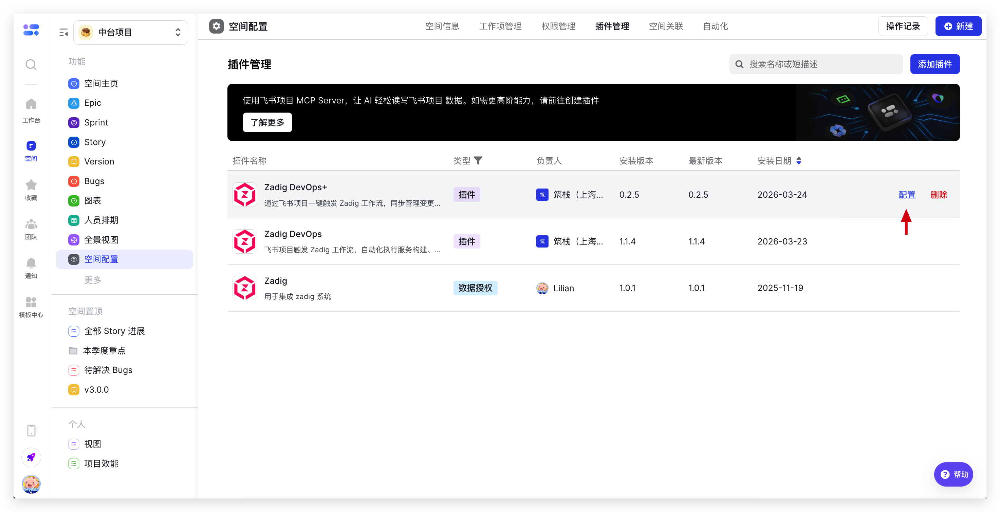
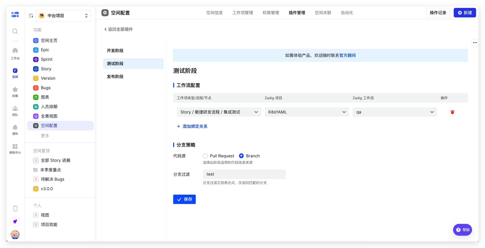
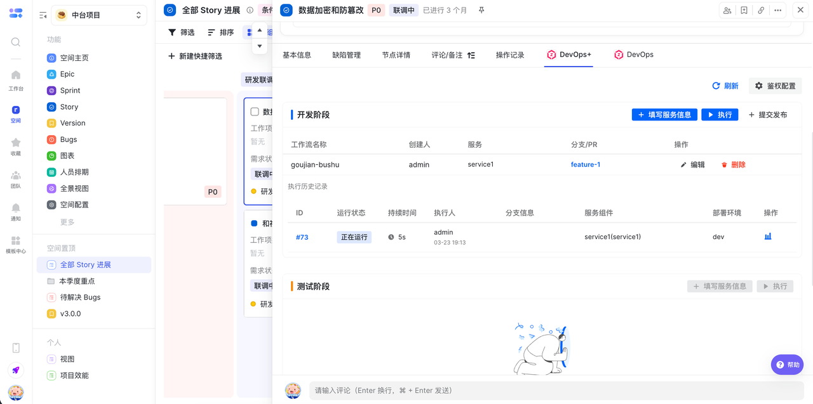
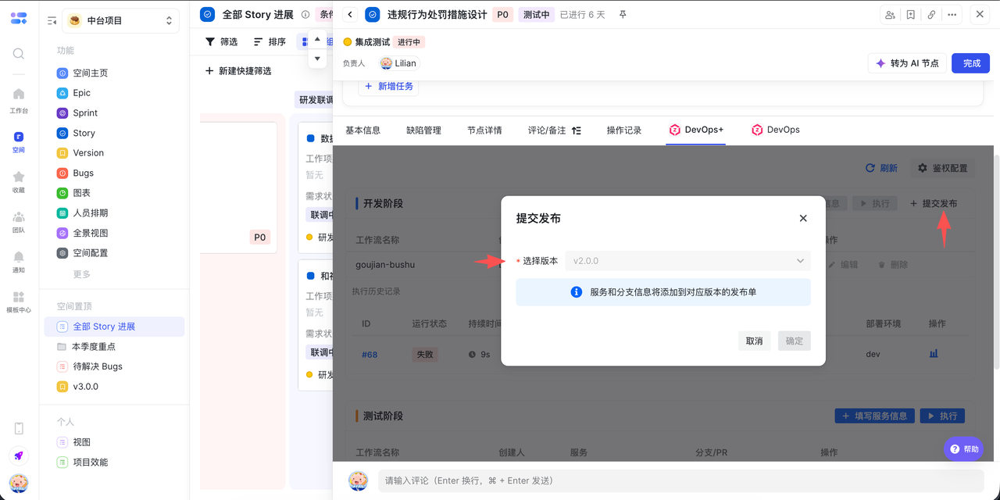
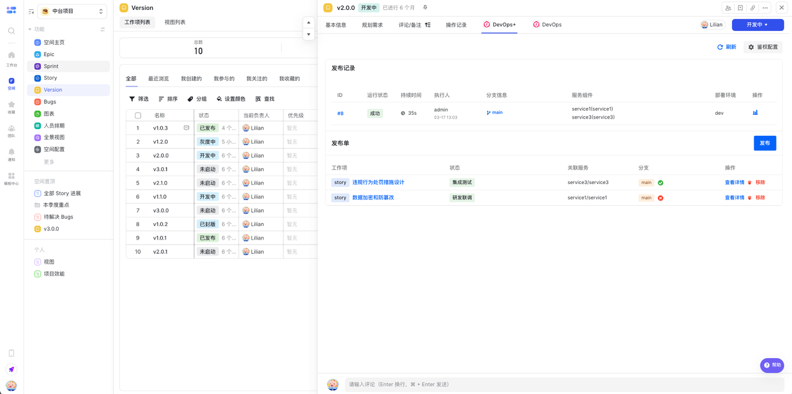
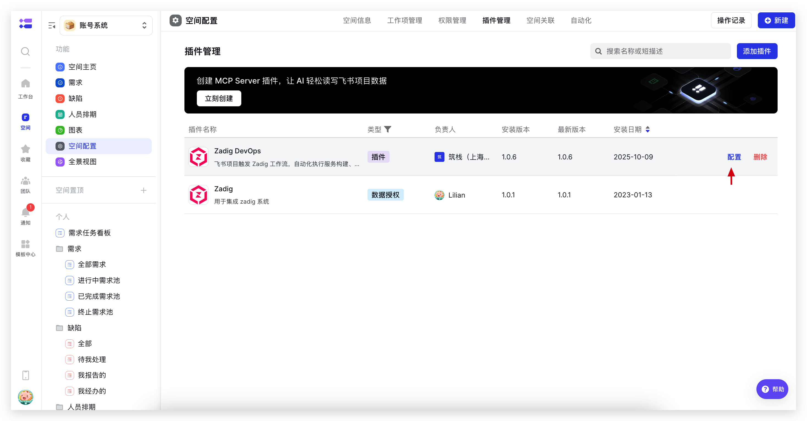
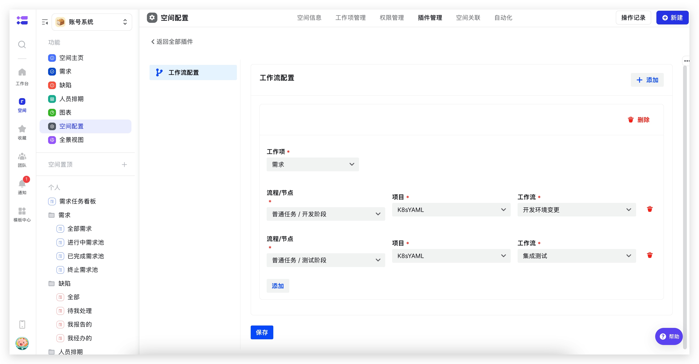
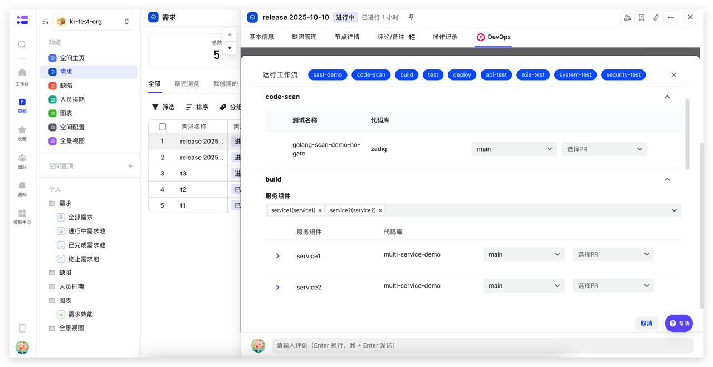
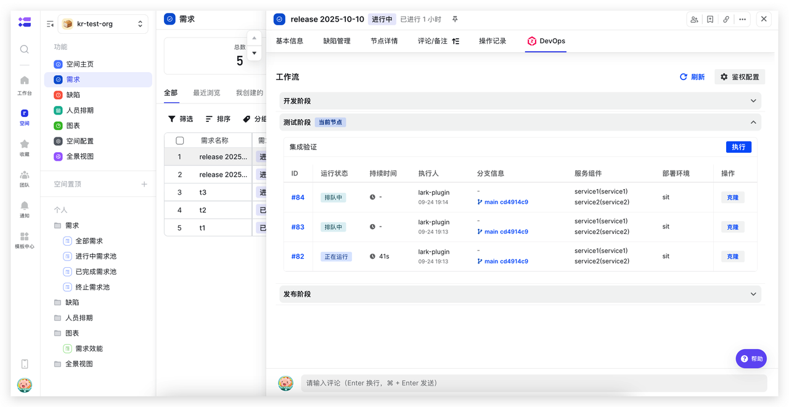

Zadig 飞书项目插件支持在飞书项目触发 Zadig 工作流，自动化执行服务构建、部署、发布等操作，提升效率保障质量。目前提供 **Zadig DevOps** 和 **Zadig DevOps+** 两款插件。

Zadig DevOps 开箱即用、零配置，适合小团队快速集成与简单发布场景。Zadig DevOps+ 在其基础上增强变更追溯、发布单管理、双向数据同步及定制能力，面向大型企业复杂发布与安全合规需求。

## 安装插件

飞书项目空间管理员在插件管理中找到「Zadig DevOps」或「Zadig DevOps+」插件，点击「添加」完成安装。

## Zadig DevOps+

### 插件配置

安装完成后，在插件管理中找到已安装的「Zadig DevOps+」插件，点击右侧「配置」，设置各阶段与 Zadig 工作流的对应关系及分支策略。

### 使用场景

Zadig DevOps+ 为大型企业提供全链路变更追溯与发布单管理。开发在飞书项目提交变更信息（关联服务、分支）并纳入发布单，测试阶段执行结果自动回传，发布时直接使用发布单中的变更信息，确认后一键发布，审批通过自动执行。

**开发阶段：变更提交与发布单关联**

开发完成后，开发在飞书项目提交变更信息（关联服务、分支），并一键纳入发布单，变更可多次复用。无需切换系统，变更记录清晰可见。

**测试阶段：执行结果实时查看**

测试节点执行工作流后，执行结果自动回传到飞书项目，各阶段通过情况一目了然，方便快速响应。

**发布阶段：确认变更后一键发布**

发布节点执行工作流时，直接使用发布单中的变更信息，确认代码已合并后即可发布，审批通过后自动执行。发布过程高效可控。

## Zadig DevOps

### 插件配置

安装完成后，在插件管理中找到已安装的「Zadig DevOps」插件，点击右侧「配置」开始配置。配置工作项各个节点和 Zadig 工作流的对应关系，如下图所示。

### 使用场景

**开发自测阶段：更新开发环境并进行自测联调**

在飞书项目开发节点上直接执行 Zadig 开发工作流，自动化执行代码扫描、单元测试、构建、部署、冒烟测试等过程，结合配置变更、数据变更等能力实现开发过程一致性变更，减少频繁的系统切换成本，提升研发效率。

**集成验证阶段：更新测试环境并进行自动化验证**

在飞书项目测试节点直接执行 Zadig 测试工作流，自动化完成接口测试、性能测试、安全扫描等全流程，提升测试验证效率和质量。

**生产发布阶段：结合飞书审批进行生产发布**

在飞书项目发布节点直接执行 Zadig 发布工作流，自动化完成服务更新、配置变更、数据变更等过程，结合飞书审批应用，实现高效、稳定的发布。

