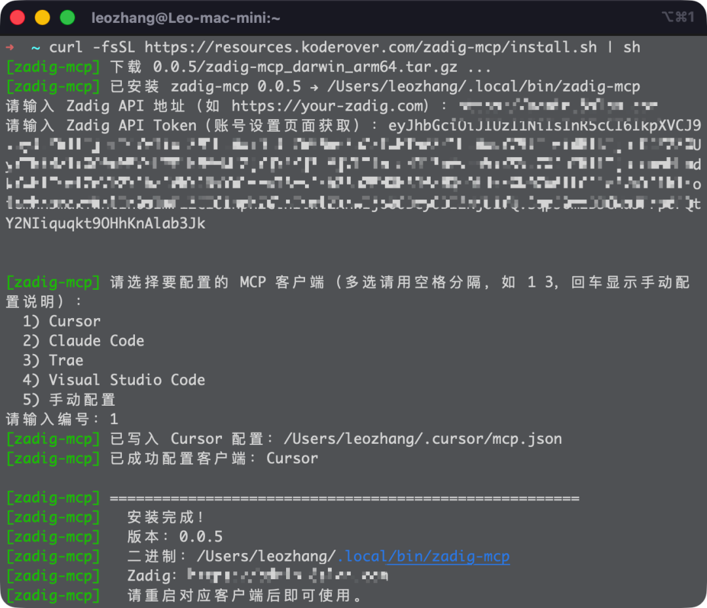
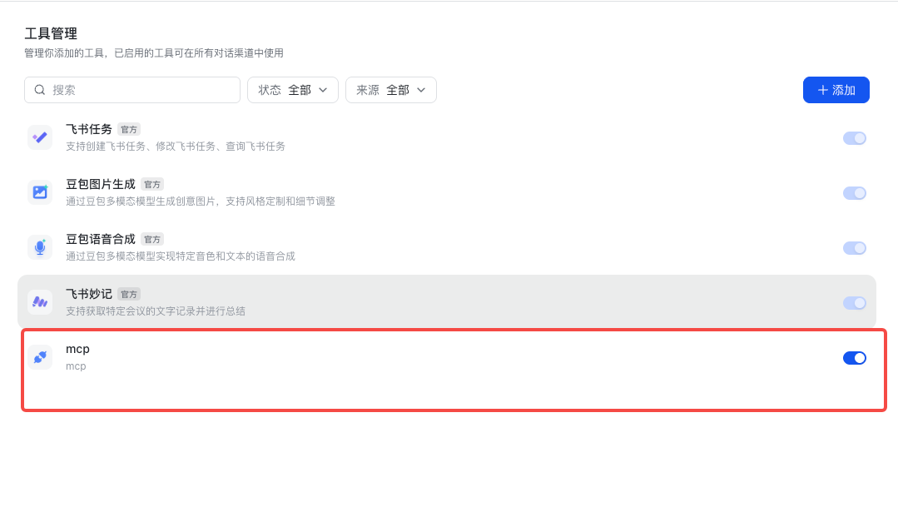
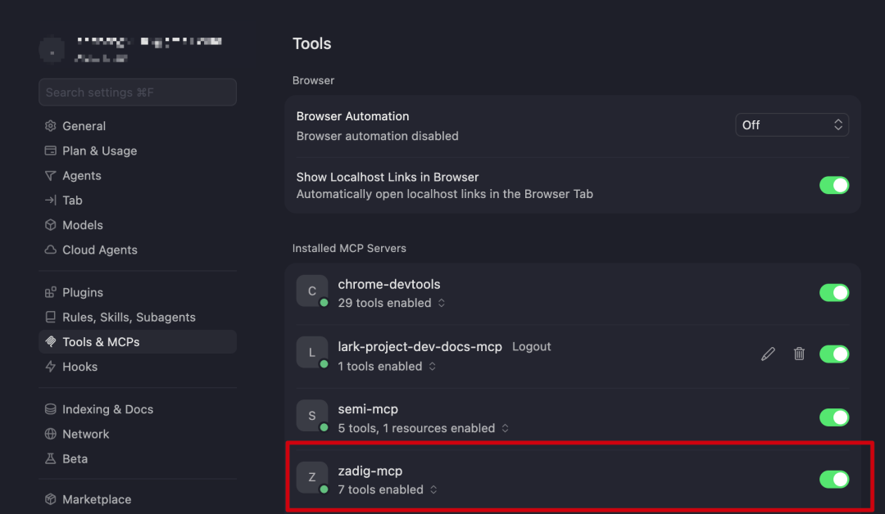

本文主要介绍如何安装并配置 Zadig MCP 服务。

## 使用说明

::: tip
- MCP Server 需要 Zadig 版本为 v4.2.0 或以上方可正常使用。
- API Token 可在 Zadig 平台的“账号设置”中获取。
- Zadig MCP 支持 `stdio` 和 `sse` 两种启动方式，可根据接入场景选择。
:::

### stdio 启动方式

#### 适用场景

- 适用于 Cursor、Claude Code、Trae、VS Code 等支持本地 `stdio` 启动 MCP Server 的 IDE/客户端。
- 适用于开发者在本机安装并使用 MCP，无需额外部署独立服务端。

#### 安装方式

安装脚本支持自动写入配置到以下客户端：Cursor、Claude Code、Trae、VS Code。其他支持 MCP 标准的客户端也可选择手动配置。

```bash
#Linux / macOS / Windows (WSL)
curl -fsSL https://resources.koderover.com/zadig-mcp/install.sh | sh

# Windows(PowerShell)
irm https://resources.koderover.com/zadig-mcp/install.ps1 | ie
```

#### 静默安装

适用于需要在脚本中预先传入 Zadig 地址和 Token 的场景。

```bash
curl -fsSL https://resources.koderover.com/zadig-mcp/install.sh | \
ZADIG_API_HOST=https://your-zadig.com ZADIG_API_TOKEN=your-token sh
```



### SSE 启动方式

::: tip
- 请将示例中的 `https://your-zadig.com`、`https://mcp.your-company.com` 以及 `your-token` 替换为实际地址和 Token。
- 该模式适用于通过远程 URL 接入 Zadig MCP 服务的场景，需先单独启动或部署 MCP Server。
- 适用于飞书 Aily 这类需要通过远程 URL 访问 MCP 服务的客户端。
:::

#### 适用场景

- 客户端不支持本地 `stdio` 拉起 MCP Server，需要通过公网或内网 URL 访问。
- 需要将 MCP Server 统一部署在测试、办公或共享环境中，供多人复用。
- 需要接入飞书 Aily 等通过远程地址访问 MCP 服务的场景。

#### 一次实践：在 Zadig 中部署 SSE 服务

- 该方式适用于将 Zadig MCP Server 作为服务部署在 Zadig 环境中，并通过 Ingress 以 SSE 方式对外提供访问能力。
- 部署前请确认 `3000` 端口未被占用。
- 请根据实际情况修改 `ZADIG_API_HOST`、`MCP_BASE_URL`、`ingressClassName`、`name`、`namespace` 以及 Ingress 域名。

##### 操作步骤

1. 在 Zadig 中创建一个 K8s 项目，例如：`mcp`。
2. 将下面的 K8s YAML 加入到服务配置并起名为`zadig-mcp`，并按实际环境修改其中的关键参数。
3. 保存服务配置。
4. 将该服务加入环境中。
5. 查看 Pod 状态，确认服务是否成功启动。

##### 服务配置 YAML 示例

```yaml
apiVersion: v1
kind: ConfigMap
metadata:
  name: zadig-mcp-config
  labels:
    app: zadig-mcp
data:
  ZADIG_API_HOST: "https://your_zadig.com"
  MCP_TRANSPORT_TYPE: "sse"
  MCP_LISTEN_ADDR: "0.0.0.0:3000"
  MCP_BASE_URL: "http://your_domain:3000"
  MCP_SSE_ENDPOINT: "/sse"
  MCP_MESSAGE_ENDPOINT: "/message"
---
apiVersion: apps/v1
kind: Deployment
metadata:
  name: zadig-mcp
  labels:
    app: zadig-mcp
spec:
  replicas: 1
  selector:
    matchLabels:
      app: zadig-mcp
  template:
    metadata:
      labels:
        app: zadig-mcp
    spec:
      containers:
        - name: zadig-mcp
          image: koderover.tencentcloudcr.com/koderover-public/zadig-mcp:0.1.4
          imagePullPolicy: IfNotPresent
          args:
            - "-t"
            - "$(MCP_TRANSPORT_TYPE)"
            - "-a"
            - "$(MCP_LISTEN_ADDR)"
          ports:
            - name: http
              containerPort: 3000
              protocol: TCP
          env:
            - name: ZADIG_API_HOST
              valueFrom:
                configMapKeyRef:
                  name: zadig-mcp-config
                  key: ZADIG_API_HOST
            - name: MCP_TRANSPORT_TYPE
              valueFrom:
                configMapKeyRef:
                  name: zadig-mcp-config
                  key: MCP_TRANSPORT_TYPE
            - name: MCP_BASE_URL
              valueFrom:
                configMapKeyRef:
                  name: zadig-mcp-config
                  key: MCP_BASE_URL
            - name: MCP_SSE_ENDPOINT
              valueFrom:
                configMapKeyRef:
                  name: zadig-mcp-config
                  key: MCP_SSE_ENDPOINT
            - name: MCP_MESSAGE_ENDPOINT
              valueFrom:
                configMapKeyRef:
                  name: zadig-mcp-config
                  key: MCP_MESSAGE_ENDPOINT
            - name: MCP_LISTEN_ADDR
              valueFrom:
                configMapKeyRef:
                  name: zadig-mcp-config
                  key: MCP_LISTEN_ADDR
          resources:
            requests:
              cpu: 200m
              memory: 512Mi
            limits:
              cpu: 400m
              memory: 1024Mi
          readinessProbe:
            tcpSocket:
              port: 3000
            initialDelaySeconds: 5
            periodSeconds: 10
          livenessProbe:
            tcpSocket:
              port: 3000
            initialDelaySeconds: 10
            periodSeconds: 20
---
apiVersion: v1
kind: Service
metadata:
  name: zadig-mcp
  labels:
    app: zadig-mcp
spec:
  selector:
    app: zadig-mcp
  ports:
    - name: http
      port: 3000
      targetPort: 3000
      protocol: TCP
  type: ClusterIP
---
apiVersion: networking.k8s.io/v1
kind: Ingress
metadata:
  name: zadig-mcp
  namespace: your_namespace
  annotations:
    nginx.ingress.kubernetes.io/backend-protocol: "HTTP"
    nginx.ingress.kubernetes.io/service-upstream: "true"
    nginx.ingress.kubernetes.io/proxy-buffering: "off"
    nginx.ingress.kubernetes.io/proxy-request-buffering: "off"
    nginx.ingress.kubernetes.io/proxy-read-timeout: "3600"
    nginx.ingress.kubernetes.io/proxy-send-timeout: "3600"
    nginx.ingress.kubernetes.io/proxy-http-version: "1.1"
    nginx.ingress.kubernetes.io/ssl-redirect: "false"
    nginx.ingress.kubernetes.io/force-ssl-redirect: "false"
spec:
  ingressClassName: your_ingress_class_name
  rules:
    - host: your_domain.com
      http:
        paths:
          - path: /sse
            pathType: Prefix
            backend:
              service:
                name: zadig-mcp
                port:
                  number: 3000
          - path: /message
            pathType: Prefix
            backend:
              service:
                name: zadig-mcp
                port:
                  number: 3000
          - path: /
            pathType: Prefix
            backend:
              service:
                name: zadig-mcp
                port:
                  number: 3000
```

#### 客户端配置（MCP Client 侧）

SSE 模式支持以下两种鉴权方式：

1. `Header` 传参：适用于支持在 MCP 配置中自定义请求头的客户端，例如 IDE。
2. `token` URL 传参：适用于不方便自定义请求头、但支持直接填写 URL 的客户端，例如飞书 Aily。

##### IDE 配置

基于 `Header` 鉴权方式，在 IDE 的 Settings 中配置 `mcp.json`：

```json
{
  "mcpServers": {
    "zadig-mcp": {
      "url": "https://mcp.your-company.com/sse",
      "headers": {
        "Authorization": "Bearer your-token"
      }
    }
  }
}
```

##### 飞书 Aily 配置

基于 `token` URL 传参的鉴权方式，在飞书 Aily 中添加如下 URL：

```text
https://your_domain/sse?token=your_token
```

下面以飞书 Aily 为例，说明如何通过远程 URL 接入 Zadig MCP Server：

1. 在飞书 Aily 中新增 MCP 服务。
2. 填写上面的 SSE 地址。
3. 保存配置后，验证连接是否成功。




## 升级或卸载

```bash
# 升级到最新版本
curl -fsSL https://resources.koderover.com/zadig-mcp/install.sh | sh -s -- --update

# 检查是否有新版本
curl -fsSL https://resources.koderover.com/zadig-mcp/install.sh | sh -s -- --check

# 卸载
curl -fsSL https://resources.koderover.com/zadig-mcp/install.sh | sh -s -- --uninstall
```

## 验证安装是否成功

### stdio 方式

如果使用 IDE，可以到对应工具的 MCP Servers 配置中查看安装是否成功。




### sse 方式

如果使用飞书 Aily，可以到对应配置页确认接入是否成功。


