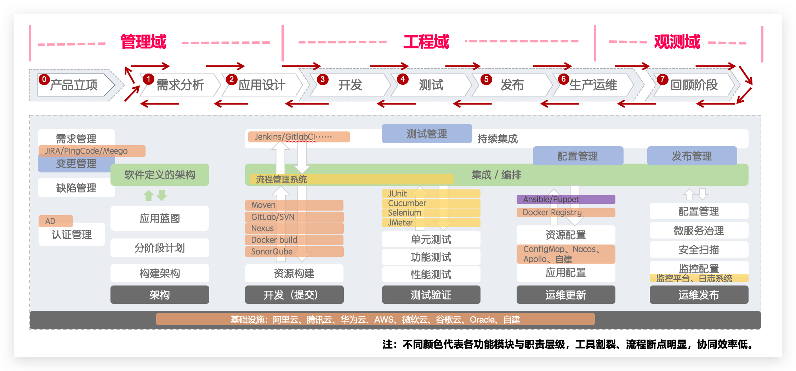
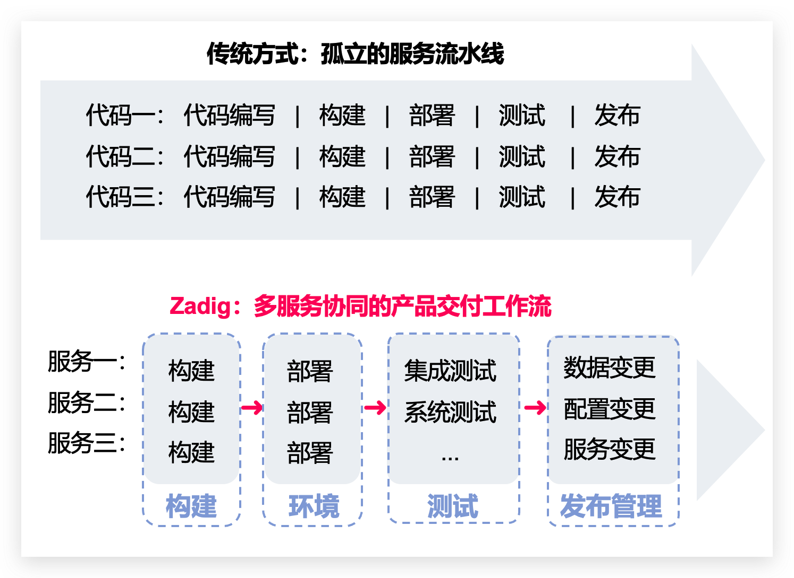
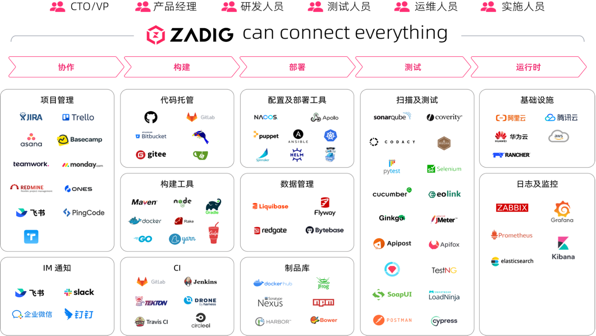

## 平台简介

Zadig 由 KodeRover 自主研发，是基于 Kubernetes 与 AI 大模型的开源云原生 DevOps 平台，源码 100% 开放，致力于帮助企业实现产研数字化转型。核心能力覆盖灵活可扩展的工作流、多种发布策略编排、一键安全审核、AI 环境巡检与效能诊断、定制化企业级 XOps 敏捷看板，并支持深度集成企业平台、项目模板化批量纳管数千服务。Zadig 全面融入 AI 代码审查、AI 发布风险评估、AI 任务编排及智能体管理等智能化能力，让代码质量防线前移、发布决策更精准、交付流程更自动，真正使工程师成为创新引擎，为数字经济的持续创新提供坚实基座。

## 现代软件交付挑战

开发 5 分钟，上线却要 2 小时。AI 生成代码量倍增，交付环节仍在七八个系统间来回切换：工具链割裂、系统繁杂，效率没有跟上，发布风险反而更高。

## 设计哲学

Zadig 的设计从面向单服务的「代码流水线」转向多服务协同的「产品交付工作流」。

|  | 传统方式 | Zadig |
| --- | --- | --- |
| 模式 | 面向单个服务的线性流水线 | 面向整个产品、多个服务统一编排 |
| 流程 | 编码 → 构建 → 部署 → 测试 → 发布，在每条服务上重复 | 多服务并行构建、部署与测试，协同数据、配置和服务变更 |
| 效果 | 协作难、反馈慢、发布笨重 | 交付更快、质量更早保障、发布更稳 |

## 业务架构

## 产品特性

- **AI 驱动的全流程提效**

  深度集成 AI 大模型，覆盖开发、发布、运维全链路：AI 代码审查精准识别代码缺陷与安全漏洞；AI 发布风险评估智能分析变更影响，辅助安全可控发布；AI 任务编排将企业智能体无缝嵌入研发流程。同时提供 AI 效能诊断与环境巡检，精准定位效能瓶颈，定期预警环境风险。

- **灵活易用的高并发工作流**

  简单配置，可自动生成高并发工作流，多个微服务可并行构建、并行部署、并行测试，大大提升代码验证效率。自定义的工作流步骤，配合人工审批，灵活且可控的保障业务交付质量。

- **面向开发者的云原生环境**

  分钟级创建或复制一套完整的隔离环境，应对频繁的业务变更和产品迭代。基于全量基准环境，快速为开发者提供一套独立的自测环境。一键托管集群资源即可轻松调试已有服务，验证业务代码。

- **高效协同的测试管理**

  便捷对接 Jmeter、Pytest 等主流测试框架，跨项目管理和沉淀 UI、API、E2E 测试用例资产。通过工作流，向开发者提供前置测试验证能力。通过持续测试和质量分析，充分释放测试价值。

- **强大免运维的模板库**

  跨项目共享 K8s YAML 模板、Helm Chart 模板、构建模板、工作流模板等，实现配置的统一化管理。基于一套模板可创建数百微服务，开发工程师少量配置可自助使用，大幅降低运维管理负担。

- **安全可靠的发布管理**

  自定义工作流打通人、流程、内外部系统合规审批，支持灵活编排蓝绿、金丝雀、分批次灰度、Istio 等发布策略。通过多集群、多项目视角呈现生产环境的状态，实现发布过程的透明可靠。

- **客观精确的效能洞察**

  全面了解系统运行状态，包括集群、项目、环境、工作流，关键过程通过率等数据概览。提供项目维度的构建、测试、部署等客观的效能度量数据，精准分析研发效能短板，促进稳步提升。

## 开放接入

贯穿开发到运维全链路，已集成 40+ 主流工具及系统，按需接入、灵活扩展，为企业打造一体化交付平台。面向 CTO/VP、产品、研发、测试、运维和实施等角色。

### 企业自研扩展

- **[导航栏自定义](/cn/Zadig%20v5.0/settings/plugin/)**：接入外部系统，按角色定制工作台入口
- **[业务元信息管理](/cn/Zadig%20v5.0/directory/)**：管理代码仓库、负责人、技术栈和部署信息
- **[OpenAPI](/cn/Zadig%20v5.0/api/usage/)**：全量开放，程序化调用平台能力
- **AI 生态**：通过 [CLI](/cn/Zadig%20v5.0/zadig-cli/)、[MCP](/cn/Zadig%20v5.0/mcp-settings/) 和 [OpenClaw 插件](/cn/Zadig%20v5.0/openclaw-plugin/) 对接企业内部 Agent
