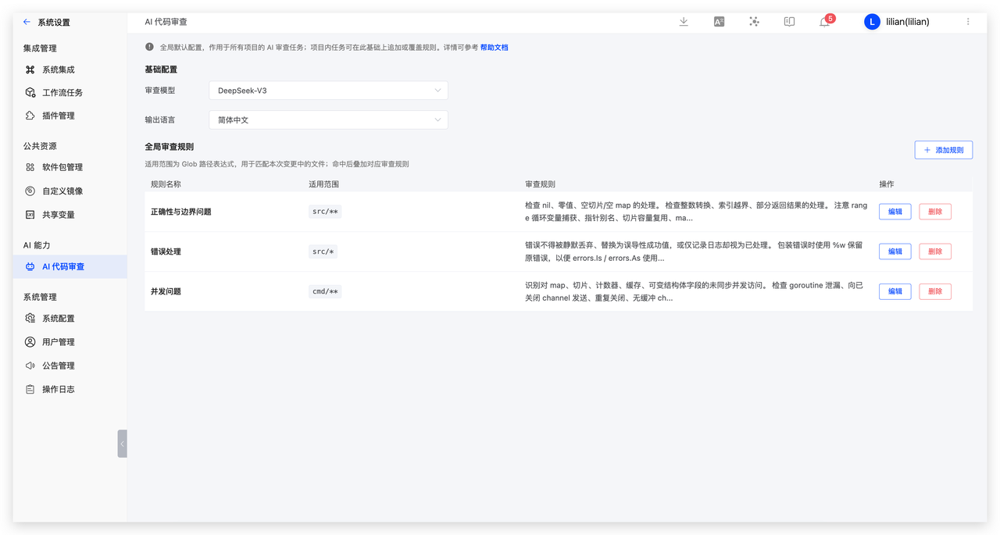
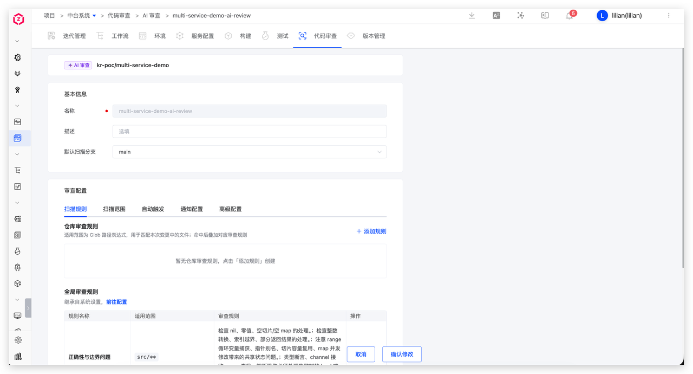

本文介绍如何将 AI 审查嵌入日常开发：本地写完代码先自查，提交 PR 后再由 Zadig 平台自动审查。

## 场景一：CLI 本地自查
使用开源 CLI 工具 [zadig-review-agent](https://github.com/koderover/zadig-review-agent) 对本地代码进行审查。

### 步骤 1：安装
```bash
go install github.com/koderover/zadig-review-agent@latest
```

### 步骤 2：配置
```bash
zadig-review-agent config set model.protocol <协议，如 openai>
zadig-review-agent config set model.name <模型名称，如 gpt-4o>
zadig-review-agent config set model.endpoint <模型地址：如 https://api.openai.com/v1>
export ZADIG_REVIEW_MODEL_API_KEY='your-api-key'
```

### 步骤 3：本地使用

在代码库根目录下执行命令：

```bash
zadig-review-agent review --from <remote>/main --to HEAD
```


## 场景二：PR 自动审查

代码提交到仓库后，Zadig 平台自动触发 AI 审查，结果直接回写到 PR/MR 评论区。作为人工 review 和代码合并的参考依据。

### 步骤 1：配置 模型

访问 Zadig 系统设置 -> 系统集成 -> AI 模型添加大模型，参考 [AI 服务](/cn/Zadig%20v5.0/settings/ai/)。

### 步骤 2：配置 AI 审查

访问 Zadig 系统设置 -> AI 代码审查，配置审查使用的 AI 模型、输出语言以及全局审查规则。系统已内置[兜底规则](https://github.com/koderover/zadig-review-agent/blob/main/internal/rules/system_rules.json)，若不配置全局规则，AI 也能按照默认标准执行审查。



### 步骤 3：为代码库添加 AI 审查

在 Zadig 项目中选择“代码审查”模块，新建审查任务，绑定目标代码仓库并选择 「AI 审查」 类型。完成基础关联后，进入配置页，按需设置仓库专属的审查规则、扫描范围、自动触发条件（如 PR/MR 创建时自动运行）以及通知方式等。




### 步骤 4：提交代码自动触发 AI 审查

完成上述配置后，研发正常提交 PR/MR，自动触发 Zadig 平台上的 AI 审查。审查完成后，结果直接回写 PR/MR 评论区，开发者无需切换工具即可查看 AI 的审查意见，包括问题严重等级、所属文件行号、具体描述及修复建议。


根据审查意见修改代码并推送后，AI 会自动重新审查，更新评论区的审查结论。全程无需额外操作，不打断研发工作流。