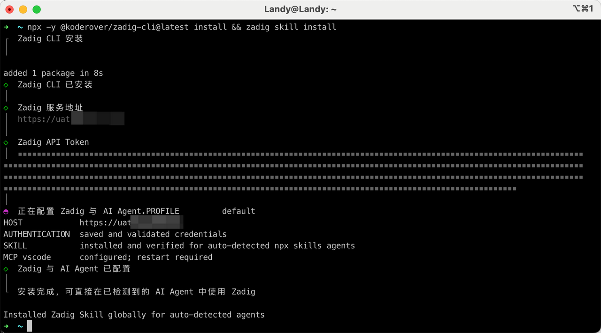
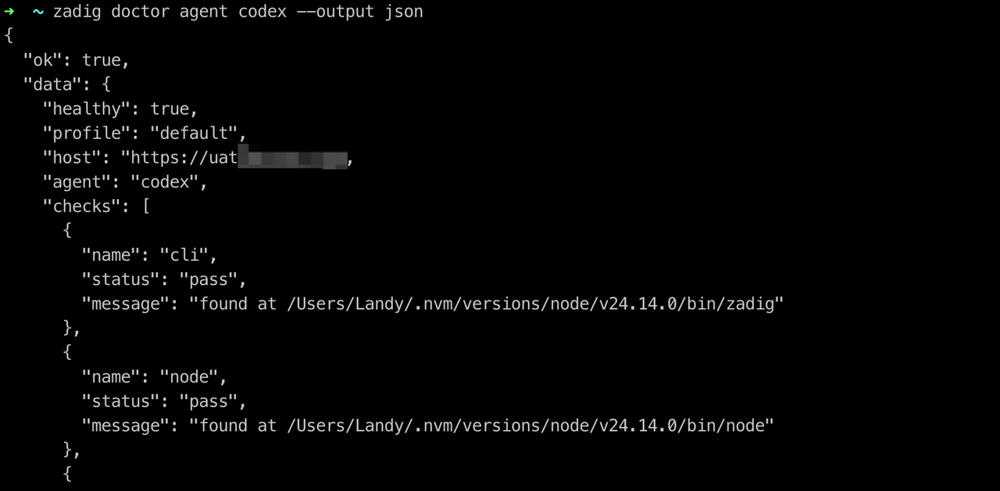
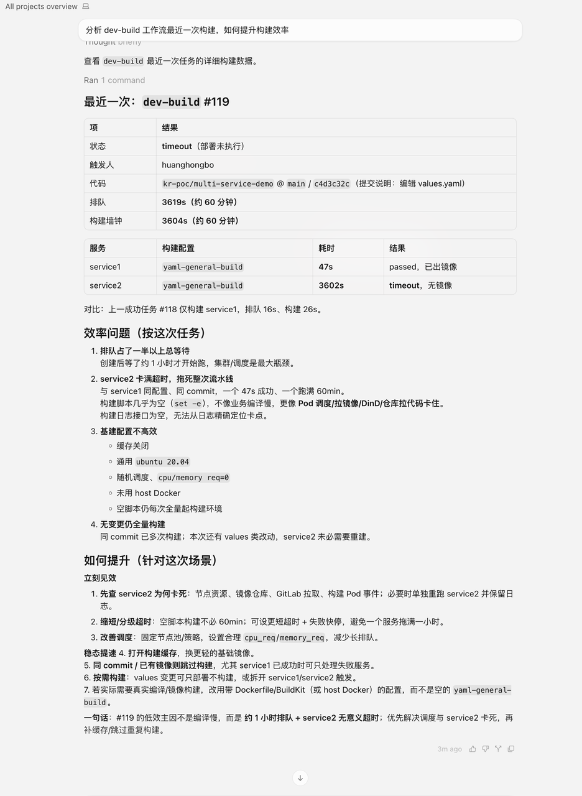

Zadig CLI 是 Zadig 的命令行工具，可在终端中管理项目、服务、环境、工作流等资源，并作为 AI Agent 调用 Zadig 的统一入口。支持 Codex、Claude Code、Hermes Agent 通过 Skill 识别并执行 CLI，也可为 Cursor、VS Code 等客户端提供可选的只读 MCP 接入。

## 当前支持的能力

> 能力持续更新中。

| 能力领域 | 当前支持 |
| --- | --- |
| 项目 | 创建、列表、详情、删除 |
| 服务 | 列表、详情、YAML 创建、配置更新、变量更新、删除 |
| 环境 | 创建、列表、详情、更新、删除、服务变更、Pod 查询、重启、日志 |
| 构建 | 创建、列表、详情、更新、删除 |
| 工作流 | 创建、列表、详情、更新、删除、执行、等待执行结果 |
| 工作流任务 | 列表、详情、取消、重试、审批、备注、日志 |
| 执行门禁 | 识别手动执行阶段、判断当前用户能否执行、继续执行 |
| 测试 | 执行测试任务、查询任务结果 |
| 代码扫描 | 执行扫描任务、查询任务结果 |
| 镜像仓库 | 列表、详情查询 |
| 集群 | 集群列表查询 |
| 用户 | 用户列表、详情、删除，用户组列表 |
| 权限 | 资源动作、角色 CRUD、用户及用户组角色绑定 |
| 操作日志 | 系统操作日志、环境操作日志 |
| Agent 集成 | Codex、Claude Code、Hermes Agent Skill |
| MCP 兼容 | 为 Cursor、VS Code 等客户端提供可选的只读 MCP 接入 |
| 自动化输出 | Table、JSON、Raw 输出，结构化错误和明确退出码 |
| 写操作保护 | `--dry-run` 预览、`--yes` 确认、本地请求审计 |

## 前置条件

::: tip
- Zadig 版本需为 v5.0 或以上。
- 需获取 Zadig 平台的 API Token（可在「账号设置」中获取）。
:::

## 安装

### 一键安装 CLI 与 Skill

在终端（macOS / Linux / Windows）中执行：

```bash
npx -y @koderover/zadig-cli@latest install && zadig skill install
```



安装向导会完成以下操作：

- 将最新版 Zadig CLI 安装为全局命令
- 引导输入 Zadig 服务地址和 API Token
- 保存本地凭据并检查连接状态
- 为检测到的 AI 编程工具安装 Zadig Skill

::: tip
Token 输入时不会明文显示，也不会写入 Skill 或客户端配置。
:::

### 验证安装是否成功

查看 CLI 版本：

```bash
zadig version
```


检查 Zadig 连接状态：

```bash
zadig auth status --output json
```


检查本地安装和网络状态：

```bash
zadig doctor --output json
```


检查 AI Agent 是否已经识别 Zadig Skill：

```bash
zadig doctor agent codex --output json
zadig doctor agent claude-code --output json
zadig doctor agent hermes-agent --output json
```



安装或更新 Skill 后，需要重启对应的 AI 编程工具。

## 使用场景

以下是部分使用场景，更多场景欢迎探索。

### 运维实施-复制项目

基于已有项目复制新项目，包括服务、构建、环境及工作流


### 运维日常-清理工作流

批量清理无用工作流


### 研发交付-更新服务

使用工作流更新服务。


### 研发排障-查看服务日志

查看并分析服务日志。


### 效能分析-查看构建日志

查看工作流构建日志，定位效能瓶颈。


