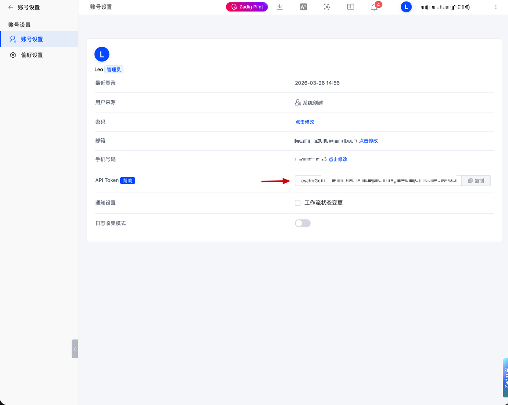
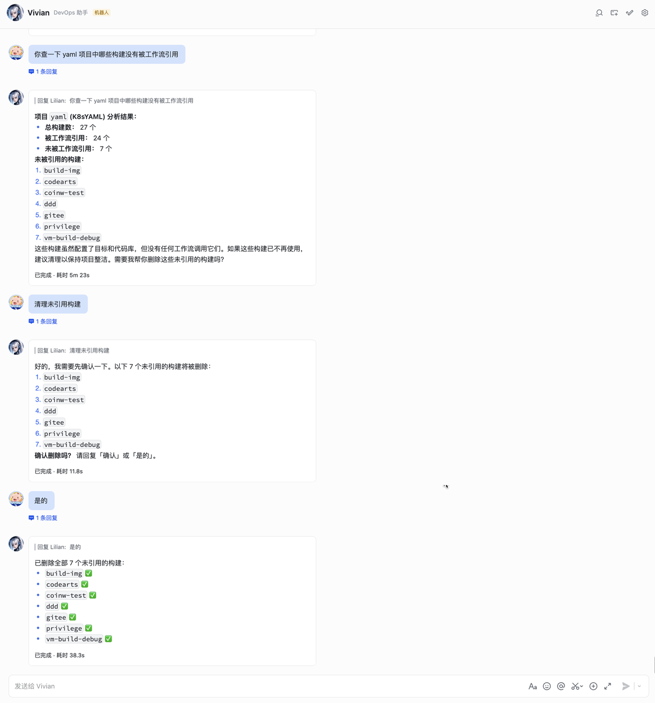

本文主要介绍如何安装并配置 Zadig OpenClaw 插件。


## 支持 Zadig 能力

| 业务类别 | 支持能力 |
| -------- | -------- |
| 项目 | 项目列表、详情、创建、删除 |
| 工作流 | 工作流触发、任务状态、审批、取消、重试、审批、视图管理、查看任务日志 |
| 环境 | 环境管理（含 K8s YAML/Helm 服务添加）、镜像更新、副本调整、重启 |
| 服务 | K8s YAML / Helm 服务查询和管理 |
| 构建 | 构建配置管理 |
| 测试 | 测试任务执行与结果查询 |
| 代码扫描 | 代码扫描配置与执行 |
| 用户与权限 | 用户和用户组管理 |
| 效能洞察 | 效能洞察（构建/部署/回滚/测试统计） |
| 审计日志 | 系统操作日志 |

## 重要风险提示（使用前必读）

🔴 核心风险
- 该插件通过 API 与平台数据交互，AI 可访问的信息存在潜在泄露风险。虽已采取安全防护措施，但 AI 系统尚不够成熟稳定，无法保证绝对安全。

🔴 强烈建议
- 若以机器人形式供多人使用，请警惕数据泄露、权限滥用等风险
- 使用前请务必遵守企业内部数据安全与隐私规范

📌 其他操作风险
- AI 存在“幻觉”风险：可能误解意图或生成不准确内容
- 部分操作不可逆：如删除资源，虽会提示确认，但删除后无法恢复
- 应对建议：写操作请严格遵循“先预览，再确认”原则，禁止 AI 在无人工干预下直接执行

## 安装插件

1. 执行安装命令：
:::tip
确保 Zadig 版本为 4.2.0 或以上。
:::

```bash
npx -y openclaw-zadig install
```

2. 配置连接信息：安装过程中输入 Zadig 的访问地址及 API Token（API Token 可在 Zadig 平台“账号设置”中获取）。




3. 验证安装是否成功：执行以下命令，若状态正常即安装成功：

```bash
npx openclaw-zadig info
```


4. 开始使用：安装完成后，在已集成的任意渠道（如飞书）发送消息，即可激活 Zadig 相关能力。


## 使用场景
1. 批量新建服务并加入环境。根据服务配置样例批量新建服务，并新建环境。


2. 研发自测与联调。执行工作流，查看服务状态与服务日志。


3. 构建日志分析及优化。分析工作流构建日志。


4. 批量清理无用的构建。批量删除未被引用的构建。


