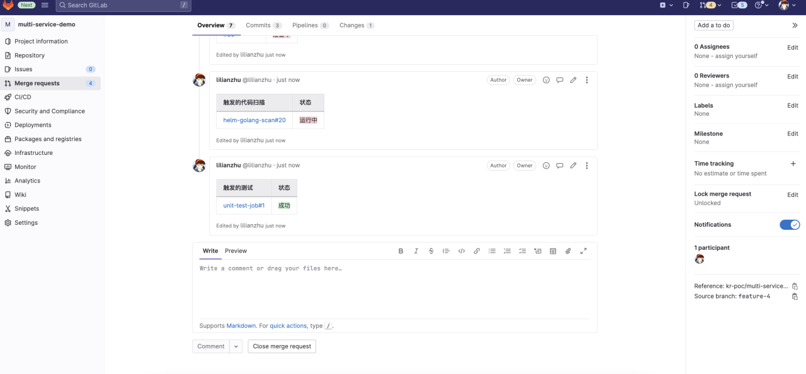
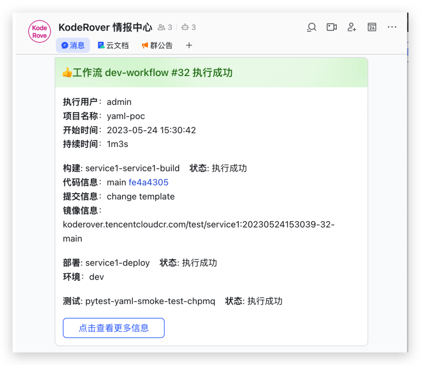
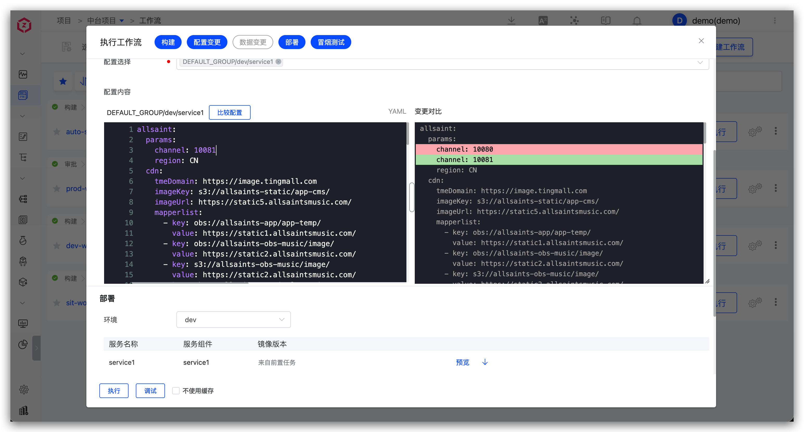
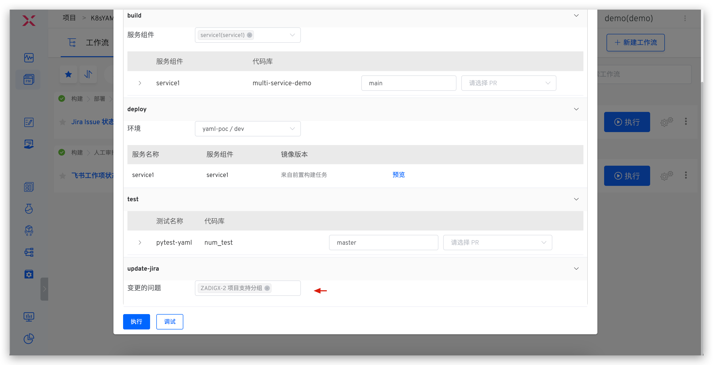
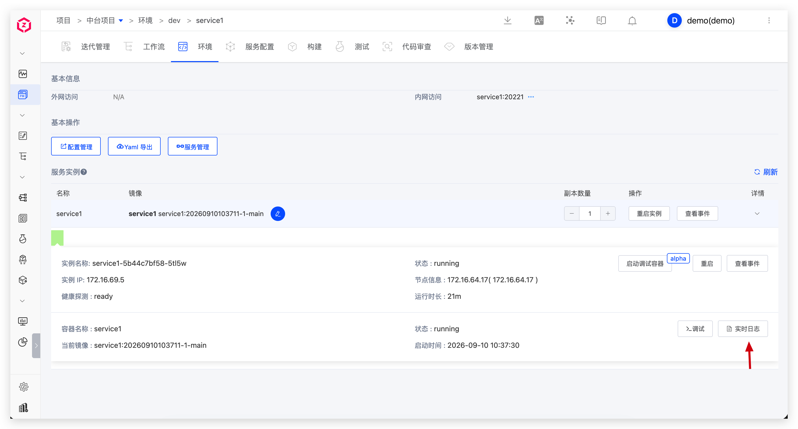
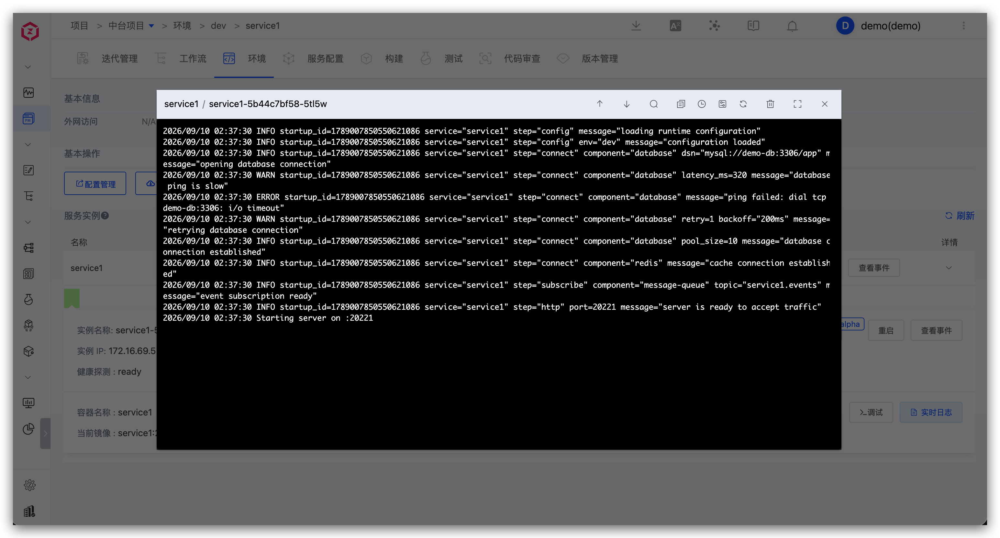
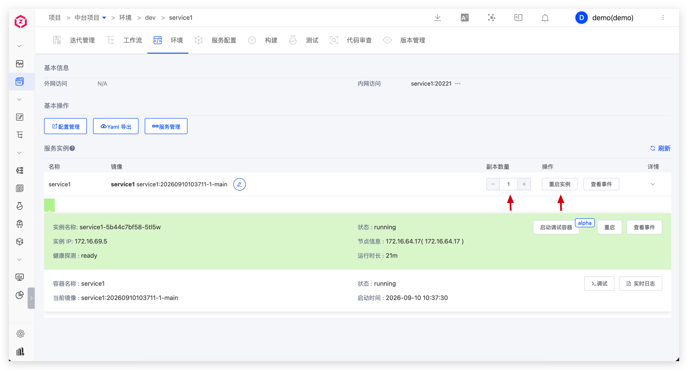

开发工程师基于 Zadig 完成代码提交、自测、联调、配置与数据变更以及服务调试。

## 提交代码及 CI 过程

1. 本地基于 develop 分支新建分支，完成代码开发后推送至远程仓库，并创建 PR/MR（Pull Request/Merge Request）。
2. 系统自动触发 CI 流程，包括单元测试、代码风格检查和代码扫描。
3. CI 执行结果（如单元测试、AI 代码审查等）将在 PR/MR 页面反馈。

## 单个工程师自测

手动或自动触发 dev 工作流，包含：构建、部署 dev 环境、冒烟测试、IM 通知。

## 多人集成联调

执行 dev 工作流，选择多个服务和对应的代码变更。

## 同一个服务多个代码变更

执行 dev 工作流，选择服务及其多个代码变更。

## 更新业务配置

> 适用场景：改动涉及到配置变更

以 Nacos 配置为例，执行对应环境的工作流，选择 Nacos 配置并修改。

## 更新项目管理任务状态

> 适用场景：功能实现完毕后一键修改跟踪任务的状态

以 Jira 为例，执行工作流，选择对应的 Jira 任务。

## 更新数据库

> 适用场景：改动涉及到数据变更（如表结构变更、表字段变更...）

以 MySQL 数据库为例，通过工作流输入 SQL 语句完成数据更新。

## 服务调试

查看环境和服务状态。

查看服务实时日志。

进入容器调试。

临时替换服务镜像。

调整副本数量或重启实例。

