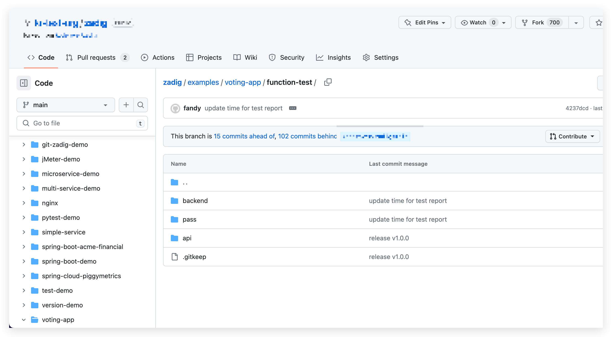
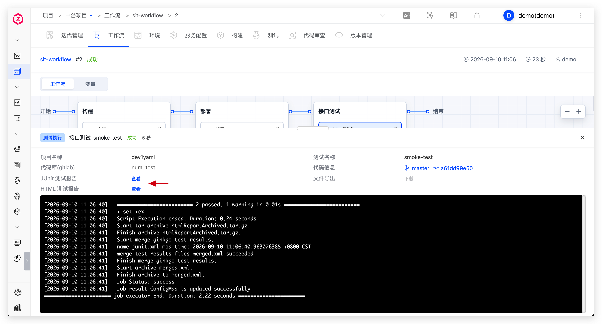
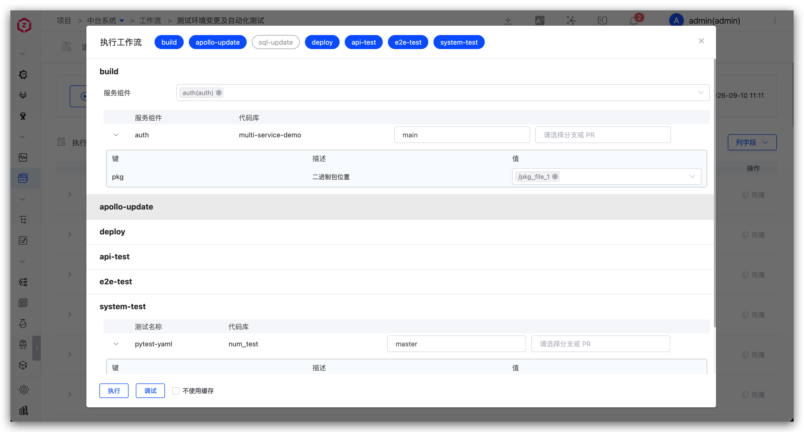

测试工程师基于 Zadig 管理测试用例，完成 sit/uat 发布验证，并分析自动化测试结果。

## 管理测试用例

1. 本地编写测试用例脚本并针对 sit 环境自测。
2. 自测通过后提交到代码仓库。

## sit 发布验证

执行 sit 工作流更新环境进行集成验证，包括：构建、部署 sit 环境、接口测试、IM 通知。

## uat 发布验证

执行 uat 工作流做预发布验证，包含：质量门禁、构建、配置变更、部署 uat 环境、回归测试、IM 通知。

## 自动化测试结果分析

分析自动化测试结果，基于覆盖情况持续优化自动化测试套件。

