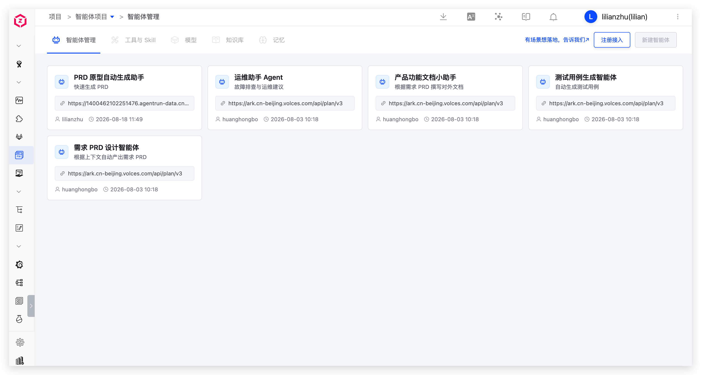

智能体正逐步成为产研协作的新单元。Zadig 智能体项目用于管理与发布智能体，当前支持将外部智能体注册接入平台统一管理，后续将支持构建与发布新智能体。

场景价值：
- 将分散的智能体纳入项目统一纳管，团队可集中查看和使用。
- 支持 OpenAI 和 Anthropic 协议接入，快速对接已有智能体服务。

## 新建项目

进入 Zadig 系统，点击「项目」-「新建项目」，填写项目名称，选择`智能体项目`，即可创建。

如有智能体相关场景希望落地，可通过[反馈表单](https://koderover.feishu.cn/share/base/form/shrcnGBw4s7V6lIk8pFBETsGGag)向官方反馈，我们会优先评估支持。

## 注册接入

创建项目后进入智能体管理，可将外部智能体注册到当前项目，统一查看和管理。

接入时配置智能体基本信息及其服务地址、协议与认证方式，保存前可校验连接是否可用。

参数说明：
- `名称`：智能体名称。
- `描述`：对该智能体的简要说明。
- `服务端点`：智能体服务的 API 地址。
- `协议配置`：支持 OpenAI 和 Anthropic 协议。
- `认证方式`：支持 API Key 和 AK/SK 认证。
- `API Key`：访问智能体服务的密钥。
- `AK/SK`：访问智能体服务的 AK/SK。

在 Zadig 中注册的智能体可以被其他项目工作流 AI 任务调用，请参考[工作流任务](/cn/Zadig%20v5.0/05.系统功能模块/02.工作流/02.workflow_jobs.md#ai-任务)。

工具与 Skill、模型、知识库、记忆，以及智能体的构建、发布与授权能力将陆续开放，敬请期待。
