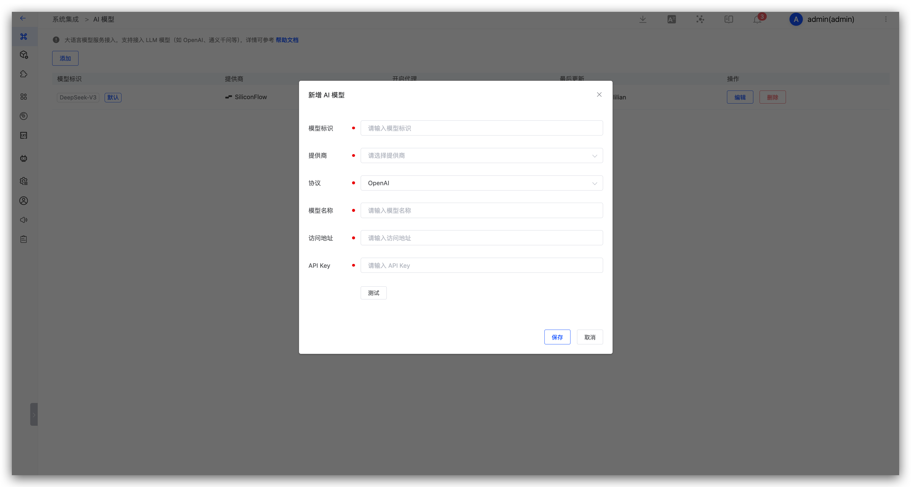
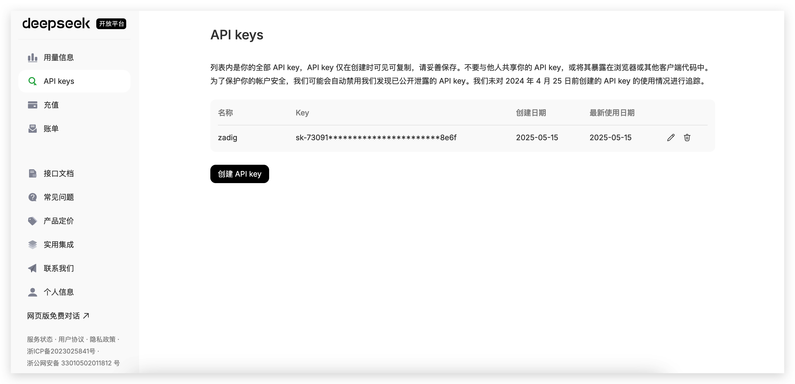
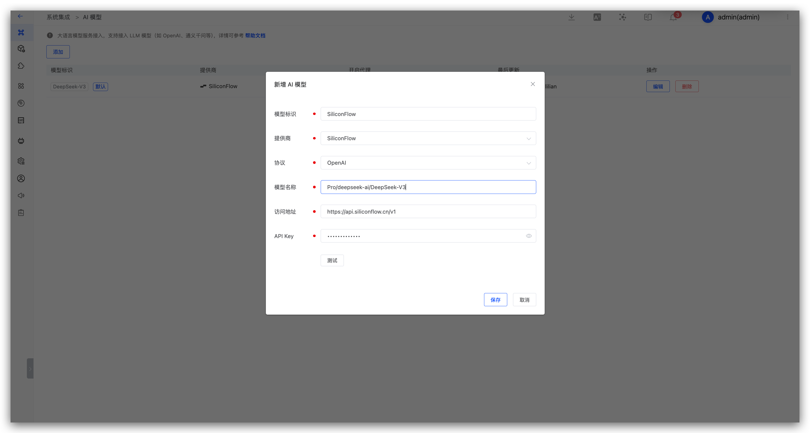
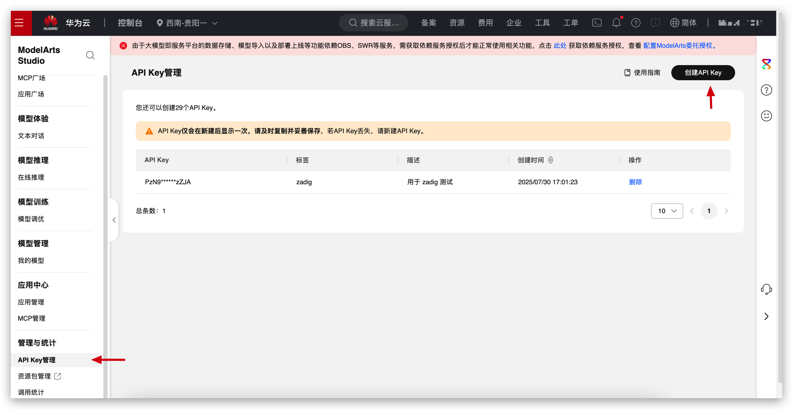
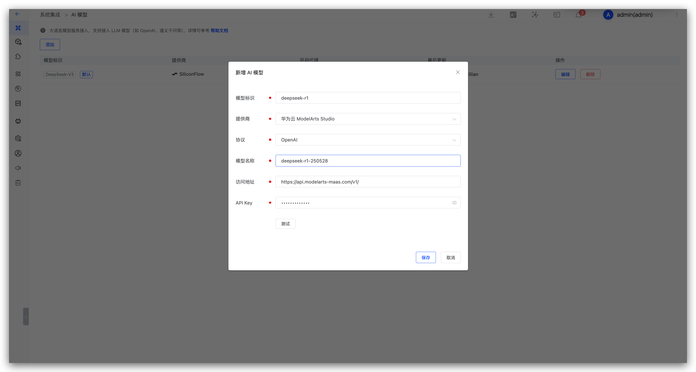
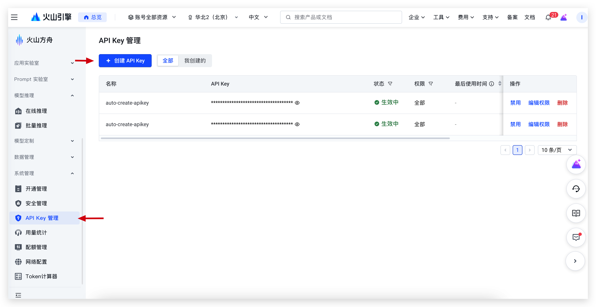
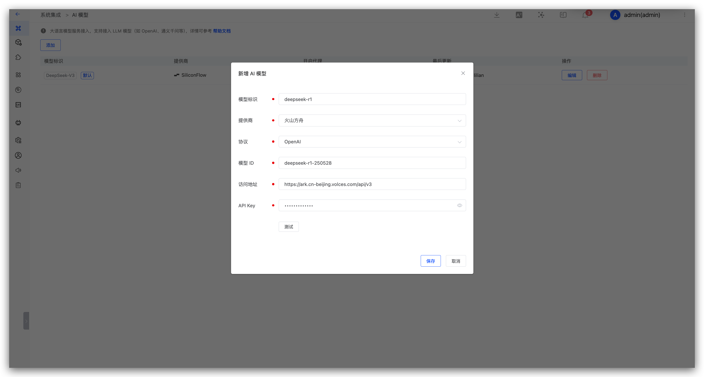

本文介绍在 Zadig 系统上集成 AI 模型。支持接入 OpenAI、Azure、Azure AD、DeepSeek、SiliconFlow、火山方舟、阿里云百炼、华为云 ModelArts Studio 等多家模型提供商。

模型接入后可用于以下场景：

- [AI 效能诊断](/cn/Zadig%20v5.0/ai/insight-analysis/)：分析构建、部署、测试等效能数据，识别瓶颈并给出改进建议
- [AI 环境巡检](/cn/Zadig%20v5.0/ai/env-analysis/)：检查 Kubernetes 环境健康状态，识别常见问题并提供处理建议
- [AI 代码审查](/cn/Zadig%20v5.0/project/scan/#ai-审查)：审查代码变更，识别缺陷与风险，结果可回写 MR 评论区
- [AI 发布专员](/cn/Zadig%20v5.0/project/workflow-jobs/#ai-发布专员)：结合变更与发布上下文进行风险分析，输出结论与建议
- [AI 任务](/cn/Zadig%20v5.0/project/workflow-jobs/#ai-任务)：对接 AI 模型，按提示词自动执行智能任务

## 新增 AI 模型

访问`系统设置` -> `系统集成` -> `AI 模型`，选择提供商并填写模型信息。

参数说明：

- `模型标识`：在 Zadig 中识别该模型的标识。
- `提供商`：选择模型提供商。
- `协议`： 支持OpenAI 和 Anthropic 协议。
- `模型名称`：提供商侧的模型名称。
- `访问地址`：模型服务的 API 地址。
- `API Key`：访问模型服务的密钥。

::: tip
接入多个模型后，可指定其中一个为默认模型。[AI 效能诊断](/cn/Zadig%20v5.0/ai/insight-analysis/)、[AI 环境巡检](/cn/Zadig%20v5.0/ai/env-analysis/) 和 [AI 发布专员](/cn/Zadig%20v5.0/project/workflow-jobs/#ai-发布专员) 使用默认模型。
:::

以下以常见提供商为例，说明如何获取 API Key 和访问地址。

## DeepSeek

1. 在 DeepSeek 上完成注册，生成 [API Key](https://platform.deepseek.com/api_keys)，创建新的 API Key 并复制。

2. 在 Zadig 上，访问`系统设置` -> `系统集成` -> `AI 模型`，添加 DeepSeek AI 模型。

**参数说明：**

1. 提供商：选择 DeepSeek
2. 模型名称：输入 DeepSeek 上提供的模型
3. 访问地址：https://api.deepseek.com/v1
4. API Key：上一步中获取的 API Key

## SiliconFlow

1. 在 SiliconFlow 上完成注册，生成 [API 密钥](https://cloud.siliconflow.cn/account/ak)，创建新的 API 密钥并复制。

2. 在 Zadig 上，访问`系统设置` -> `系统集成` -> `AI 模型`，添加 AI 模型。

**参数说明：**

1. 提供商：选择 SiliconFlow
2. 模型名称：输入 SiliconFlow 上提供的模型
3. 访问地址：https://api.siliconflow.cn/v1
4. API Key：上一步中获取的 API 密钥

## 华为 ModelArts Studio

1. 在华为云 ModelArts Studio 上完成注册，生成 [API Key]((https://www.huaweicloud.com/product/modelarts/studio.html))，创建新的 API Key 并复制。

2. 在 Zadig 上，访问`系统设置` -> `系统集成` -> `AI 模型`，添加华为云 ModelArts Studio AI 模型。

**参数说明：**

1. 提供商：选择华为云 ModelArts Studio
2. 模型名称：输入华为云 ModelArts Studio 上提供的模型，如 `deepseek-r1-250528`
3. 访问地址：https://api.modelarts-maas.com/v1/
4. API Key：上一步中获取的 API Key

## 火山方舟

1. 在火山方舟上完成注册，生成[API Key](https://www.volcengine.com/product/ark)，创建新的 API Key 并复制。

2. 在 Zadig 上，访问`系统设置` -> `系统集成` -> `AI 模型`，添加火山方舟 AI 模型。

**参数说明：**

1. 提供商：选择火山方舟
2. 模型 ID：输入火山方舟上提供的模型 ID，如 `deepseek-r1-250528`
3. 访问地址：https://ark.cn-beijing.volces.com/api/v3
4. API Key：上一步中获取的 API Key

## 阿里云百炼

1. 在阿里云百炼上完成注册，生成[API Key](https://bailian.console.aliyun.com/?tab=model#/api-key)，创建新的 API Key 并复制。

2. 在 Zadig 上，访问`系统设置` -> `系统集成` -> `AI 模型`，添加阿里云百炼 AI 模型。

**参数说明：**

1. 提供商：选择阿里云百炼
2. 模型名称：输入阿里云百炼上提供的模型，如 `deepseek-r1-0528`
3. 访问地址：https://dashscope.aliyuncs.com/compatible-mode/v1
4. API Key：上一步中获取的 API Key
