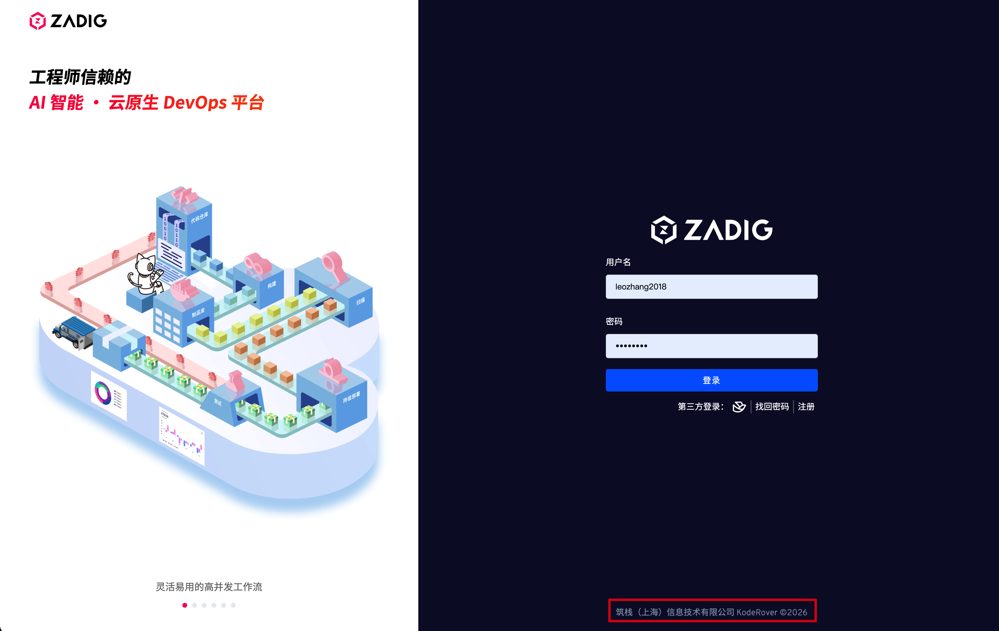
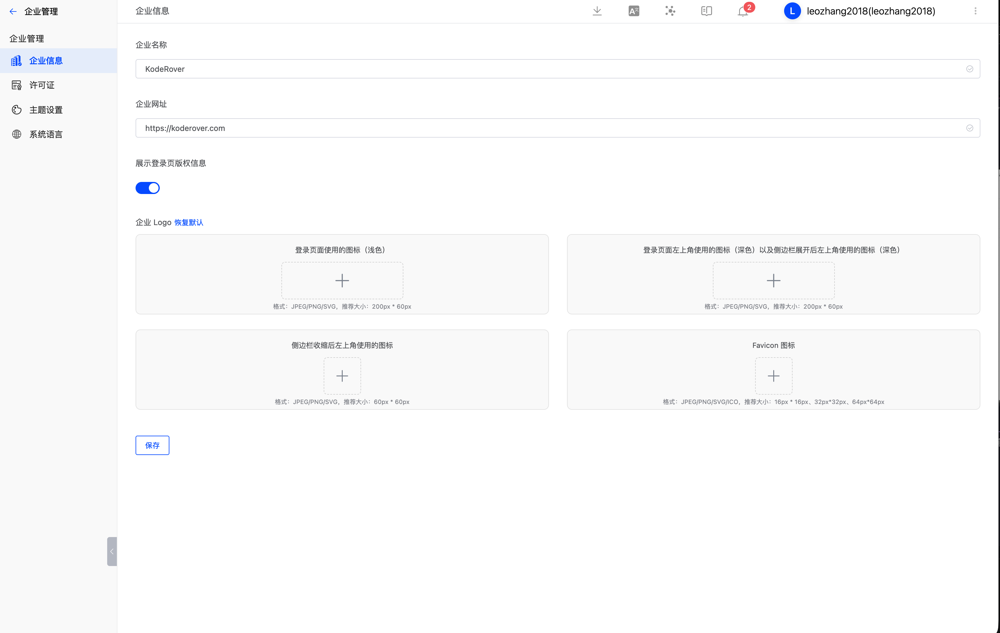
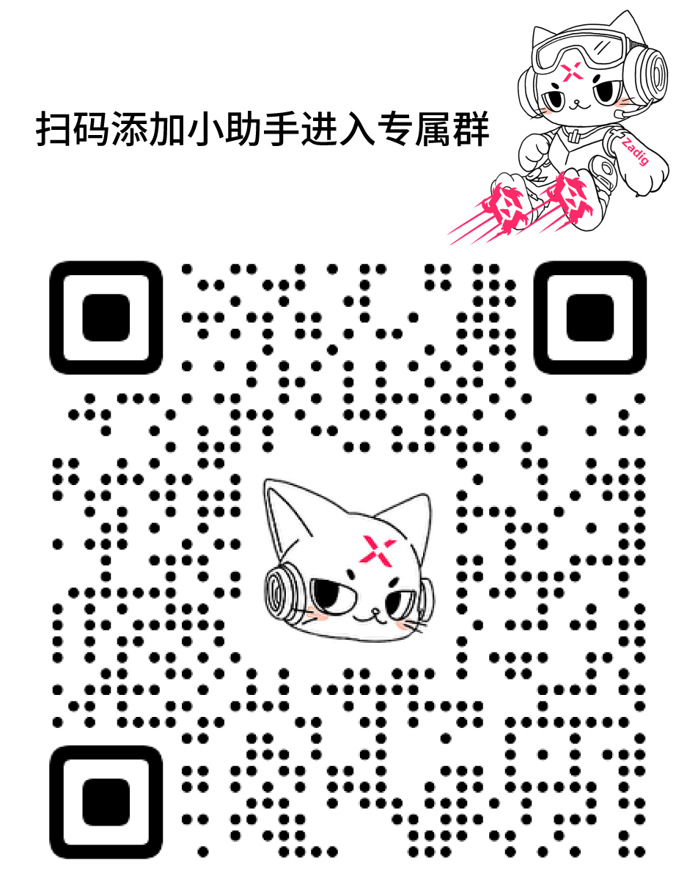
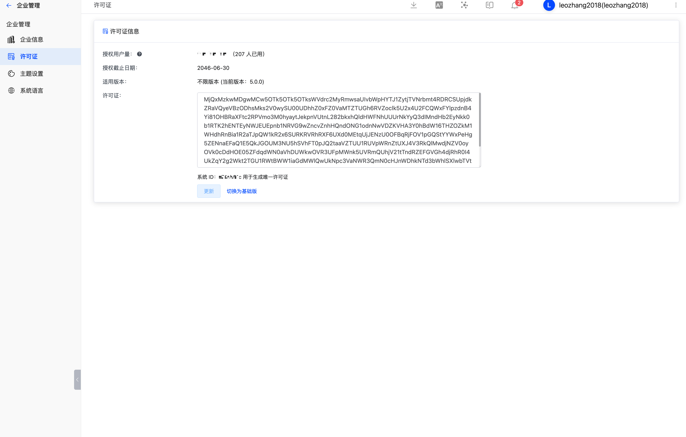
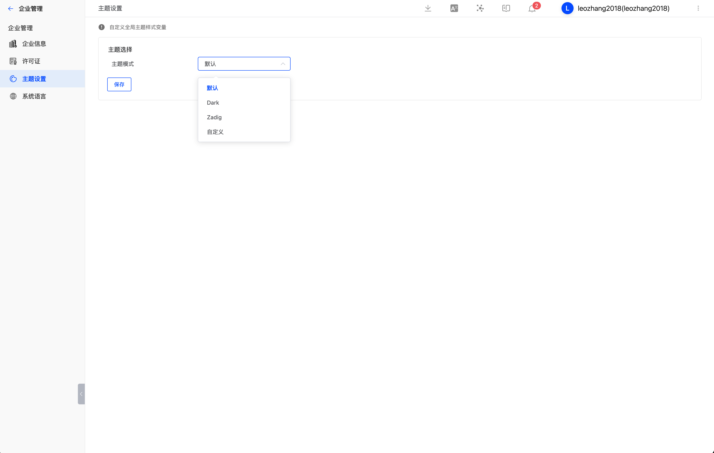
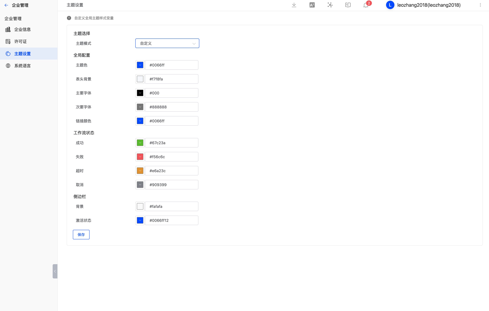

本文主要介绍如何在 Zadig 中管理企业信息，包括：

- 企业信息（名称、网址、登录页版权显示、企业 Logo）
- 许可证
- 主题设置
- 系统语言

## 企业信息

系统管理员访问`企业管理` -> `企业信息`，可修改企业名称、网址、登录页版权显示和企业 Logo 信息。

### 登录页版权显示

可控制登录页的底部信息是否展示

### 企业 logo：

1. 登录页面使用的图标（浅色），格式：JPEG/PNG/SVG，推荐大小：200px * 60px
2. 登录页面左上角使用的图标（深色）以及侧边栏展开后左上角使用的图标（深色），格式：JPEG/PNG/SVG，推荐大小：200px * 60px
3. 侧边栏收缩后左上角使用的图标，格式：JPEG/PNG/SVG，推荐大小：60px * 60px
4. Favicon 图标，格式：JPEG/PNG/SVG/ICO，推荐大小：16px * 16px、32px*32px、64px*64px

## 许可证

### 获取免费试用 30 天许可证

安装后，通过[官网自助](https://koderover.com/getLicense)获取试用许可证，试用过程如需获得帮助添加小助手进入使用交流群。

### 配置许可证

系统管理员访问`企业管理` -> `许可证`，按需对许可证进行配置。

## 系统主题

系统管理员访问 `企业管理` -> `主题设置`，选择内置系统配色，或者自定义系统主题配色。

> 提示：系统主题一旦设置后，对所有用户都生效。

## 系统语言

设置系统组件使用的语言，包括邮件模板、IM 通知等

