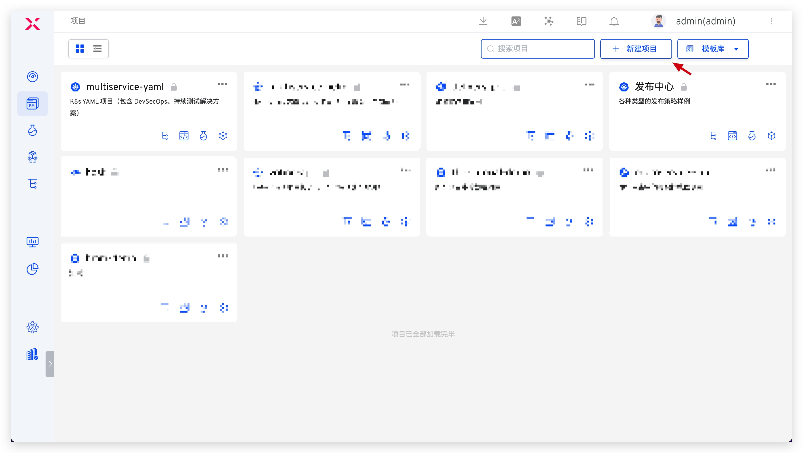
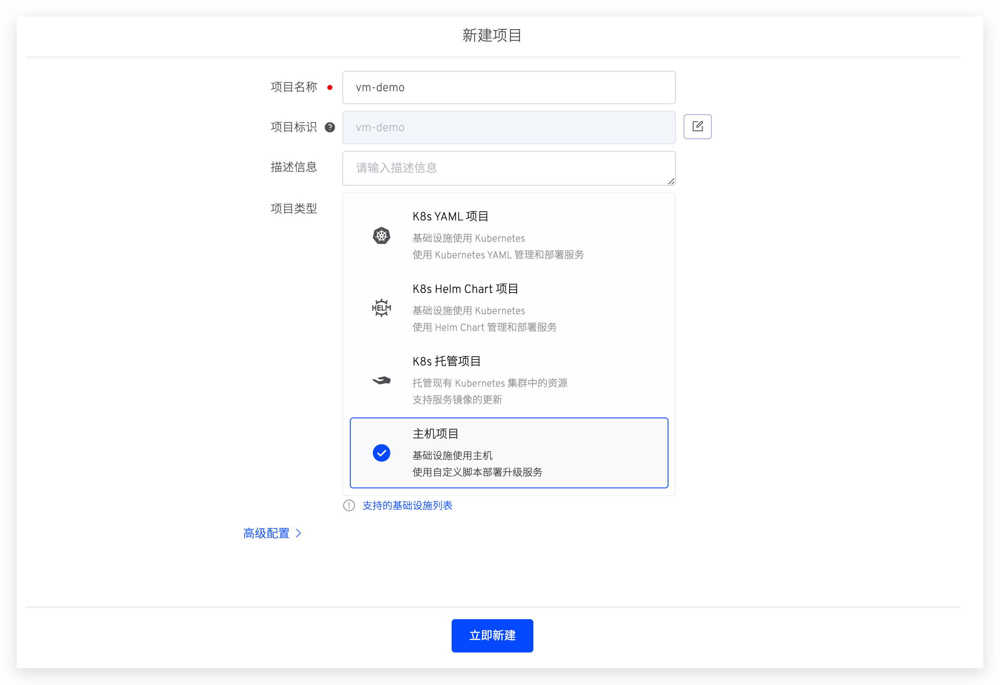
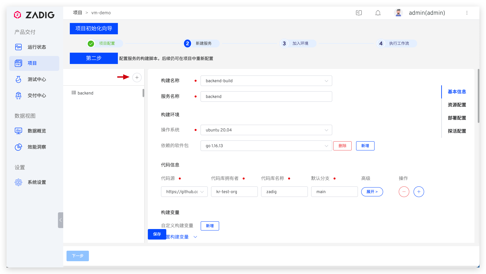
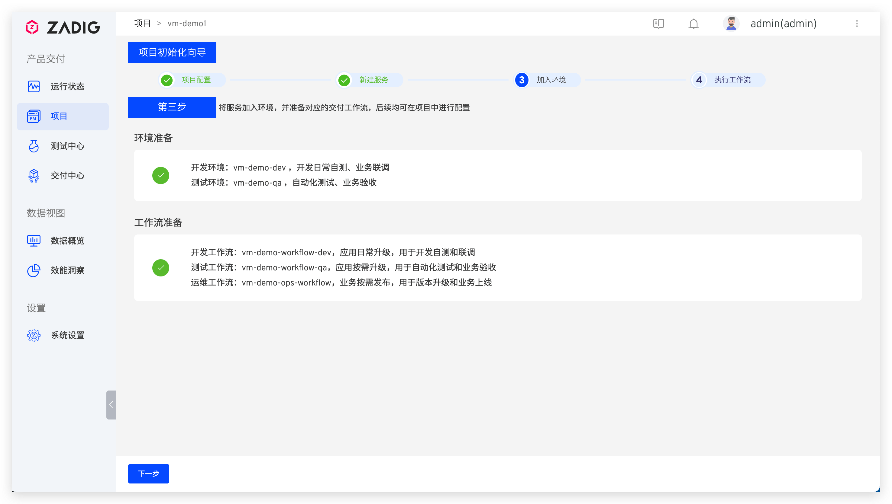
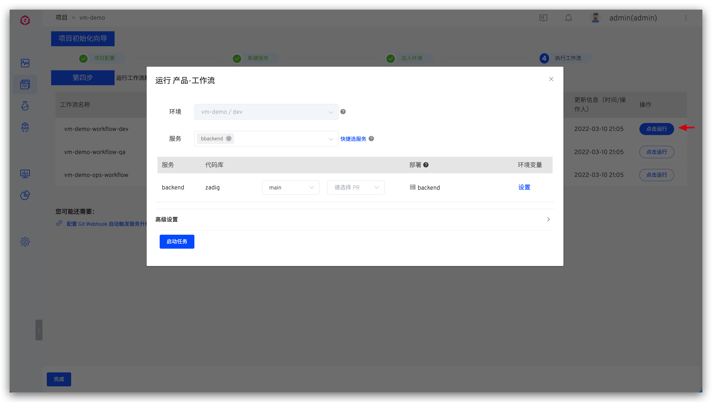
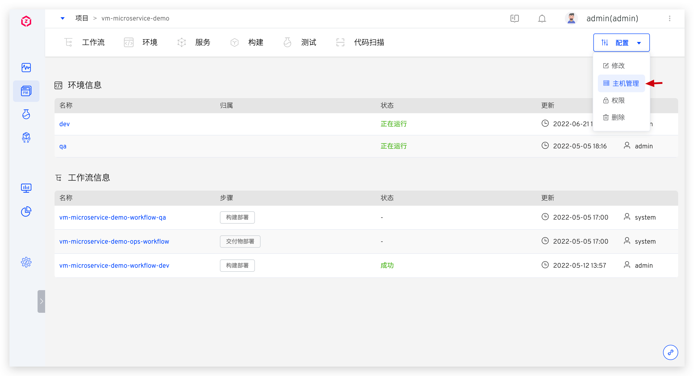
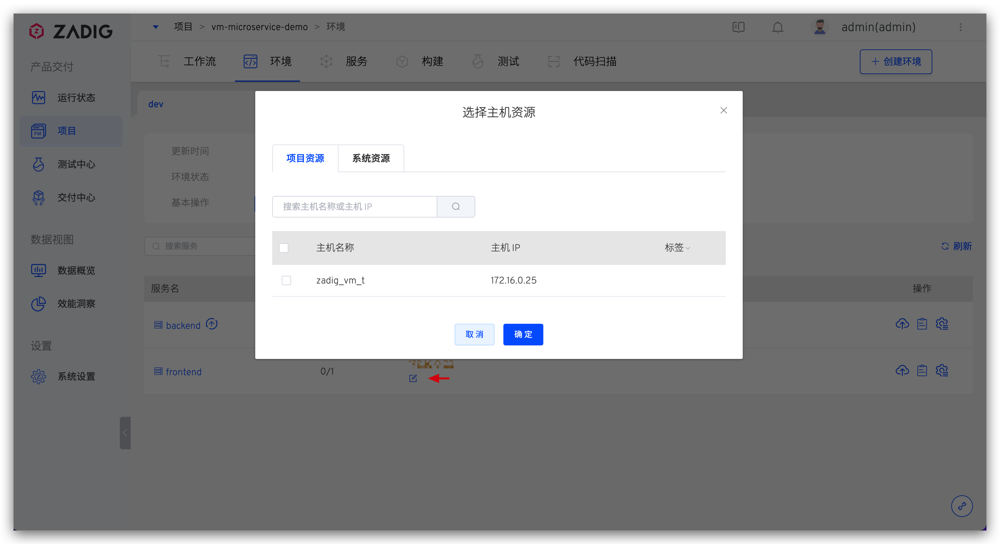

## 快速搭建项目

以下内容为主机项目的快速搭建步骤，如果你需要具体的案例，可参考：[教程](https://www.koderover.com/tutorials/codelabs/cloudhost/index.html?index=..%2F..index#0)。

### 新建项目

进入 ZadigX 系统，点击「项目」-「新建项目」，填写项目名称，选择`主机项目`的项目类型新建项目。

### 服务配置
点击 `+` 按钮，填写服务名称。并分别为其配置构建、主机资源、服务部署及服务探活等信息。

> 可参阅 [主机服务](/ZadigX%20v1.5.0/project/service/vm/)，完成相关配置项。

### 加入环境

主机服务配置完毕后，保存并点击`下一步`，ZadigX 系统会默认为该项目创建两套集成环境和两条工作流。

### 工作流交付

待环境和工作流准备完毕，点击`下一步`，选择 dev 环境的工作流，可触发 dev 环境的服务更新。

## 主机管理

主机项目中，项目管理员点击`配置` -> `主机管理`可在项目中对主机资源进行管理，具体配置可参考 [添加主机](/ZadigX%20v1.5.0/settings/vm-management/#添加主机)。

创建后，环境中的服务可按需关联系统资源/项目资源。
::: tip
在`系统设置`-`主机管理`中创建的主机为系统资源，在项目中创建的主机为项目资源。系统资源可用于所有项目中，项目资源可用于当前项目中。
:::

